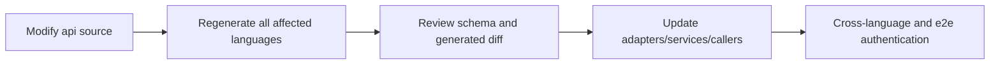

# API generation and changes

API changes must start from the source schema of the root `api/`. Direct modification of `*.pb.go`, OpenAPI Go output, JavaScript generated client, or C nanopb output generated by third-party tools is prohibited. `rpcapi/generated.go` is a manually maintained wrapper left over from history and does not belong to the third-party generated output; the source proto, `rpcproto` and codec tests must be checked at the same time when modifying.

## Generate link

| Source | Main Output | Commands |
| --- | --- | --- |
| HTTP OpenAPI + shared schemas | Go HTTP server/client/models | `go generate ./pkgs/gizclaw/api/adminhttp ./pkgs/gizclaw/api/apitypes ./pkgs/gizclaw/api/peerhttp ./pkgs/gizclaw/api/openaihttp` |
| `api/proto/rpc/**/*.proto` | Go Protobuf | `go generate ./pkgs/gizclaw/api/rpcproto` |
| RPC descriptors/wrappers | Manually maintained `rpcapi` committed surface | `go test ./pkgs/gizclaw/api/rpcapi` (currently `go generate` only performs this verification and will not regenerate the file) |
| HTTP + RPC schemas | JavaScript SDK | `npm --prefix sdk/js run gen:sdk` |
| RPC Protobuf | C nanopb SDK | `go generate ./sdk/c/gizclaw` |
| Telemetry Protobuf | Go/JavaScript telemetry | `go generate ./pkgs/gizclaw/api/telemetry` and `npm --prefix sdk/js run gen:telemetry` |

The full Go API is available:

```sh
go generate ./pkgs/gizclaw/api/...
```

## A complete change



The review cannot just look at the generated files. You should first confirm whether the source contract is correct, then confirm that each generated surface is fresh and consistent, and finally verify the call point and business implementation.

## Minimum verification

Select by scope of change, but include at least:

```sh
go test ./pkgs/gizclaw/api/... ./pkgs/gizclaw/... ./sdk/go/... -count=1
npm --prefix sdk/js test
git diff --check
```

Add C generation/build tests when the RPC/C surface changes; add resource manager and CLI e2e when the management resources change; overwrite the success and user-visible error paths of the strict adapter when the HTTP endpoint changes.

If a large number of irrelevant diffs appear after building, check tool version, ordering, and template first instead of commit noise. Generated output must be consistent with the source schema in the same commit.

## Generator ownership

- `rpcproto/*.pb.go` is generated directly by a third party `protoc-gen-go`.
- The Go output of `adminhttp`, `apitypes`, `openaihttp` and `peerhttp` are generated by the third party `oapi-codegen`; the tools in the repository can prepare the input, but do not therefore have the generation template.
- The alias, helper signature or import qualifier generated by the third-party generator keeps the generated result, and does not manually change the local style rules, fork the generator or append the AST normalizer.
- The repository's handwritten code and the repository's own generator directly use the package to which the type belongs, and do not add cross-package alias that are only used for renaming or re-export.
