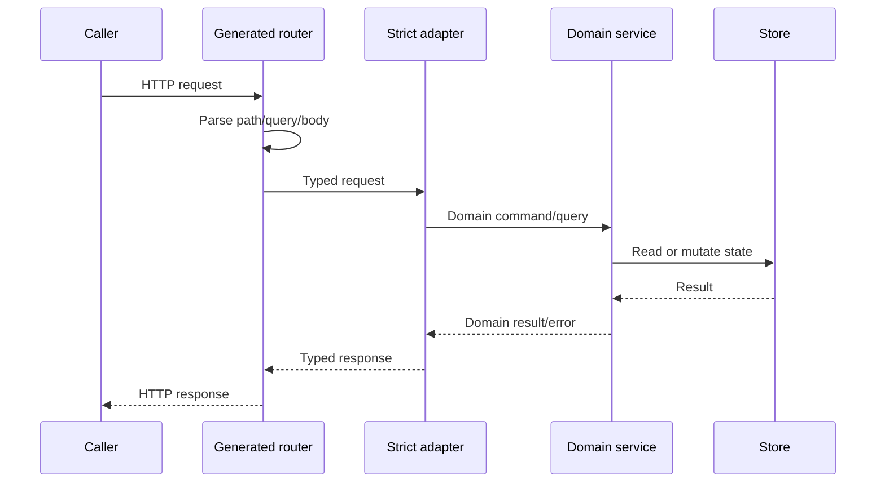

# HTTP API

GizClaw Server maintains three independent HTTP surfaces externally. They can reuse DTOs, but their callers, authentication methods, and business boundaries are different, and they cannot be merged into a "large and comprehensive" router contract.

## Surface

| Source | Caller and Responsibilities | Go Generate Results |
| --- | --- | --- |
| `admin.json` | Administrator manages resources, Peer, Telemetry and operation and maintenance actions | `pkgs/gizclaw/api/adminhttp` |
| `peer.json` | Public/Peer login, own status, Server info and WebRTC offer | `pkgs/gizclaw/api/peerhttp` |
| `openai-compat/v1/service.json` | OpenAI-compatible model, chat and audio subset | `pkgs/gizclaw/api/openaihttp` |

Desktop application contract belongs to `apps/wails` and does not belong to GizClaw Server HTTP API.

## Request flow

OpenAPI has path, method, parameters, wire DTO and response status. Adapter is responsible for mapping generated types to domain calls. Service has authorization decisions, resource rules, and persistence. Do not write the business implementation into the generated package, and do not let the service directly parse the Fiber request.

## Change rules

- For the new endpoint, first select the correct surface, and then define a stable operation ID.
- The cross-surface DTO points to `shared.json` through `$ref`; the Admin declarative resource is defined in `resources/*.json` and aggregated by the generation entry of `shared.json`. Specs with only one Resource owner are directly defined in the corresponding Resource file.
- Make it clear that success and all user-visible error responses cannot only generate happy path.
- After modifying the schema, strict server/client must be regenerated, and the actual handler must meet the new interface.
- Authentication middleware and endpoint Self-authentication boundaries must be explicitly implemented by server composition; OpenAPI security declaration cannot replace runtime verification.

`/webrtc/v1/offer` belongs to the signaling entry. When its identity is verified by the Offer contract itself, it should no longer implicitly rely on another set of HTTP session preconditions.

## Subdocument

- [Admin API](./admin): Administrator resources, Peer management and operation and maintenance surface.
- [Public API](./public): WebRTC front entry point and Peer's own surface.
- [OpenAI Compatible](./openai-compatible): OpenAI-compatible model, Chat and Audio surface.

Design information: [Shared and Resources](./shared-resources) · [Dependency Rules](./type-dependencies)
