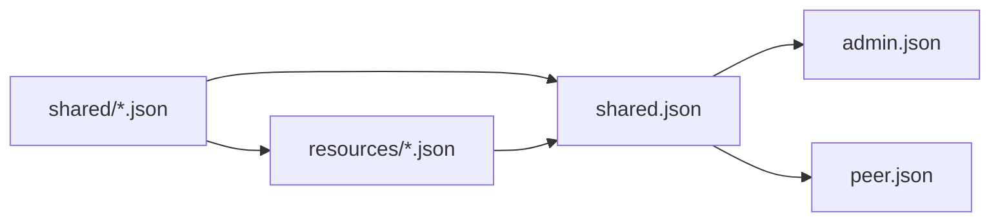

# Shared and Resources

`api/http/shared/` and `api/http/resources/` express different ownership. Shared is a contract that can be reused across surfaces or domains; Resources is Admin’s declarative resources and their exclusive data.

## shared

`shared/` Only save data structures, enums and value objects that have at least two actual consumers, or that clearly belong to a cross-domain contract. `shared.json` aggregates these definitions and makes them available to multiple HTTP surfaces and codegen via `#/components/schemas`.

Content suitable for `shared/`:

- Stable DTO shared between request/response;
- enum, spec or nested value with independent semantics;
- Error and pagination types required for multiple HTTP surfaces.

Things that don't fit here: Single Resource-specific Specs, small value objects with only one parent schema, database rows, service dependencies, runtime locks, internal cache state, and temporary structures used only by a single handler.

## Shared ownership

`shared/` currently uses fine-grained physical files for stable schema types. The [HTTP Schema dependency rules](./type-dependencies#shared-ownership-map) maintain the actual files and ownership families; this page does not duplicate a second list that can drift.

When changing a Shared schema:

- Start from an owner file that actually exists under `api/http/shared/`; do not invent aggregate domain file names.
- Locate cross-surface error, identity, runtime, ACL, configuration, firmware, credential, model, voice, tool, workflow, workspace, and provider tenant values through the ownership map.
- Keep Public-only DTOs in `peer.json`, Admin endpoint-specific DTOs in `admin.json`, and OpenAI-compatible DTOs in `openai-compat/v1/service.json`.
- Keep Resource envelopes, metadata, Apply contracts, and the Resource union in `resources/resource.json`; Resource-specific data remains in the corresponding `resources/<kind>.json`.

If an existing Shared value is reduced to one owner, evaluate inlining it as a contract change. A generated public symbol is not sufficient reason to retain it forever, and a new Shared file requires evidence of independent reuse.

`shared.json` is the current generation entry for `apitypes`: it exports Shared schema and references `resources/*.json` to generate Resource graph. This aggregation relationship only serves codegen and does not change the ownership boundary between `shared/` and `resources/`.

## resources

`resources/` Description Admin declarative resource. They serve `admin apply`, `admin show` and the resource manager and are not used by Peer HTTP or Desktop surface.

A resource schema should express:

- resource kind and stable identity;
- User-declarable spec;
- apply/show metadata that needs to be retained;
- Explicit references to other resources.

### Core Data and Display

Resource data is first divided into two categories according to semantics:- Core data describes what a Resource is and what it is associated with, including stable identity, kind, classification, reference, ownership, running configuration and persistence semantics. These fields are involved in business judgment, query, correlation and execution, and cannot be placed in `display`.
- `display` Only describes how to display the Resource to users, such as localized name, subtitle, description, icon and cover. Deletion or replacement of `display` shall not change the relationship or operation behavior of Resource.

Resources that require general display metadata have their own optional `display` fields, and define their own strongly typed Display schema in the corresponding `resources/<kind>.json`. Even if two Resources currently require the same fields, this does not create a common `ResourceDisplay`, `ResourceDisplayData` or common catalog schema.

If a Resource only needs a localized catalog and does not require additional display metadata, it can directly have the `i18n` field with more accurate semantics. Workflow and PetDef use their own `WorkflowI18n` and `PetDefI18n` respectively: `i18n.default_locale` specifies the default language, and `i18n.en`, `i18n.zh-CN` and other locale keys directly save the corresponding catalog without adding `catalogs` or `display` intermediate layers. Workspace is a running instance created by the user and does not have catalog type i18n.

`WorkflowI18n` Although located at `shared/`, it is still a Workflow-owned contract. The Admin API and persistence layer use the complete `Workflow{name,spec,i18n}`; the declarative `WorkflowResource` retains the generic `ResourceMetadata`, the resource manager maps between `metadata.name` and `Workflow.name`, and passes `spec` and `i18n` as they are. This does not mean that Workspace or other Resources can reuse it, nor should public `ResourceI18n` be extracted.

The shared naming of Display is a structural convention and does not represent a public domain model. Different Resources can independently add display fields that conform to their own product semantics; modifying the Display of a Resource should not force unrelated Resources to simultaneously modify or regenerate APIs.

Use the following rules when determining field ownership:

| Question | Yes | No |
| --- | --- | --- |
| Does the field affect identity, association, filtering, authorization, execution, or persistence semantics? | Put it into the core field of Resource or `spec` | Continue to judge |
| Is the field used only for human-facing names, descriptions, or visual presentation? | Put this Resource's own `display` or `i18n` | No display fields should be created for it |
| Is the same field used by multiple Resources? | Each Resource still has its own Display definition | Do not put it into Shared on the grounds of "looking the same" |

Machine-readable fields such as `category`, association ID, workflow reference, provider kind, etc. belong to core data. The localized name and description belong to owner `display` or `i18n`; icon and cover belong to Display. The client can fall back to a stable ID when display data is missing, but the server should not persist the fallback text as core data.

"Visual content" does not automatically equal `display`. If the asset, clip, animation graph or action-to-clip mapping is consumed directly by the device, runtime or domain logic, it is the core content or associated data of the Resource. For example, PetDef's PIXA, canvas, clips, visual refs and `visual_clip_id` belong to the PetDef spec; `display` only saves the display metadata and localized text required for the management interface or user reading.

A new Spec used by only one Resource should be defined in the same file as that Resource. For a Spec that already lives under `shared/`, inspect every actual consumer and compatibility impact before moving it. Do not infer ownership from its name alone or create a parallel schema.

Runtime connections, streams, temporary state, and provider clients cannot be stuffed into resource specs. Resource expresses the desired state, and domain service is responsible for verifying and realizing this state.

## Reuse relationship

Schema ownership dependency is `shared/ ← resources/`; the current codegen is aggregated into two layers by `shared.json` for use by `admin.json`. `peer.json` and OpenAI-compatible surface only reference the Shared contract they actually need and do not directly rely on the Admin Resource file.

When adding fields, priority should be given to modifying their real owners: truly shared values ​​modify `shared/`, declarative resources and exclusive Spec modify `resources/`, and inputs that only belong to a certain endpoint remain on the surface. Don’t copy a schema with a similar name that drifts away.

## Stability Boundary

Schema name, property name, required collection, enum value, discriminator and OpenAPI operation ID all affect the generated API. Renaming or changing optional/nullable semantics is a caller-facing contract change and must be reviewed with all generated languages ​​and call sites.
