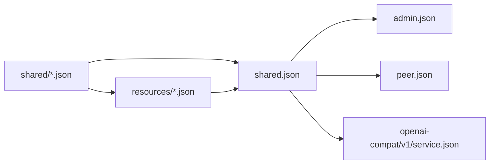

# HTTP Schema dependency rules

HTTP schema is divided into Shared, Resources and three API surfaces by ownership. The current generation entry uses a `shared.json` that aggregates Shared values ​​and Resource graph; `shared/` and `resources/` remain independent by ownership.

## Directory

```text
api/http/
├── admin.json
├── peer.json
├── openai-compat/
│   └── v1/
│       └── service.json
├── shared.json
├── shared/
│   └── ...
└── resources/
    └── ...
```

## Depends on direction



Dependencies must remain one-way:

```text
shared/ ← resources/ ← shared.json ← admin
shared.json ← public
shared.json ← openai-compatible
```

`shared/` Do not quote `resources/`. `resources/` can quote `shared/`. `shared.json` is the generation entry, and exports two layers of stable schema at the same time; its file name does not indicate that the Resource belongs to Shared ownership.

## Shared Rules

Schema can only be entered `shared/` if at least one of the following conditions is met:

- Used directly by more than two HTTP surfaces;
- Used by two or more domain owners;
- It is a stable value contract shared by multiple Resources.

The need to generate Go or JavaScript symbols does not constitute a reason for Shared. There is only one owner schema and the owner is placed in the same file.

### Shared ownership map

`shared/` uses fine-grained files for stable schema types instead of one aggregate file per domain. The current files are organized into these ownership families:

| Ownership family | Current files | Owned schema |
| --- | --- | --- |
| Error | `error_payload.json`, `error_response.json` | `ErrorPayload`, `ErrorResponse` |
| Device identity | `device_info.json`, `hardware_info.json`, `peer_imei.json`, `peer_label.json` | Device, hardware, and stable identity values |
| Runtime, Peer, and Server state | `runtime.json`, `peer*.json`, `registration.json`, `server*.json` | Runtime, registration, Peer lifecycle, stream, telemetry, and Server values |
| ACL | `acl_*.json` | Permission, Policy, Resource, Subject, Role, View, and binding values |
| Configuration | `configuration.json`, `agent_selection.json`, `refresh_*.json` | Shared configuration, Agent selection, and refresh contracts |
| Gameplay | `gameplay.json` | Gameplay metadata and shared rule values |
| Firmware | `firmware*.json` | Firmware, slot, artifact, spec, and selection values |
| Credential | `credential*.json` | Credential body, spec, and values shared across Resources and APIs |
| Model | `model*.json` | Model kind, capabilities, provider, source, spec, and provider data |
| Voice | `voice*.json` | Voice provider, source, spec, and provider data |
| Tool | `tool*.json`, `toolkit_policy.json` | Tool executor, trigger, source, spec, policy, and JSON schema values |
| Workflow and Workspace | `workflow*.json`, `workspace*.json` | Workflow identity, i18n, locale, driver, variants, and Workspace values |
| Provider tenant | `*_tenant*.json` | Provider-specific tenant, spec, enum, and shared values |

The glob entries group existing files by ownership; they are not literal file names to create. Before changing a schema, select an owner file that actually exists under `api/http/shared/`. Add a file only when no existing owner applies and the schema meets the Shared rules.

Schemas outside these Shared ownership families must be defined in their owner file:

- Public-only DTO put in `peer.json`.
- Admin endpoint exclusive DTO is placed in `admin.json`.
- OpenAI-compatible DTO put in `openai-compat/v1/service.json`.
- Resource, exclusive `*Spec` and nested values ​​are put into corresponding `resources/<kind>.json`.
- Resource envelope, metadata, kind, Apply contract and union are placed in `resources/resource.json`.

To add `shared/*.json`, first prove that it has multiple independent consumers. If it introduces a new ownership family, update this map in the same change. Do not create a file first and leave it in Shared based on possible future reuse.

## Resource rules

Each `resources/<kind>.json` also has:

- The specific kind of Resource envelope;
- This Resource is exclusive to Spec;
- Only serve the nested values of this Resource;
- Explicit reference to Shared schema.

`resources/resource.json` owns `ResourceAPIVersion`, `ResourceKind`, `ResourceMetadata`, Apply contract and Resource union. Resource exclusive Spec does not include `shared/`.

## Surface rules

- `admin.json` refers to Shared values and Resource graph via `shared.json`.
- `peer.json` only quotes `shared.json`, not Admin Resources. Public-only DTO is defined directly at `peer.json`.
- OpenAI-compatible models stay in their own `service.json`; only contracts that are actually shared with other GizClaw HTTP surfaces reference `shared.json`.
- Desktop application contract belongs to `apps/wails` and does not enter the Server HTTP API schema graph.

## File boundaries

File boundaries are determined by common owners and common changes:

- `*Spec` of a single Resource is inlined into the corresponding Resource file.
- The parent, enum and nested value in a field are merged into the same Shared file.
- Split out new Shared files only if independent reuse and stable semantics exist.

Schema file merging must not change JSON properties, required/nullable semantics, enum values, discriminators, or OpenAPI operation IDs.
