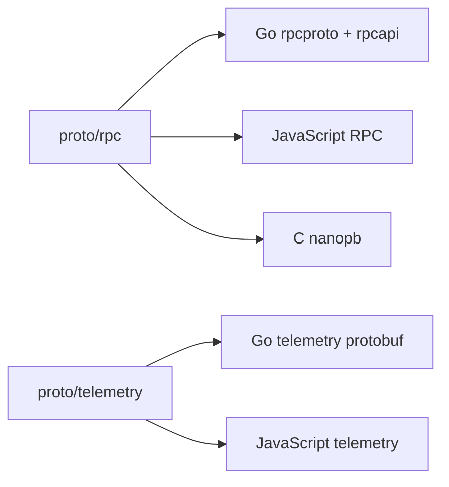

# Proto API

`api/proto/` is the root directory of all Protobuf source contracts. Protobuf is an encoding format; under it, RPC and Telemetry continue to be distinguished according to protocol usage, and all `.proto` files cannot be tiled into the same directory.

```text
api/proto/
├── rpc/
│   ├── rpc.proto
│   ├── nanopb.options
│   └── payload/
└── telemetry/
    └── peer_telemetry.proto
```

## Boundary

- `rpc/` Define the request, response, error, stream frame and method payload on the Peer connection.
- `telemetry/` Defines the high-frequency event wire format sent by Peer to Server in one direction.
- Both can share the Protobuf tool chain, but transport semantics cannot be confused just because they both use Protobuf.
- Proto schema is not generated from HTTP Shared/Resource JSON Schema conversion, nor is HTTP DTO generated in reverse.

## Generate results



## Subdocument

- [Peer RPC](./rpc/overview): RPC schema division of labor, provider/caller direction and cross-language boundaries.
- [Telemetry](./telemetry): Telemetry event data path and design rules.
- [Generation and Change](../generation): Complete generation command and verification process.
