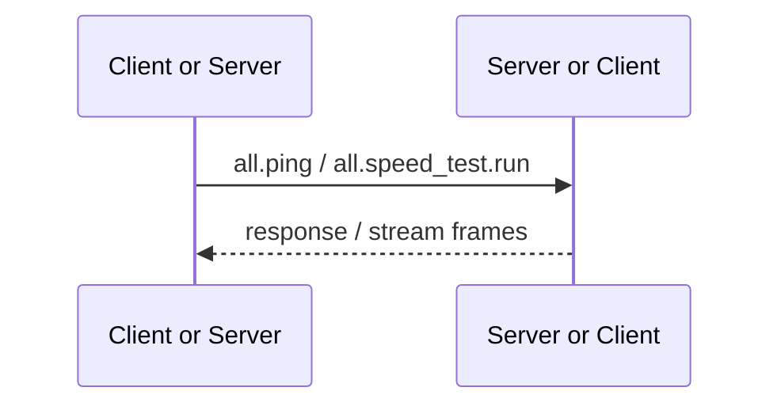

# Both Provided

Both Provided RPC is implemented by both sides of the connection. Either Client or Server can be used as caller or provider, which is used for connection diagnosis and transport measurement without reading the unique product resources of one end.

## Methods

| Method | Function | Implementation requirements |
| --- | --- | --- |
| `all.ping` | Verify that the RPC request/response path is available | Both Client and Server return Ping response |
| `all.speed_test.run` | Perform throughput test on RPC stream | Both Client and Server process speed-test stream |

## Calling relationship

`all.*` Only suitable for truly symmetrical basic abilities. Data or behavior owned only by one end must use `client.*` or `server.*`, and cannot be placed in `all.*` for the purpose of reusing the handler.
