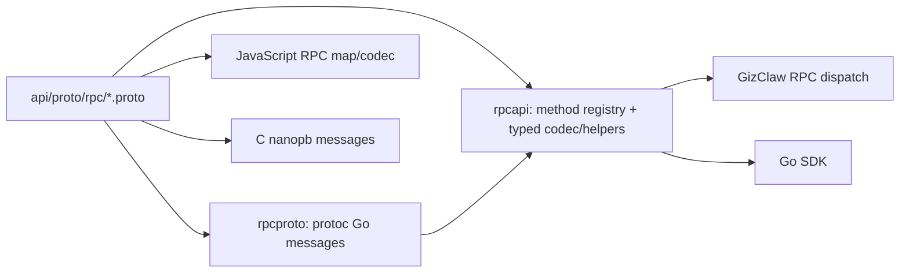

# Peer RPC

Peer RPC is the request, response, and stream contract on the Giznet Peer connection. It uses Protobuf to define wire messages and is not generated via OpenAPI or JSON Schema.

## Schema division of labor

```text
api/proto/rpc/
├── rpc.proto          # request, response, error, stream, and method registry
├── nanopb.options     # C/nanopb generation configuration
└── payload/
    ├── ai.proto
    ├── edge.proto
    ├── enums.proto
    ├── firmware.proto
    ├── gameplay.proto
    ├── social.proto
    ├── system.proto
    └── workspace.proto
```

`rpc.proto` unifiedly owns the core RPC protocols: `RpcRequest`, `RpcResponse`, `RpcStreamFrame`, `RpcError`, `RpcErrorCode`, `RpcMethodOptions` and the complete `RpcMethod` registry. Request and Response belong to the same envelope contract and are not split into `peer.proto` and `common.proto`.

`nanopb.options` Only controls the generation behavior of C/nanopb and does not define wire messages. `payload/` Have method-specific messages by domain to avoid core `rpc.proto` absorbing business DTOs.

## The relationship between generation and running



`rpcproto` only has Protobuf wire messages, and the Go package is named `rpcpb`. `rpcapi` provides method registry, typed payload codec and stream frame helpers on it; the handwritten interface and call point directly use the `rpcpb` type that defines the message, without renaming through `rpcapi` alias. RPC handler and domain service do not belong to these two packages.

## Method Design

- Method name should be stable and reflect domain ownership, and cannot be bound to a certain Go file name.
- Request/response payload is put into the corresponding field proto; cross-field enum is entered into `enums.proto`.
- Ordinary request response, long data stream and direct packet are different transport shapes and should not be combined into one message through optional fields.
- Error code is a wire contract; domain errors must be stably mapped at the Server adapter, and the internal error string cannot be used as a protocol.
- Edge route RPC uses `edge.proto` messages directly and does not maintain JSON DTO in HTTP shared schema.

Any method or payload changes must simultaneously check Go Server, Go SDK, JavaScript SDK, C SDK and e2e, rather than just confirming that Protobuf can be generated.

## Provider direction

The RPC method prefix describes who provides the capability, not which file the request is issued from:

- [Both Provided](./both-provided): A common diagnostic method implemented by both Client and Server.
- [Client Provided to Server](./client-provided-to-server): Server calls, device capabilities implemented by Client.
- [Server Provided to Client](./server-provided-to-client): Client calls, products and resource capabilities implemented by Server.
- [Server Provided to Edge-node](./server-provided-to-edge-node): Edge-node call, routing control capability implemented by Server.
