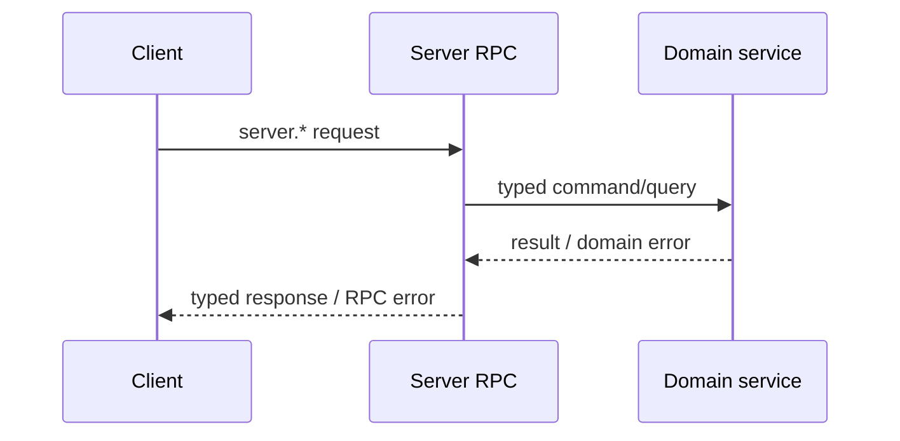

# Server Provided to Client

This set of capabilities is implemented by Server and called by Client/Device through Peer connection. It is the main RPC surface for Clients to access Server runtime, resources and product services.

## Method groups

| Prefix | Main capabilities |
| --- | --- |
| `server.info.*` | Reading and updating Server/Peer information |
| `server.runtime.*`, `server.status.*` | Runtime and status query |
| `server.run.*` | Agent, Workspace, history, memory, recall, say, reload and stop |
| `server.firmware.*` | Firmware list/get and files download |
| `server.workspace.*` | Workspace CRUD, history and history audio |
| `server.workflow.*` | Workflow list/get read-only query |
| `server.model.*` | Model CRUD |
| `server.voice.*` | Voice list/get |
| `server.credential.*` | Credential CRUD |
| `server.contact.*` | Contact CRUD |
| `server.friend.*` | Friend and invite-token operations |
| `server.friend_group.*` | Group, member, message and invite-token operations |
| `server.game_ruleset.*` | Gameplay ruleset lookup |
| `server.pet.*` | Pet resource CRUD and drive |
| `server.pet.actions.get` | Press Pet to get available actions, without returning the complete PetDef |
| `server.pet.pixa.download` | Press Pet to download PIXA metadata and materials without exposing PetDef API |
| `server.badge.*` | Badge resource query |
| `server.badge_def.pixa.download` | Download the PIXA material associated with Badge Definition; Badge Definition CRUD is not provided |
| `server.points.*` | Points account and transactions |
| `server.game_result.*`, `server.reward_grant.*` | Gameplay result and reward query |
| `server.tool.*` | Tool CRUD |

`server.peer.lookup`, `server.peer.assign` and `server.route.resolve` do not belong to this page; they are only available to Edge-node.

## Workflow localization

`server.workflow.list` and `server.workflow.get` accept `WorkflowLocale lang`. The initial enum only contains `en` and `zh-CN`; when it is not specified, the requested language does not exist or cannot be recognized, the server uses `i18n.default_locale` of Workflow. `Workflow.i18n` in the RPC response only contains the final selected one `WorkflowI18nCatalog`, and neither the complete language table nor the actual hit locale is returned.

The catalog is selected as a whole by language, and is not spliced ​​field by field across languages. When the selected catalog is missing `name`, the client uses stable `Workflow.name`; when `description` is missing, the client uses an empty string. The Admin API still returns the full `WorkflowI18n` and is persisted by Server along with Workflow.

## Calling relationship

RPC adapter is responsible for payload decoding, method dispatch and stable error mapping; domain service is responsible for authorization, resource rule, storage and lifecycle. These business behaviors cannot be implemented in the generated RPC package.
