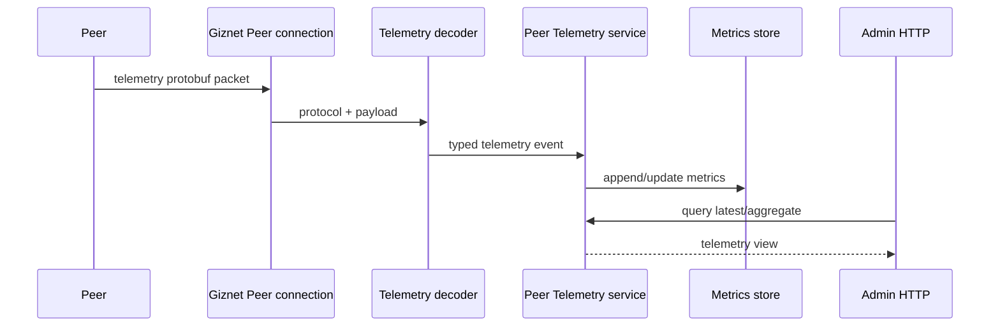

# Telemetry API

`api/proto/telemetry/peer_telemetry.proto` Defines the telemetry event wire format sent by Peer to Server. It is a high-frequency one-way event stream, not an RPC method, and not an Admin HTTP resource.

## Data path

Telemetry Protobuf owns the wire fields reported by the device. Metrics store has save and query semantics; Admin HTTP has a response contract for administrators. Do not directly use the storage model as a telemetry wire message for convenience, and do not let the device depend on the Admin response DTO.

## Design rules

- The high frequency field should remain compact, stable and backward compatible.
- New fields must have explicit units, time semantics, and default values; they cannot just rely on guesswork from Go annotations.
- Decoder treats malformed or out-of-limit input as untrustworthy boundaries.
- Aggregation, retention and query filtering belong to service/store and not to wire schema.
- Regenerate Go and JavaScript telemetry code after Schema changes, and verify the real packet decode and service ingestion.
