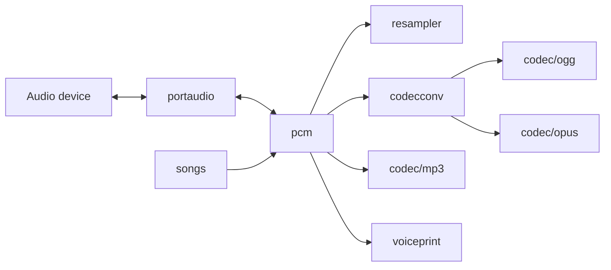

# pkgs/audio Overview

`pkgs/audio` Provides GizClaw reusable audio codec, PCM pipeline, device I/O, resampling, music rendering and voiceprint capabilities. The product layer can combine these packages, but the codec and audio processing do not own the peer, agent, workspace or transport lifecycle.

## Package structure

```text
pkgs/audio/
├── codec/
│   ├── mp3/         # MP3 encode / decode
│   ├── ogg/         # Ogg pages, packets and streams
│   └── opus/        # Opus encode / decode
├── codecconv/       # PCM, Ogg and Opus conversion
├── pcm/             # PCM formats, chunks, tracks and mixer
├── portaudio/       # Native capture and playback
├── resampler/       # Sample-rate and channel conversion
├── songs/           # Song definitions and PCM rendering
└── voiceprint/      # Speaker embedding and identity detection
```

## Data flow relationship



## Package Navigation

- Codec: [mp3](./codec-mp3), [ogg](./codec-ogg), [opus](./codec-opus)
- Conversion and PCM: [codecconv](./codecconv), [pcm](./pcm), [resampler](./resampler)
- Device and product materials: [portaudio](./portaudio), [songs](./songs)
- Identification: [voiceprint](./voiceprint)

Audio packages only have format, frame, sample, device stream and signal-processing contract. WebRTC track, Peer connection, Agent realtime stream and product resources belong to giznet, gizclaw runtime and domain services respectively.
