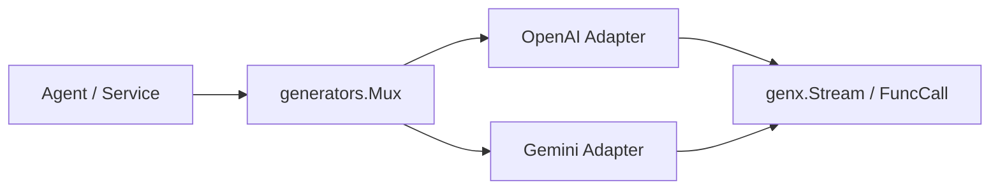

# Generators Overview

`pkgs/genx/generators` manages the registration and selection of `genx.Generator`. The caller uses the pattern to select the Generator, and then executes the generation with the unified `ModelContext -> Stream` contract, without directly binding the specific model protocol.

[Go API References](https://pkg.go.dev/github.com/GizClaw/gizclaw-go@v0.0.0-20260707135347-b9bf1fb24b9f/pkgs/genx/generators)

## Structure

| Modules | Responsibilities |
| --- | --- |
| [OpenAI Adapter](./openai) | Convert OpenAI-compatible Chat Completions to GenX message, stream, tool call and usage. |
| [Gemini Adapter](./gemini) | Convert Gemini GenerateContent to the same GenX contract. |

## Core structure and main function

| Symbol | Function |
| --- | --- |
| [`Mux`](https://pkg.go.dev/github.com/GizClaw/gizclaw-go@v0.0.0-20260707135347-b9bf1fb24b9f/pkgs/genx/generators#Mux) | Stores the route of pattern to Generator and complete the matching. |
| [`NewMux`](https://pkg.go.dev/github.com/GizClaw/gizclaw-go@v0.0.0-20260707135347-b9bf1fb24b9f/pkgs/genx/generators#NewMux) | Create an independent Generator registry. |
| [`Handle`](https://pkg.go.dev/github.com/GizClaw/gizclaw-go@v0.0.0-20260707135347-b9bf1fb24b9f/pkgs/genx/generators#Handle) | Register the Generator with the default registry. |
| [`GenerateStream`](https://pkg.go.dev/github.com/GizClaw/gizclaw-go@v0.0.0-20260707135347-b9bf1fb24b9f/pkgs/genx/generators#GenerateStream) | Select Generator and return the generated result Stream. |
| [`Invoke`](https://pkg.go.dev/github.com/GizClaw/gizclaw-go@v0.0.0-20260707135347-b9bf1fb24b9f/pkgs/genx/generators#Invoke) | Request the model to call the specified FuncTool, and return the usage and parsed call. |

Generators only manage generating protocols and routes. Model configuration, credentials, tenants, and product catalog do not belong to this package.
