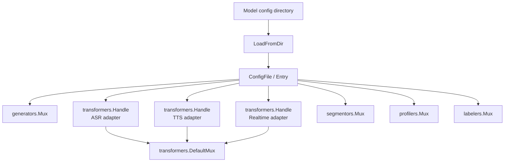

# Model Loader

`pkgs/genx/modelloader` Read the model configuration and register Generator, ASR, TTS, Realtime, Segmentor, Profiler and Labeler to the corresponding mux. It is the adaptation layer between configuration and runtime capability registration.

[Go API References](https://pkg.go.dev/github.com/GizClaw/gizclaw-go@v0.0.0-20260707135347-b9bf1fb24b9f/pkgs/genx/modelloader)

## Loading relationship

## Core structure and main function

| Symbol | Function |
| --- | --- |
| [`ConfigFile`](https://pkg.go.dev/github.com/GizClaw/gizclaw-go@v0.0.0-20260707135347-b9bf1fb24b9f/pkgs/genx/modelloader#ConfigFile) | Express a single model configuration file. |
| [`Entry`](https://pkg.go.dev/github.com/GizClaw/gizclaw-go@v0.0.0-20260707135347-b9bf1fb24b9f/pkgs/genx/modelloader#Entry) | Describe the model capabilities to be registered and their parameters. |
| [`VoiceEntry`](https://pkg.go.dev/github.com/GizClaw/gizclaw-go@v0.0.0-20260707135347-b9bf1fb24b9f/pkgs/genx/modelloader#VoiceEntry) | Describe the voice configuration used by the voice model. |
| [`LoadFromDir`](https://pkg.go.dev/github.com/GizClaw/gizclaw-go@v0.0.0-20260707135347-b9bf1fb24b9f/pkgs/genx/modelloader#LoadFromDir) | Scan the directory, parse the configuration and register the capabilities, and return successfully loaded entries. |

Model Loader does not own the product model catalog or credential resource. The product layer is responsible for generating and protecting the configuration, and the Loader only interprets the configuration and establishes the runtime registration relationship.
