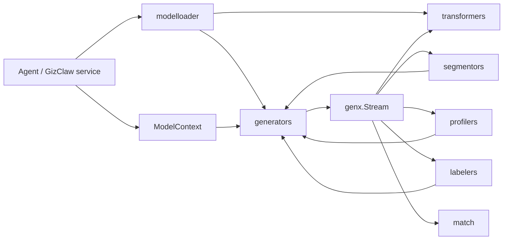

# pkgs/genx Overview

`pkgs/genx` is GizClaw’s general multi-modal AI stream processing layer. It defines message, model context, tool, generator, transformer and stream contract so that Agent and product services can combine model capabilities without directly relying on a certain provider's protocol.

[Go API References](https://pkg.go.dev/github.com/GizClaw/gizclaw-go@v0.0.0-20260707135347-b9bf1fb24b9f/pkgs/genx)

## Package structure

```text
pkgs/genx/
├── generators/    # Generator registration, selection, and invocation
├── transformers/  # ASR, TTS, Realtime, and stream transformation
├── segmentors/    # conversation segmentation and entity-relation extraction
├── profilers/     # entity profile updates
├── labelers/      # Recall query-label selection
├── modelloader/   # load and register model capabilities from configuration
└── match/         # rule- and model-based message matching
```

## Core Interfaces

### Generator

[`Generator`](https://pkg.go.dev/github.com/GizClaw/gizclaw-go@v0.0.0-20260707135347-b9bf1fb24b9f/pkgs/genx#Generator) is the unified entry point to model generation capabilities:

```go
type Generator interface {
    GenerateStream(context.Context, string, ModelContext) (Stream, error)
    Invoke(context.Context, string, ModelContext, *FuncTool) (Usage, *FuncCall, error)
}
```

- `GenerateStream` Generate multi-modal output streams based on model pattern and Model Context.
- `Invoke` requires the model to generate calling parameters specifying `FuncTool`, which is suitable for structured generation.
- OpenAI, Gemini or other provider adapter implement this interface; the upper layer chooses to implement it through `generators.Mux`.

### Transformer

[`Transformer`](https://pkg.go.dev/github.com/GizClaw/gizclaw-go@v0.0.0-20260707135347-b9bf1fb24b9f/pkgs/genx#Transformer) Express stream-to-stream conversion:

```go
type Transformer interface {
    Transform(context.Context, string, Stream) (Stream, error)
}
```

It does not change the calling model: both input and output use `Stream`. ASR can convert audio stream to text stream, TTS can do the opposite conversion, and Realtime and speech translation also respect the same boundary.

### ModelContext

[`ModelContext`](https://pkg.go.dev/github.com/GizClaw/gizclaw-go@v0.0.0-20260707135347-b9bf1fb24b9f/pkgs/genx#ModelContext) is a read-only view of the context required for a model call:

```go
type ModelContext interface {
    Prompts() iter.Seq[*Prompt]
    Messages() iter.Seq[*Message]
    CoTs() iter.Seq[string]
    Tools() iter.Seq[Tool]
    Params() *ModelParams
}
```

It exposes system prompts, historical messages, inference context, callable tools and model parameters respectively. `ModelContextBuilder` is used to assemble a single context, `MultiModelContext` is used to assemble multiple context sources sequentially.

### Stream

[`Stream`](https://pkg.go.dev/github.com/GizClaw/gizclaw-go@v0.0.0-20260707135347-b9bf1fb24b9f/pkgs/genx#Stream) is the common transport protocol between all generation and transformation capabilities:

```go
type Stream interface {
    Next() (*MessageChunk, error)
    Close() error
    CloseWithError(error) error
}
```

- `Next` Gets the next `MessageChunk` in sequence until the stream ends or an error is returned.
- `Close` Terminate normally and release producer resources.
- `CloseWithError` Terminates the flow with the failure reason, allowing errors to be propagated upstream and downstream in the pipeline.

`Merge`, `Split`, `Tee`, `CompositeSeq` and `Iter` provide combining, splitting and consuming capabilities on this minimal interface.

#### StreamCtrl

[`StreamCtrl`](https://pkg.go.dev/github.com/GizClaw/gizclaw-go@v0.0.0-20260707135347-b9bf1fb24b9f/pkgs/genx#StreamCtrl) is optional control information on `MessageChunk`, used to describe chunk The logical subflow it belongs to and the status of the subflow:

| Fields | Semantics |
| --- | --- |
| `StreamID` | Logical route identifier. Correlated text, audio, transcription, or tool chunks can share the same ID while retaining independent MIME-channel lifecycles. |
| `Label` | A substream usage tag, such as `transcript`, `assistant`, or `history.user_audio`; it supplements the StreamID and does not replace the unique identifier. |
| `Error` | The termination error text of the current substream. Usually used together with `EndOfStream`, it is not equivalent to closing the entire Stream. |
| `BeginOfStream` | The current chunk is a starting boundary. A chunk with a Part begins or announces that MIME channel; a control-only chunk begins the StreamID route. |
| `EndOfStream` | The current chunk is an end boundary. A chunk with a Part ends that MIME channel; a control-only chunk ends the whole StreamID route. It can also carry final data or Error. |
| `Timestamp` | The millisecond timestamp of the Chunk for `RealtimeStream` sorting and delayed processing; when the value is zero, `RealtimeStream` will supplement the monotonically increasing value based on the current time. |

`Ctrl == nil` means that the current chunk does not have explicit routing or boundary control information. Consumers should judge the boundaries through `MessageChunk.IsBeginOfStream()` and `IsEndOfStream()` and do not directly assume that `Ctrl` must exist.

#### StreamID, MIME channels, and EOS

`MessageChunk.Ctrl.StreamID` identifies a logical route. One route can carry multiple MIME channels with independent completion boundaries:

- `Text` uses the canonical `text/plain` MIME channel. `Blob` uses its parsed and canonicalized MIME type, including semantically relevant parameters such as `codecs=opus`; case, parameter order, and insignificant spacing do not create a second channel.
- An EOS chunk with a Part ends only that Part's MIME channel on the route. For example, `text/plain` EOS does not end `audio/opus` with the same StreamID.
- A control-only EOS with `Part == nil` ends the whole StreamID route and all of its outstanding MIME channels. It still does not close the enclosing `Stream`.
- A producer that may add a MIME channel after all currently observed channels complete must announce it with a MIME-bearing BOS or data chunk before that completion, or keep the route open until a control-only EOS.
- The same `Stream` can carry multiple StreamIDs in an interleaved manner. `Stream.Close` and `CloseWithError` terminate the enclosing transport and all outstanding routes.
- `Iter` aggregates content readers until the enclosing Stream ends; it does not expose route-aware EOS through `StreamElement`.
- Adapters must preserve StreamID, role, label, MIME type, BOS/EOS, and error semantics instead of keeping boundaries only in private session state.

### Tool

[`Tool`](https://pkg.go.dev/github.com/GizClaw/gizclaw-go@v0.0.0-20260707135347-b9bf1fb24b9f/pkgs/genx#Tool) is a restricted collection of tool types. Currently implemented by [`FuncTool`](https://pkg.go.dev/github.com/GizClaw/gizclaw-go@v0.0.0-20260707135347-b9bf1fb24b9f/pkgs/genx#FuncTool) and `SearchWebTool`.

`FuncTool` Saves the tool name, description, JSON Schema and typed invoke function; Generator is only responsible for generating `FuncCall`, and the actual call is still performed by the upper layer that owns the tool.

## Core data structures

| Structure | Responsibility |
| --- | --- |
| [`Message`](https://pkg.go.dev/github.com/GizClaw/gizclaw-go@v0.0.0-20260707135347-b9bf1fb24b9f/pkgs/genx#Message) | Express a complete multi-modal input or output, consisting of role and contents. |
| [`MessageChunk`](https://pkg.go.dev/github.com/GizClaw/gizclaw-go@v0.0.0-20260707135347-b9bf1fb24b9f/pkgs/genx#MessageChunk) | Incremental messages passed in Stream, carrying content, tool calls, status or flow events. |
| [`ModelParams`](https://pkg.go.dev/github.com/GizClaw/gizclaw-go@v0.0.0-20260707135347-b9bf1fb24b9f/pkgs/genx#ModelParams) | Unify model parameters such as max tokens, temperature, top-p, and allow provider extra fields. |
| [`Usage`](https://pkg.go.dev/github.com/GizClaw/gizclaw-go@v0.0.0-20260707135347-b9bf1fb24b9f/pkgs/genx#Usage) | Record prompt, cache and generated token usage. |
| [`State`](https://pkg.go.dev/github.com/GizClaw/gizclaw-go@v0.0.0-20260707135347-b9bf1fb24b9f/pkgs/genx#State) | Generate final state such as expression completion, truncation, rejection or error. |

## Calling relationship



`genx.Stream` is the common data boundary of capability combination. Generators generate streams; Transformers rewrite streams; Segmentors, Profilers, and Labelers use Generators to complete structured reasoning; Model Loader is responsible for parsing configurations into registration relationships for these capabilities.

## Placement rules

- Common message, stream, model, and tool contracts are placed in the `pkgs/genx` root package.
- Capabilities that can be selected by name are registered through the mux of the corresponding sub-package, and the second set of routing tables is not maintained by the product service.
- Provider SDK adapter is placed in the package with this specific capability; provider credential and product model resource still belong to `pkgs/gizclaw/services/ai`.
- Agent memory, workspace, running Agent lifecycle and product HTTP/RPC do not belong to `genx`.
