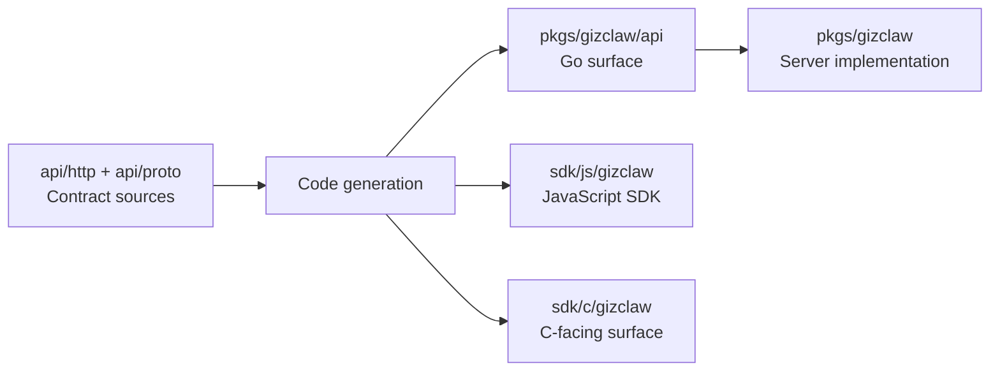

# pkgs/gizclaw/api

`pkgs/gizclaw/api` Stores the Go API surface generated and submitted by GizClaw, as well as the codec and adaptation that closely follow the generated contract. The source of truth of Public contract is located in the repository root directory `api/`.

## Directory relationship



API changes must start from the source schema, and then synchronize the generation and verification of all affected language surfaces. A generated directory cannot be modified as an independent contract.

## Directory structure

```text
pkgs/gizclaw/api/
├── adminhttp/     # Admin HTTP Go surface
├── apitypes/      # HTTP Shared and Resource Go models
├── openaihttp/    # OpenAI-compatible HTTP surface
├── peerhttp/      # Peer HTTP Go surface
├── rpcapi/        # RPC method registry, typed codecs, and helpers
├── rpcproto/      # Protobuf-generated RPC messages
└── telemetry/     # Telemetry protobuf contract
```

## Subdirectory responsibilities

### adminhttp

Stores the request/response type, client, server interface and route contract generated by Admin HTTP OpenAPI. It describes the HTTP protocol for managing surfaces and does not have business implementations of ACLs, AI, Gameplay, Peers, or other resources.

### apitypes

Stores the Go models generated from `api/http/shared.json` and its referenced `api/http/resources/*.json`. The Source layer still maintains the one-way dependency and ownership boundaries of Shared and Resources; Go generated output can be concentrated in a package, without mirroring the source directory.

### openaihttp

Stores the generated contract for the GizClaw OpenAI-compatible HTTP surface. It is responsible for aligning with OpenAI-compatible request, response and route shapes; the running behavior of Agent, GenX, model and workflow belongs to the corresponding AI services.

### peerhttp

Stores the generated contract of the Public API, including Server information, login, WebRTC Offer and Peer self endpoints. The Go package name remains `peerhttp`; Session, signaling, registration and runtime queries are implemented by root `pkgs/gizclaw` handlers and domain services.

### rpcapi

Provides method registry, typed payload codec, stream helpers and error contract on top of RPC protobuf messages. The handwritten API directly uses the message types defined in `rpcpb` and does not maintain cross-package alias in `rpcapi`. RPC dispatch and the specific method handler belong to the RPC module of the root `pkgs/gizclaw`.

### rpcproto

Stores wire messages generated from RPC protobuf schema. The Go package is named `rpcpb`, and the directory path remains `rpcproto`; this package only expresses protobuf wire format and does not have RPC method semantics or business behavior.

### telemetry

Stores the device telemetry protobuf contract. The decoding, state projection, aggregation and metrics writing of Telemetry packets belong to `services/runtime/peertelemetry` and cannot be written into the generated package.

## Ownership Boundary

These sub-packages jointly own the Go contract surface, but the source of truth of the contract is still at the root `api/`. The generated directories can be shared `apitypes`, but DTOs cannot be copied to each other, and handlers, storage, authorization or domain lifecycle cannot be written into the generated package.

## Code placement rules

The root `api/` should be modified:

- Add or modify public HTTP endpoint.
- Add or modify RPC method, payload or enum.
- Modify cross-language shared product schema.
- Modify telemetry wire contract.

It should be written as `pkgs/gizclaw/api`:

- Go files generated and committed by Schema generation.
- The generator itself and the build configuration.
- A codec/adapter that adheres closely to the wire/generated contract and does not contain business storage or domain rules.

Should not be written here:

- Business implementation of Admin, Peer or Edge handler.
- Domain resource storage, validation and lifecycle.
- JavaScript, C, or desktop-specific implementation.
- A second set of public DTOs maintained manually.

The core boundary of the API directory is the contract, not the service implementation.
