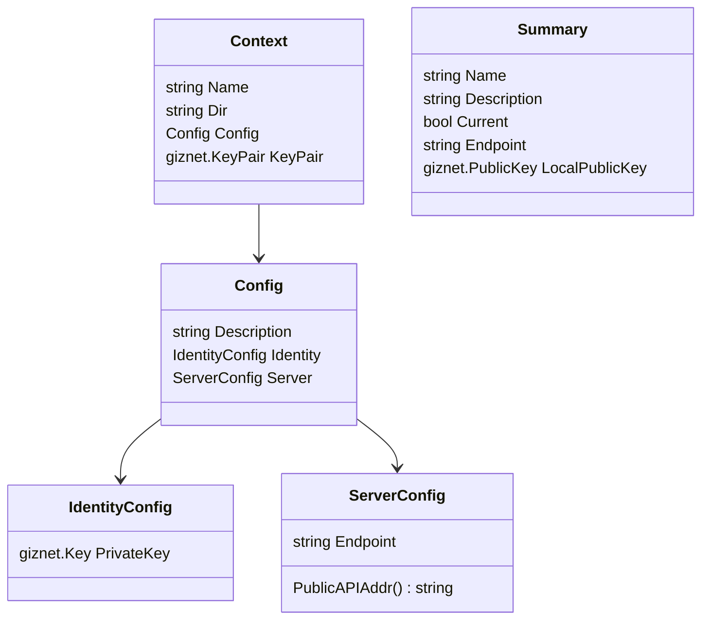
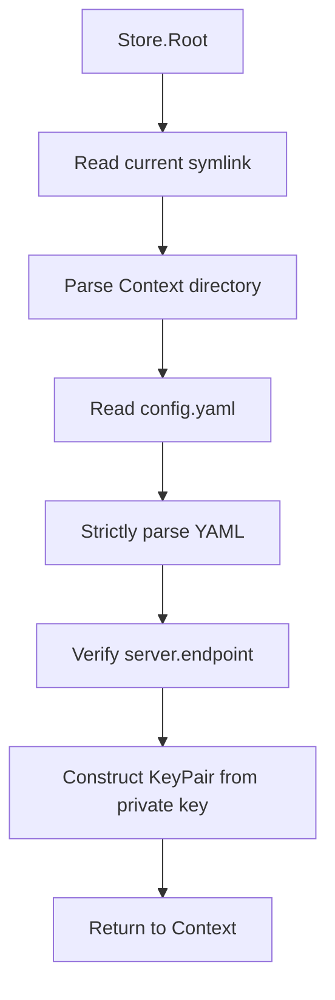

# Context Store

`pkgs/gizclaw/contextstore` Manages the local connection Context of the GizClaw client. Each Context is bound to a local Giznet identity and a target Server endpoint; the CLI or other client first selects the Context and then uses its configuration to establish a connection.

[Go API References](https://pkg.go.dev/github.com/GizClaw/gizclaw-go@v0.0.0-20260707135347-b9bf1fb24b9f/pkgs/gizclaw/contextstore)

## Disk structure

```text
<context-root>/
├── current -> local
├── local/
│   └── config.yaml
└── staging/
    └── config.yaml
```

- Each first-level subdirectory is a named Context.
- `current` is a symbolic link pointing to the current Context directory name.
- The permissions of the new Context directory are `0700`, and the permissions of `config.yaml` are `0600`.
- When deleting the current Context, `current` will also be removed, and a replacement Context will not be automatically selected.

## config.yaml

```yaml
description: Local development server
identity:
  private-key: <giznet-private-key>
server:
  endpoint: 127.0.0.1:8080
```

`private-key` is a local identity credential and cannot be submitted to the repository, documentation examples, or logs. `Store.Create` will generate a new Giznet key pair and only write the private key to the Context configuration.

## Config structure



| YAML fields | Go fields | Meaning | Rules |
| --- | --- | --- | --- |
| `description` | `Config.Description` | Optional description of Context. | Remove leading and trailing whitespace when creating; can be omitted. |
| `identity.private-key` | `IdentityConfig.PrivateKey` | The local Giznet private key of the current Context. | Required; must be able to construct valid `giznet.KeyPair`. |
| `server.endpoint` | `ServerConfig.Endpoint` | Target Server Public API address. | Required; the format must be `host:port` and cannot contain `http://` or `https://`. |

Enable unknown-field rejection when parsing `config.yaml`. Misspelled or undefined YAML fields will directly return an error and will not be silently ignored.

## Loading process



`LoadSummary` Use the same configuration and private-key verification, but only return the name, description, endpoint, current status and local public key required by the list UI.

## Core structure and main function

| Symbol | Function |
| --- | --- |
| `Config` | The complete typed representation of `config.yaml`. |
| `Context` | Loaded Context directory, configuration and derived KeyPair. |
| `Summary` | Lightweight metadata used by the Context list. |
| `Store` | Manage multiple Contexts with `Root` as the boundary. |
| `Load` / `LoadConfig` / `LoadSummary` | Load full Context, strict configuration or list summary. |
| `Store.Create` / `CreateWithOptions` | Verify name and endpoint, generate identity and write to new Context. |
| `Store.Use` | Update `current` symlink to switch Context. |
| `Store.Current` / `LoadByName` | Load the context of the current or specified name. |
| `Store.List` / `ListSummaries` | List Contexts sorted by name and mark the current item. |
| `Store.Delete` | Delete the named Context and, if necessary, remove `current`. |
| `validateName` / `validateEndpoint` | Restrict directory name and `host:port` endpoint format. |

## Ownership Boundary

Context Store is not responsible for Server config, Peer registration, WebRTC signaling, HTTP/RPC client, workspace content or other server resources. After the caller obtains the identity and endpoint from the Context Store, the GizClaw connection is established by the connection layer.
