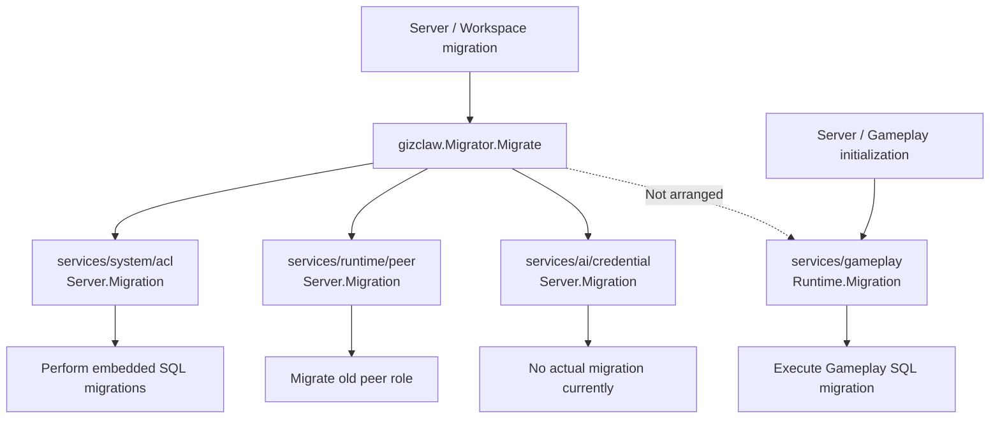

# migrator

`migrator.go` There are currently production calls and also include the actual migrations performed, not unused history files.

## File function

| Documentation | Features included |
| --- | --- |
| `pkgs/gizclaw/migrator.go` | Define cross-domain `Migrator`, and call migration in each domain in the order of ACL, Peer, and Credential. The service corresponding to the unconfigured optional store is allowed to be `nil`. |
| `cmd/internal/server/migrator.go` | Open SQL/KV store according to Server configuration, create domain service and assemble `gizclaw.Migrator`; provide workspace migration entry point and store cleanup. |

## Calling path

```text
ServeContext
└── NewMigrator(config)
    ├── open ACL / Peer / Credential stores
    └── gizclaw.Migrator.Migrate
        ├── ACL.Migration
        ├── Peers.Migration
        └── Credentials.Migration
```

`cmd/internal/server/workspace.go` Execute migration before Server officially listens on the port. `MigrateWorkspace` also provides an entry point to migrate only the specified workspace without starting the server.

## Migration Service relationship



Root `Migrator` only orchestrates ACL, Peer and Credential. Gameplay also defines `Migration`, but it is directly called by the initialization path of Server and Gameplay runtime, and does not belong to the execution sequence of the root `Migrator`.

## Currently defined migrations

| Domain | Current Behavior |
| --- | --- |
| `services/system/acl` | Execute embedded `migrations/*.sql`; create ACL tables and be compatible with `acl_policy_bindings.display_order`. |
| `services/runtime/peer` | Scan the persistent Peer and update the old role value `gear` to the current `client`. |
| `services/ai/credential` | `Migration` The method has been connected to the call chain, but currently only returns `nil`, and there is no actual migration behavior. |

Gameplay runtime also has its own SQL migration, but it is executed by the Gameplay runtime initialization path and does not belong to the ACL/Peer/Credential orchestration of this root `Migrator`.

## Ownership Boundary

The specific schema or data conversion logic is owned by the corresponding domain service; the root `Migrator` is only responsible for determining the execution sequence and aggregating errors. The hosting layer is responsible for opening and closing the real store according to configuration.

## Core structure and main function

| Symbol | Function |
| --- | --- |
| [`Migrator`](https://pkg.go.dev/github.com/GizClaw/gizclaw-go@v0.0.0-20260707135347-b9bf1fb24b9f/pkgs/gizclaw#Migrator) | Combine ACL, Peer and Credential migration services. |
| [`Migrator.Migrate`](https://pkg.go.dev/github.com/GizClaw/gizclaw-go@v0.0.0-20260707135347-b9bf1fb24b9f/pkgs/gizclaw#Migrator.Migrate) | Run configured realm migrations in sequence. |
