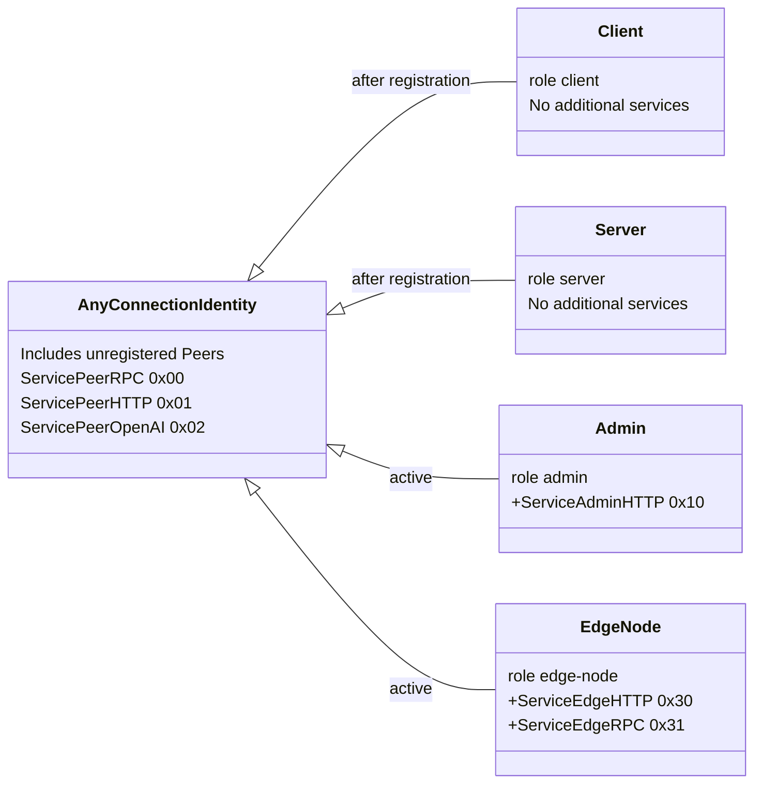
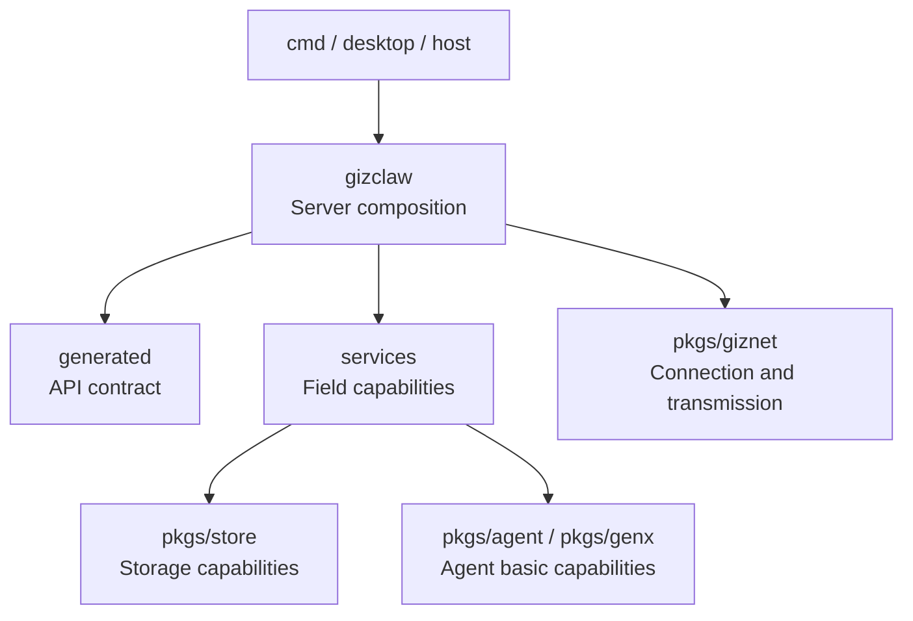

# pkgs/gizclaw

`pkgs/gizclaw` is the core package of GizClaw product layer. It combines API contract, domain services, Peer Runtime and Server public surface on top of the universal connection and transport provided by `pkgs/giznet`.

This directory holds GizClaw Server behaviors that can be reused by CLI Server, desktop, or other hosts; the process-specific configuration loading, storage backend selection, and startup processes belong to `cmd/`.

[Go API References](https://pkg.go.dev/github.com/GizClaw/gizclaw-go@v0.0.0-20260707135347-b9bf1fb24b9f/pkgs/gizclaw)

## Document structure

Currently the `peer_*`, `server_*` and `rpc_*` files are still located directly at `pkgs/gizclaw/`. Documents are grouped directly according to these stable prefixes, without adding repeated `gizclaw/` intermediate layers. `generated` is the document name, and the actual code directory is `api/`.

```text
pkgs/gizclaw/
├── peer/          # documentation group for the current peer_*.go files
├── server/        # documentation group for the current server*.go files
├── rpc/           # documentation group for the current rpc_*.go files
├── services/      # actual directory for services organized by product domain
├── generated/     # documentation group backed by pkgs/gizclaw/api/
├── contextstore/  # actual directory for local client context storage
└── customid/      # actual directory for cross-domain product resource IDs
```

## What are the responsibilities of each group?

### peer, server and rpc

[peer](./peer/overview), [server](./server/overview) and [rpc](./rpc/overview) directly expand the files with the corresponding prefix in the current root package. They share connection, server composition and RPC runtime responsibilities and do not have business rules in a single domain.

### services

[services](./services/overview) is an actual domain-level directory that contains AI, device, gameplay, runtime, social and system resources, validation, storage and service lifecycle.

### generated

[generated](./api) corresponds to the actual directory `pkgs/gizclaw/api/`. It saves the Go contract generated and submitted from the root directory `api/` schema, as well as the codec and stable adaptation closely following the contract. Public contracts must be modified from the source schema and cannot be directly modified to generate results.

### contextstore

[contextstore](./contextstore) Saves the client connection context, including local identity, target endpoint and current context selection. It is not a Server business data store.

### customid

[customid](./customid) saves the product resource ID rules commonly recognized by multiple GizClaw surfaces or domains, and does not include domain private database keys or universal encoding helpers.

## Service Layout

`pkgs/gizclaw` Divide a giznet connection into multiple independent product surfaces. `Service*` The name is only used for RPC or HTTP carried on the reliable giznet service stream; the service ID also determines which handler is used at both ends of the connection, and also constitutes the authorization boundary of the Server security policy.

| Service | ID | Agreement and Responsibilities | Access Boundary |
| --- | ---: | --- | --- |
| `ServicePeerRPC` | `0x00` | Business RPC between Peer and Server | Any connection identity |
| `ServicePeerHTTP` | `0x01` | Server information, login, WebRTC Offer and current Peer information | Any connection identity |
| `ServicePeerOpenAI` | `0x02` | Expose OpenAI-compatible HTTP through Peer connection | Any connection identity |
| `ServiceAdminHTTP` | `0x10` | Resource Management and Operation HTTP API | active `admin` Peer |
| `ServiceEdgeHTTP` | `0x30` | Edge forwards public API requests to the authoritative Server | active `edge-node` Peer |
| `ServiceEdgeRPC` | `0x31` | Edge queries Peer, allocates Peer and resolves routes | active `edge-node` Peer |



The "any connection identity" here is a service-level policy, not a `PeerRole`. Unregistered Peers, as well as Peers registered as `client`, `server`, `admin` or `edge-node`, can open three general peer services. Specific endpoints can still continue to check session, registration status or role at the handler layer.

### Boundaries of each surface

- **Peer RPC**: carries common, client and server RPC methods. It is an RPC surface for the device and server to exchange information, runtime, workspace, workflow, social and gameplay data; see [RPC](./rpc/overview) for the method and calling path.
- **Peer HTTP**: Only carries the HTTP endpoint related to the connection establishment and the current Peer, including `/server-info`, `/login`, `/webrtc/v1/offer`, `/me`, `/me/status` and `/me/runtime`; for the handler organization, see [Peer HTTP · WebRTC](./peer/service/webrtc) and [Peer HTTP · /me](./peer/service/peer-http-me).
- **Peer OpenAI-compatible HTTP**: Place the OpenAI-compatible handler on an independent service stream and do not mix it with the bootstrap and signaling endpoints of Peer HTTP.
- **Admin HTTP**: Provides resource management surface for Peer with active `admin` role. It covers ACL, workflow, firmware, credential, model, gameplay, AI tenant, workspace, Peer and social resource; see [Peer Services](./peer/service/overview) for the entry point to each field.
- **Edge HTTP**: Edge uses the Peer identity of the incoming token to forward browser/device public API requests to the authoritative Server; it is not an Admin surface.
- **Edge RPC**: Only three edge-node control methods `server.peer.lookup`, `server.peer.assign` and `server.route.resolve` are provided; see [Edge RPC](./rpc/edge) for implementation boundaries.

### Event and Media do not belong to Service

The following identifiers are also defined by `pkgs/gizclaw`, but do not belong to the HTTP/RPC service layout above:

| Identifier | Value | Transport semantics |
| --- | ---: | --- |
| `EventStreamAgent` | `0x20` | Reliable Agent event stream |
| `EventStreamTelemetry` | `0x40` | Unreliable telemetry event packet |
| `MediaStreamOpus` | `audio/opus` | WebRTC Opus media track codec |

Therefore, use `Service*` when adding an RPC or HTTP surface; when adding an event or media capability, you should first determine whether it is a reliable event stream, a direct packet, or a WebRTC media track. You cannot put it into the Service namespace just because it shares a Peer connection.

## Depends on direction



- Host provides storage, transport and running configuration, and then assembles GizClaw Server.
- `peer`, `server` and `rpc` are grouped to connect public surface, Peer Runtime and domain services.
- `services` has behaviors in various fields and can rely on generated contracts and necessary basic packages.
- `pkgs/gizclaw` consumes `pkgs/giznet`; `pkgs/giznet` does not rely on product logic in reverse.

If a change is to be written into the root package just because "Server will use it", first determine whether it belongs to connection composition, specific domain, public schema, host process or general basic capabilities.
