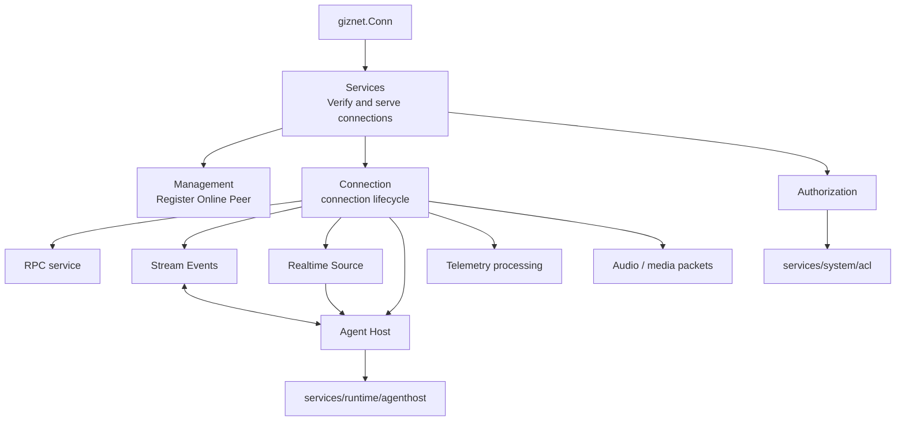

# Peer Runtime

Peer Runtime is responsible for connecting the established `giznet.Conn` to the GizClaw product runtime. Entries are organized by responsibility module; implementation files are only used to locate the code.

## Module

| Module | Responsibilities | Implementation files |
| --- | --- | --- |
| [Management](./manager) | Online Peer, connection replacement, runtime query and device information refresh. | `peer_manager.go` |
| [Authorization](./authorizer) | Connect the current Peer identity to the ACL view and policy. | `peer_authorizer.go` |
| [Connection](./conn) | The service, packet, Agent, telemetry and media life cycle of a single connection. | `peer_conn.go`, `peer_conn_openai.go` |
| [Services](./service/overview) | Provides Admin, Public HTTP, WebRTC and other Giznet services on connection. | `peer_service.go`, `peer_service_*.go` |
| [Agent Host](./agent-host) | Assemble the Agent Host for the current Peer. | `peer_agent_host.go` |
| [Realtime Source](./realtime-source) | Connect Peer realtime input to GenX stream. | `peer_realtime_source.go` |
| [Stream Events](./stream-event) | Convert between Agent chunks, product events, and media packets. | `peer_stream_event.go` |

## Calling relationship

WebRTC, DataChannel and service stream multiplexing belong to `pkgs/giznet`; Peer's persistent resources, route, run state and telemetry aggregation belong to `services/runtime`. Peer Runtime has connection-scoped product wiring.
