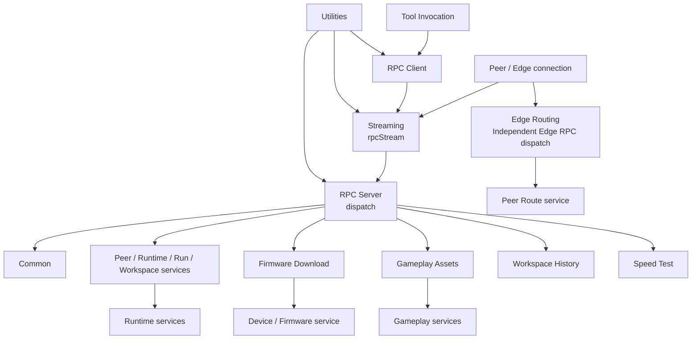

# RPC

The RPC module is responsible for client/server, dispatch, stream framing and domain data stream adaptation of GizClaw RPC.

## Module

| Module | Responsibilities | Implementation files |
| --- | --- | --- |
| [Common](./all) | Ping common to all RPC connections. | `rpc_all.go` |
| [Client](./client) | Client-side RPC receiver, Client info and identifiers query. | `rpc_client.go` |
| [Server](./server) | RPC Server composition, dispatch, Server methods, and handling for unimplemented methods. | `rpc_server.go` |
| [Firmware Download](./firmware) | Firmware binary streaming. | `rpc_firmware.go` |
| [Gameplay Assets](./gameplay-pixa) | Gameplay pixa asset streaming. | `rpc_gameplay_pixa.go` |
| [Workspace History](./workspace-history) | History audio streaming. | `rpc_workspace_history.go` |
| [Speed Test](./speed) | Bidirectional RPC/DataChannel throughput test. | `rpc_speed.go` |
| [Streaming](./stream) | Frame, protobuf envelope and EOS. | `rpc_stream.go` |
| [Tool Invocation](./tool) | Server calls the online Peer tool. | `rpc_tool.go` |
| [Utilities](./utils) | Request loop, typed payload and error helpers. | `rpc_utils.go` |
| [Edge Routing](./edge) | Peer lookup, assignment and route resolve. | `rpc_edge.go` |

## Calling relationship

The RPC source contract belongs to `api/proto/rpc/`, and the generated types belong to `pkgs/gizclaw/api/rpcapi` and `rpcproto`. The RPC module only has runtime wiring, framing and domain service adaptation.
