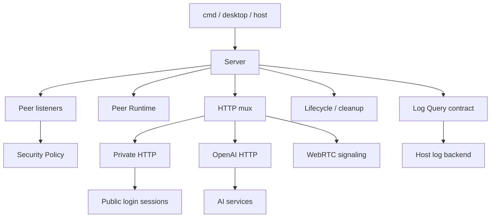

# Server

The Server module is responsible for the assembly, life cycle, HTTP entry and connection security policies of the complete GizClaw Server.

## Module

| Module | Responsibilities | Implementation files |
| --- | --- | --- |
| [Server](./main) | Composition root, listeners, service initialization and life cycle. | `server.go` |
| [Log Query](./log-query) | Log query contract, stream request and error model. | `server_log_query.go` |
| [OpenAI HTTP](./openai-http) | Server-level OpenAI-compatible HTTP wiring. | `server_openai_http.go` |
| [Private HTTP](./private-http) | Session identity and authorization for Private ingress. | `server_private_http.go` |
| [Security Policy](./security-policy) | Giznet Peer connection and service access. | `server_security_policy.go` |

## Calling relationship

Domain resource, validation and storage lifecycle belong to `services/<domain>`; process configuration, real store backend and listening address belong to the host layer.
