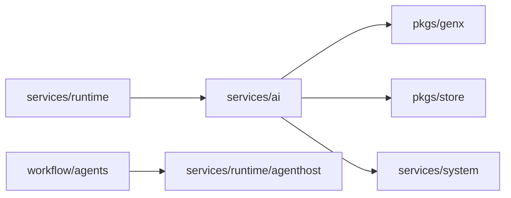

# services/ai

`pkgs/gizclaw/services/ai` Has configurable AI resources and provider integration in GizClaw, including credential, model, voice, workflow and workspace. It organizes these resources into product capabilities that can be consumed by the Agent Runtime, but is not responsible for the online life cycle of the Agent instance.

## Directory structure

```text
services/ai/
├── credential/        # Provider credential resources
├── model/             # Model resources and GenX model resolution
├── openaiapi/         # OpenAI-compatible product service
├── peergenx/          # Peer-backed GenX provider integration
├── providertenants/   # Provider tenant resources and provider-specific configuration
├── voice/             # Voice resources and provider voice resolution
├── workflow/          # Workflow resources and driver selection
│   └── agents/        # concrete workflow agent integrations
└── workspace/         # Workspace resources, runtime stores, and history
```

## Subdirectory responsibilities

### [credential](https://pkg.go.dev/github.com/GizClaw/gizclaw-go@v0.0.0-20260707135347-b9bf1fb24b9f/pkgs/gizclaw/services/ai/credential)

Have the credential resources required to call external AI providers and their persistence boundaries. Credentials are protected product resources and should not leak into workflow definitions, workspace history, or generic GenX abstractions.

### [model](https://pkg.go.dev/github.com/GizClaw/gizclaw-go@v0.0.0-20260707135347-b9bf1fb24b9f/pkgs/gizclaw/services/ai/model)

Owns the GizClaw model catalog and has the ability to parse persistent model definitions into models that GenX can use. The general model interface belongs to `pkgs/genx`; the specific GizClaw model resources and selection logic belong here.

### [openaiapi](https://pkg.go.dev/github.com/GizClaw/gizclaw-go@v0.0.0-20260707135347-b9bf1fb24b9f/pkgs/gizclaw/services/ai/openaiapi)

Implement GizClaw's OpenAI-compatible product service and expose the configured Agent/GenX capabilities to the corresponding HTTP surface. The OpenAPI contract belongs to `api/`, and the route assembly belongs to the root `pkgs/gizclaw`, which contains the AI ​​business behavior of the surface.

### [peergenx](https://pkg.go.dev/github.com/GizClaw/gizclaw-go@v0.0.0-20260707135347-b9bf1fb24b9f/pkgs/gizclaw/services/ai/peergenx)

Connect GizClaw peer or provider-backed generation capabilities to the unified GenX abstraction. Provider SDK integration and provider-specific resolution stay here and should not go into generic `pkgs/genx`.

### [providertenants](https://pkg.go.dev/github.com/GizClaw/gizclaw-go@v0.0.0-20260707135347-b9bf1fb24b9f/pkgs/gizclaw/services/ai/providertenants)

Have product resources for each AI provider tenant, such as provider endpoint, account-level configuration, and information required for voice synchronization. It can rely on specific provider SDKs, but it cannot allow provider-specific fields to proliferate into unrelated areas.

### [voice](https://pkg.go.dev/github.com/GizClaw/gizclaw-go@v0.0.0-20260707135347-b9bf1fb24b9f/pkgs/gizclaw/services/ai/voice)

Have voice resources and provider voice mappings available to Agent/GenX for selection. Common capabilities such as Audio codec, resampling and playback belong to `pkgs/audio` and do not belong to the voice catalog.

### [workflow](https://pkg.go.dev/github.com/GizClaw/gizclaw-go@v0.0.0-20260707135347-b9bf1fb24b9f/pkgs/gizclaw/services/ai/workflow)

Owns workflow definition, driver selection, and workflow resource persistence. `workflow/agents` Stores integration between specific workflow engines and GizClaw Agent Host, such as Flowcraft, chatroom, AST translation and realtime workflow.

Workflow describes how to run an Agent, but does not own the online state and stream lifecycle of the Agent instance.

#### Flowcraft composition boundary

The Flowcraft workflow factory only composes typed Workflow configuration with the Workspace owner's RuntimeProfile aliases, LogStore, KV Store, ObjectStore, and Audio Dock into the generic Flowcraft Transformer. It does not construct Claw, a local Flowcraft Workspace, `config.yaml`, or BBH.

History uses the AgentHost-injected `logstore.MutableStore`; State uses a Workspace/Agent-prefixed `kv.Store`. When long-term Memory is enabled, the factory constructs `memoryflowcraft.Store` with an ObjectStore-backed Flowcraft persistence interface. Workflows configure extraction, recall, and write policy, not physical Stores. Releasing the final Workspace Agent reference closes only per-Agent adapters, never Server-owned backing Stores or durable data.

The public `FlowcraftWorkflowSpec` requires an explicit `agent.graph` with at least one node and an `entry` that names a defined node. Supported nodes are `llm`, inline `script`, and `passthrough`; `publish: true` selects the node output exposed through the GenX Stream. Graph, Memory extraction/rerank/embedding, ASR, and voice fields directly reference aliases exposed by the Workspace owner's RuntimeProfile.

Workflow configuration retains `conversation`, Graph, Memory policy, and `voice_adapter`. It does not accept local directories, History drivers, Memory scope/retrieval backends, `settings`/`models` indirection, a parallel switch, implicit single-model Agents, or Tool configuration. The factory derives a compact deterministic Owner/Workspace/Agent scope; hashing each identity keeps Flowcraft retrieval and ObjectStore keys within filesystem limits without weakening isolation. Reload releases only the caller's reference; while another reference remains, the live Agent is reused. A new Agent reads current construction-time configuration only after the reference count reaches zero and a later acquire reconstructs it.

### [workspace](https://pkg.go.dev/github.com/GizClaw/gizclaw-go@v0.0.0-20260707135347-b9bf1fb24b9f/pkgs/gizclaw/services/ai/workspace)

Has workspace resources, workspace runtime storage and history. The Workspace is the persistence boundary for instantiating the Agent environment; the running Agent, input and output, and connection streams are the responsibility of the Runtime domain.

Workspace also owns the immutable `system` lifecycle classification. Generic creation stores `system: false`; domain-owned creation stores `system: true`. Generic deletion always rejects system Workspaces. Deleting a user Workspace atomically removes its active record and owner index and writes one `kind=workspace` PendingDeletion; runtime, history, icons, objects, and files remain for asynchronous cleanup. The name cannot be created or put again while that pending record exists. The internal system lifecycle surface remains restricted to the owning Social or Gameplay service and is not changed into a pending-deletion producer.

## Dependencies and boundaries



Should be placed at `services/ai`:

- Product resources for AI provider, credential, model, voice, workflow and workspace.
- Provider integration and GizClaw-specific GenX resolution.
- Adaptation of Workflow engine and GizClaw Agent Runtime.

Shouldn't be placed here:

- Generic GenX interface, audio codec or transport.
- Agent instance, peer connection and online operation life cycle.
- Provider credential plain text log or cross-domain replication.
- Wiring codes that belong only to the Admin/Peer HTTP route registration.
