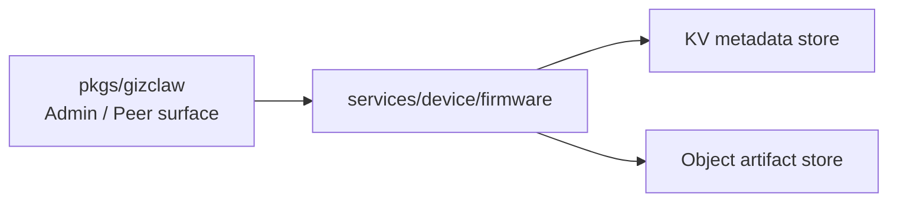

# services/device

`pkgs/gizclaw/services/device` Saves server resources owned by the device domain. Currently, the directory only has `firmware/`, which is responsible for Firmware catalog, artifact and OTA metadata.

## Directory structure

```text
services/device/
└── firmware/    # Firmware metadata, channel artifacts, and file distribution
```

## firmware

`firmware` owns:

- Firmware catalog and channel metadata.
- Uploading, indexing, reading and deletion of Firmware artifacts.
- Server data required for OTA query and file download.
- Coordination of Firmware metadata store and artifact object store.

It does not own device connections, peer registration, runtime status, or telemetry. What transport is the device connected through, whether it is currently online, and what status is reported, which belongs to the root peer connection and `services/runtime`.

## Dependencies and boundaries



Should be placed at `services/device/firmware`:

- Domain rules for Firmware and channels.
- Artifact storage, metadata and OTA download behavior.
- Validation and cleanup of Firmware files as untrusted input.

Shouldn't be placed here:

- WebRTC connection, device signaling or telemetry transport.
- Peer identity, registration approval, or ACL resource ownership.
- Board-specific flash, bootloader or firmware implementation.
- Creation of CLI storage backend and filesystem root.

When adding device domain services in the future, you should first confirm whether it has independent resources and life cycle before deciding to add `services/device/<service>`. Do not put all device-related logic into `firmware/`.
