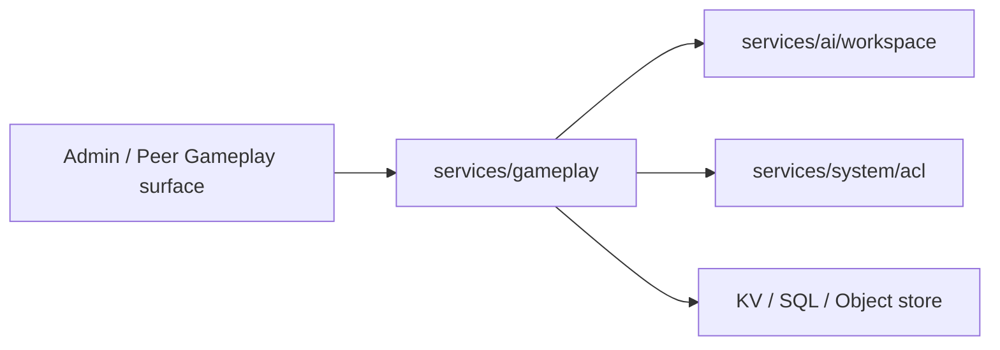

# services/gameplay

`pkgs/gizclaw/services/gameplay` Owns GizClaw Gameplay's catalog, player status, reward actions and digital assets. Currently the Gameplay service remains a package because these resources participate in the same set of rules and transaction boundaries.

[Go API References](https://pkg.go.dev/github.com/GizClaw/gizclaw-go@v0.0.0-20260707135347-b9bf1fb24b9f/pkgs/gizclaw/services/gameplay)

## Domain content

```text
services/gameplay/
├── Catalog       # GameRuleset, PetDef, BadgeDef, and GameDef
├── Runtime       # Pet, points, badge, and game-result state
├── Reward        # Reward grants and points/badge changes
├── Assets        # pixa assets such as PetDef and BadgeDef
└── Storage       # KV, object store, and gameplay SQL state
```

This is a domain responsibility map, not a Go file or type list.

## Ownership

Gameplay owns:

- A collection of Gameplay rules defined by GameRuleset.
- catalog definition for Pet, badge and game.
- Care actions such as Pet adoption, update, delete and drive.
- Points account, transaction, reward grant and badge progression.
- Game result writing and querying.
- Gameplay definition associated pixa digital assets.

Gameplay can use workspace as an associated boundary for pet workspace or Agent memory, but the workspace resource itself is still owned by `services/ai/workspace`. Gameplay also uses ACL to complete access judgment, but does not redefine role or policy binding.

## Dependencies and boundaries



Should be placed at `services/gameplay`:

- Gameplay catalog and player/pet state.
- Domain rules for points, reward, badge, game result and care action.
- Gameplay-owned pixa assets and consistency checks.

Shouldn't be placed here:

- Universal digital content storage or pixa codec.
- Implementation of Workspace, Agent Runtime or social graph.
- Admin/Peer transport and route registration.
- Generic accounting, SQL or object-store helper that is not related to Gameplay.

When Gameplay continues to grow, you should decide whether to split sub-packages based on resource ownership and transaction boundaries, and not just mechanical splitting based on the number of API endpoints.
