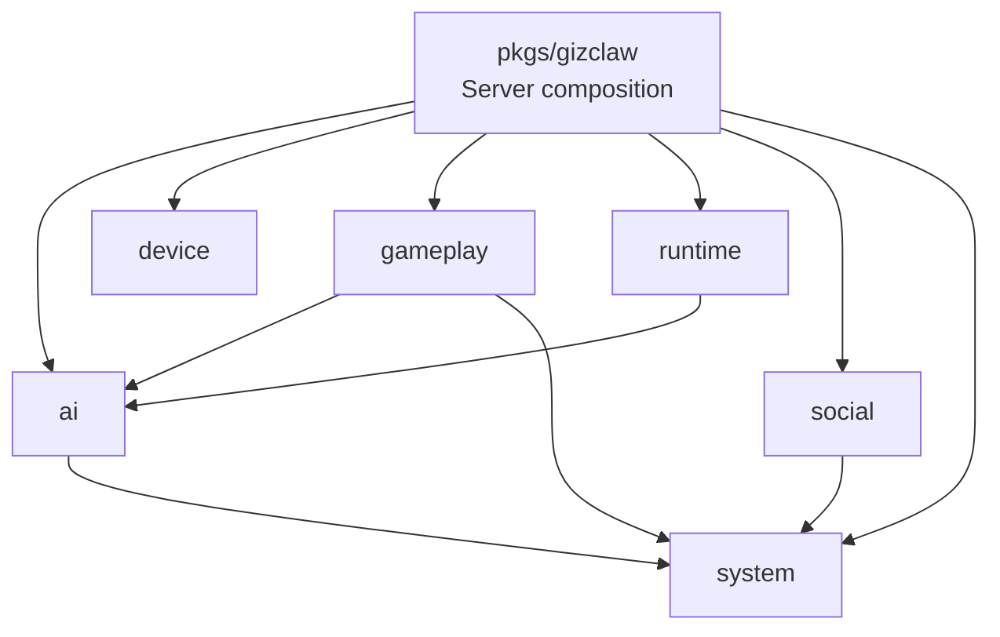

# GizClaw Services Overview

`pkgs/gizclaw/services` Organize GizClaw Server's reusable services by product area. This is the main ownership root for business resources, domain rules, persistence behavior, and runtime services.

The root `pkgs/gizclaw` package is responsible for assembling these services into Peer, Admin, Edge, and OpenAI-compatible public surfaces; `services/` itself does not own a transport listener, process startup, or complete Server composition.

## Directory structure

```text
pkgs/gizclaw/services/
├── ai/          # AI providers, models, voices, workflows, and workspaces
├── device/      # device-owned resources, currently focused on firmware
├── gameplay/    # gameplay catalog, pets, points, rewards, and assets
├── runtime/     # online Peer and Agent runtime capabilities
├── social/      # contacts, friends, and friend groups
└── system/      # ACL, public login, and unified resource management
```

## Domain relationship



Dependencies in the diagram represent explicit collaborations that are allowed to exist, not that one domain owns data from another domain:

- Runtime starts the Agent using AI resources but does not own the workflow, workspace, model or credentials.
- Gameplay can use workspace and ACL, but does not own Agent Runtime or System policy.
- AI, Gameplay, and Social use the ACL or unified resource capabilities provided by System, but each still has its own domain resources.

## Service Catalog Rules

For a capability to enter `services/<domain>`, it should usually meet:

- It has clear product area resources or online operational responsibilities.
- It has its own validation, storage or lifecycle.
- It can be reused by different public surfaces instead of belonging to only one HTTP/RPC handler.
- It does not rely on specific CLI commands, desktop UI or transport implementation.

The following content should not be placed in `services/`:

- OpenAPI, protobuf and generate API contract.
- WebRTC, HTTP-over-stream or other common transport.
- CLI config, storage backend creation and process startup.
- Only public route registration, no domain behavior wiring.
- A common store, audio, GenX or encoding library that can be reused across GizClaw products.

## Field Guide

- [AI](ai.md)
- [Device](device.md)
- [Gameplay](gameplay.md)
- [Runtime](runtime/overview.md)
- [Social](social.md)
- [System](system.md)
