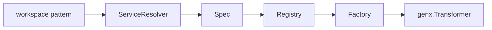

# Agent

[Go API Reference](https://pkg.go.dev/github.com/GizClaw/gizclaw-go/pkgs/gizclaw/services/runtime/agent)

`agent` Parse the workspace pattern into a runnable workflow Transformer. It has the workflow factory registry and resolution from persistent Workspace/Workflow to run specifications, but does not have the long-term online state of the Agent instance.

## Calling relationship

## Core structure and main function

| Structure or function | Function |
| --- | --- |
| `Spec` | Stores the parsed Workspace and Workflow configurations. |
| `Resolver` / `ServiceResolver.Resolve` | Read Workspace and Workflow from product service to form `Spec`. |
| `ParseWorkspacePattern` | Verify and extract workspace pattern. |
| `Registry.Register` / `Registry.Get` | Manage `Factory` by workflow type. |
| `Factory.NewAgent` | Constructs a `genx.Transformer` from `Spec`. |
| `Host.Transform` | Complete parsing, factory selection and start Transformer. |
| `Service.Reload` | Replace the connection-owned runtime based on the current pattern, source and consumer. |

`agent` is not responsible for peer connection, audio output, ToolKit licensing or workspace lease; these online lifecycles are combined by `agenthost`.
