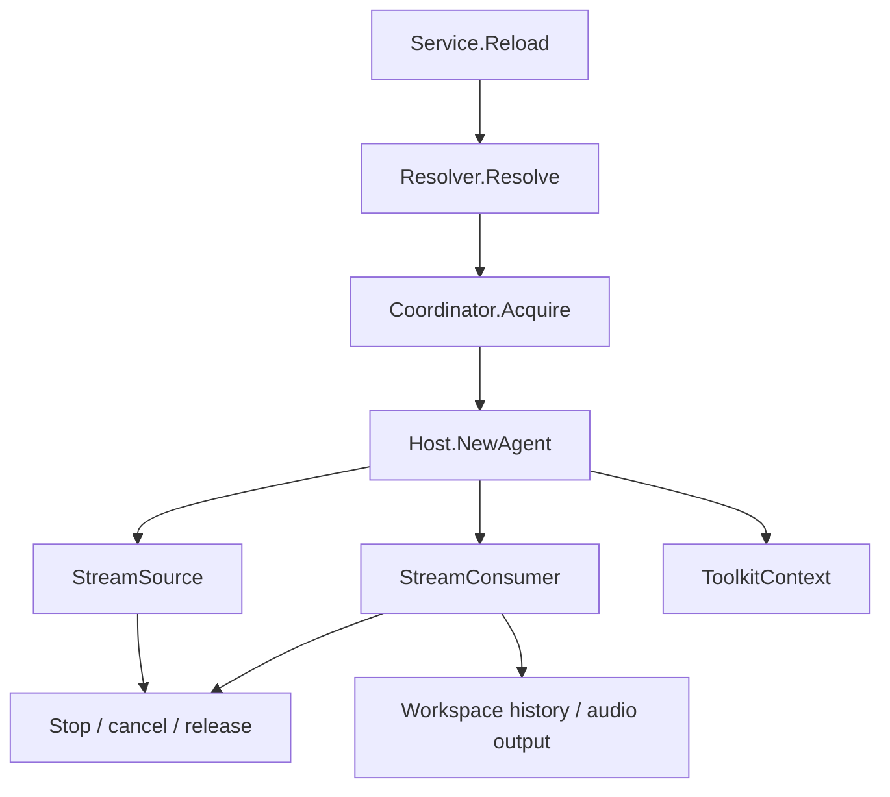

# Agent Host

[Go API Reference](https://pkg.go.dev/github.com/GizClaw/gizclaw-go/pkgs/gizclaw/services/runtime/agenthost)

`agenthost` Owns the online life cycle of Agent instance. It parses running specifications, obtains workspace lease, creates input and output streams, accesses history and ToolKit, and maintains the current runtime registry.

## Run process

## Core structure and main function

| Structure or function | Function |
| --- | --- |
| `Service.Reload` | Stop the old runtime and create a new runtime based on the current Peer run selection. |
| `Service.Status` / `Stop` | Query or terminate the current Agent runtime. |
| `Service.WorkspaceState` | Returns the running status of the current workspace. |
| `RuntimeRegistry` | Maintain the current online runtime. |
| `Coordinator` / `MemoryCoordinator` | Provide an exclusive lease for the workspace. |
| `Host` / `Registry` | Select and create an Agent based on the parsed `Spec`. |
| `InputStream` / `PushSource` | Convert continuous input into a GenX Stream consumed by the Agent. |
| `MixerOutput` | Connect the Agent audio output to the mixer track. |
| `ToolkitContext` | ToolKit after authorization for a runtime combination. |

All runtime creation paths must have symmetric cancel, stream close, lease release, and registry cleanup. The persistence of Agent definition, Workflow, and Workspace still belongs to AI services.
