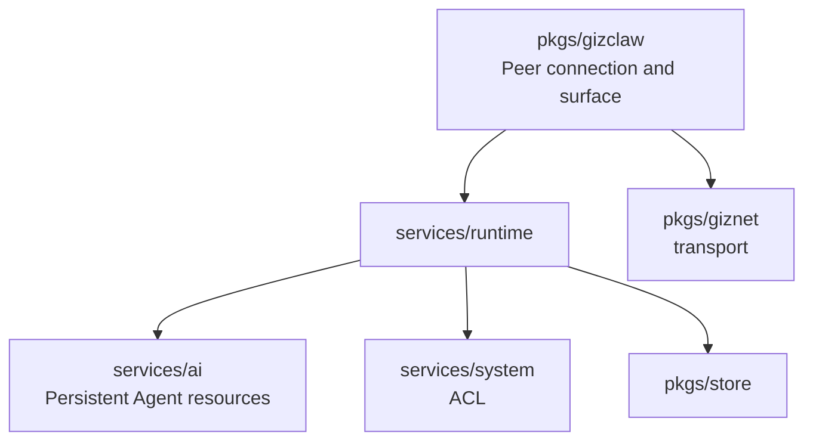

# services/runtime Overview

`pkgs/gizclaw/services/runtime` Responsible for converting persistent GizClaw product resources into online running capabilities. It manages the runtime state, resource aggregation, telemetry, route assignment and tool execution of Peer and Agent, but does not own the underlying transport or AI catalog.

## Directory structure

```text
services/runtime/
├── agent/           # Agent selection, registry, and resource resolution
├── agenthost/       # Agent instances, input/output, streams, and lifecycle
├── peer/            # Peer resources, identity, and base state
├── peerresource/    # cross-domain resource aggregation for peers
├── peerroute/       # Peer assignment and edge-route data
├── peerrun/         # selection state for the Agent currently running on a Peer
├── peertelemetry/   # Telemetry decoding, mapping, status, and metrics
└── toolkit/         # Tool resources, policies, executors, and runtime views
```

## Subdirectory responsibilities

### [agent](./agent)

Responsible for parsing runnable Agents from product resources such as workflow and workspace, and maintaining Agent types and selection boundaries supported by GizClaw. It does not directly own the streams and lifecycle of each Agent instance.

### [agenthost](./agenthost)

Responsible for the online operation of Agent instances, including runtime creation and cleanup, input and output, source, stream, history and toolkit wiring. Workflow driver can connect to Agent Host, but the persistent configuration of third-party workflow still belongs to the AI ​​field.

### [peer](./peer)

Has server-side Peer resources, identity, registration and basic status. Transport public key is the basis of peer identity, but `giznet` connection lifecycle is not implemented by this package.

### [peerresource](./peerresource)

Aggregates domain resources such as AI, firmware, gameplay, social, and tools that peers can access to provide a consistent entry point for the Peer-facing surface. It only performs cross-domain coordination and does not re-own or copy resources in each domain.

### [peerroute](./peerroute)

It has the peer assignment and route data recorded by the Server and serves the control plane of Edge/Server to find the target peer. The current data is the route state of this server, which does not mean that the mesh-wide directory already exists or is automatically synchronized.

### [peerrun](./peerrun)

Saves the state of which Agent the peer currently chooses to run. Agent definitions and workspaces don't belong here; what does have here is the association between peers and run options.

### [peertelemetry](./peertelemetry)

Receive and interpret peer telemetry, and map device reports to Server status and metrics. Telemetry schema belongs to `api/proto/telemetry`, metrics backend belongs to `pkgs/store/metrics`.

### [toolkit](./toolkit)

Has a runtime ToolKit visible to GizClaw Tool resources, policies, executors, and Agents. It is responsible for the authorized tool view and call boundary, and should not become a general function collection for any business handler.

## Dependencies and boundaries



Should be placed at `services/runtime`:

- Online status and life cycle of Peer and Agent.
- Parsing and combining persistent resources into running instances.
- Projection of Telemetry to status/metrics.
- Peer route, run selection and tool execution after authorization.

Shouldn't be placed here:

- WebRTC, service stream or packet transport.
- Catalog ownership of Workflow, workspace, model, voice and credential.
- Domain rules for Gameplay, social or firmware.
- CLI process, storage backend and listener creation.
