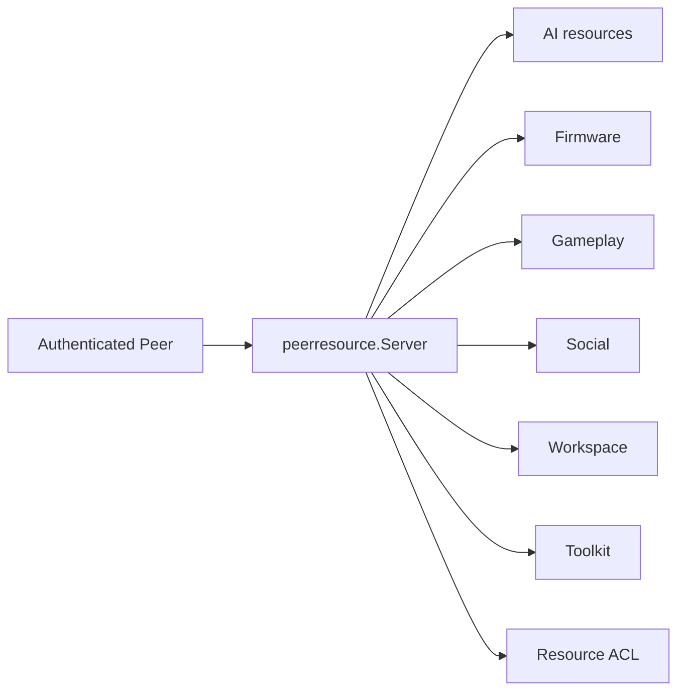
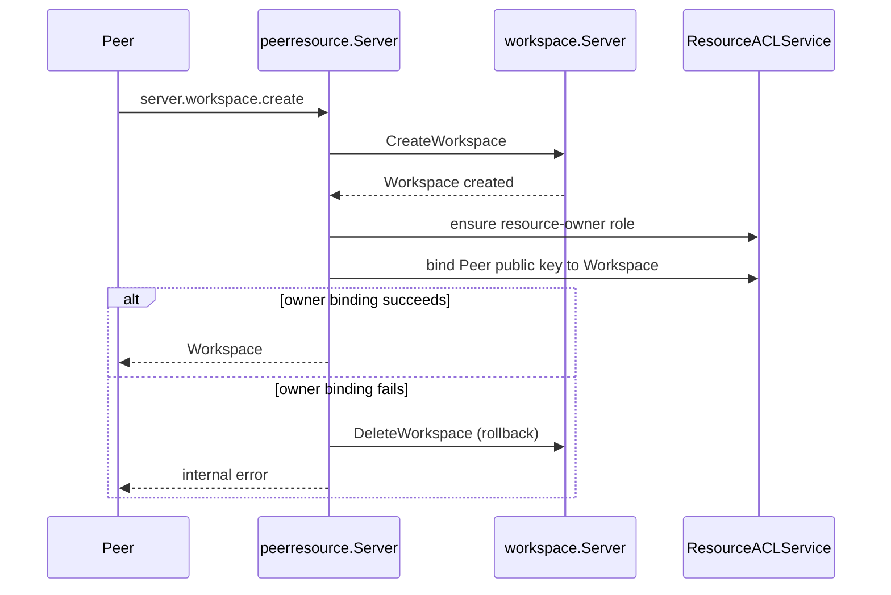

# Peer Resources

[Go API Reference](https://pkg.go.dev/github.com/GizClaw/gizclaw-go/pkgs/gizclaw/services/runtime/peerresource)

`peerresource` is the cross-domain resource aggregation layer of Peer RPC. It combines domain services such as AI, firmware, gameplay, social, workspace history, and Tool into a unified surface that can be called by Peer, and executes identity and ACL constraints before entering the domain service.

## Resource direction

## Core structure and main function

| Structure or function | Function |
| --- | --- |
| `Server` | Implement Peer resource RPC handlers and hold services in various fields. |
| `IsMethod` | Determine whether the RPC method belongs to this aggregate surface. |
| `Authorizer` | Perform resource authorization and discovery on the current Peer subject. |
| `ResourceACLService` | Create, query and clean up resource owner role/binding for Workspace and Tool created by Peer. |
| `WorkspaceHistoryService` | Provides workspace history capability for Peer RPC. |

`peerresource` API/RPC DTOs can be converted, but persistence rules for domain resources cannot be copied. The newly added resources must be owned by the corresponding domain service, and only coordination, authorization and wire conversion are added here.

## Workspace created by Peer

When a Peer creates a Workspace through `server.workspace.create`, `peerresource` not only forwards the Workspace service: it must also establish the owner binding of the Workspace for the caller.

Owner binding uses the current Peer public key as subject, Workspace name as resource, and grants the unified `resource-owner` role. This role contains `read`, `use` and `admin` permissions; Workspace and Tool share the same set of owner role definitions and ACL services.

The order when deleting a Workspace is reversed: delete the Workspace first, and then clean up the corresponding owner binding. If the binding cleanup fails, the service will re-create the workspace using the contents of the deleted workspace and return an error to the peer to avoid the semi-completed state of "the workspace has been deleted but the ACL owner binding remains". The binding is deemed to have been deleted successfully if it no longer exists.

Therefore, the Workspace resource record and owner binding behave as a whole to Peer RPC: the creation operation cannot leave a Workspace without owner permissions, and the deletion operation cannot return normally but leaves an isolated owner binding.
