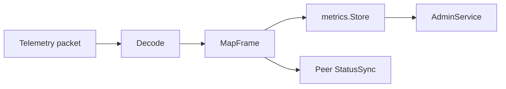

# Peer Telemetry

[Go API Reference](https://pkg.go.dev/github.com/GizClaw/gizclaw-go/pkgs/gizclaw/services/runtime/peertelemetry)

`peertelemetry` Decode the Peer telemetry packet, project the frame into metrics sample and fixed Peer status patch, and provide aggregation entry for Admin query.

## Data flow

## Core structure and main function

| Structure or function | Function |
| --- | --- |
| `Decode` | Verify and decode the telemetry protobuf payload. |
| `MapFrame` | Map frame to metrics and `StatusPatch`. |
| `Service` | Handle Peer telemetry ingestion. |
| `StatusSync` | Merge patch into Peer runtime status. |
| `AdminService` | Provides Admin query for telemetry metrics. |
| `PeerStatusStore` / `StatusService` | Isolate persistence status and update interface. |

Telemetry schema belongs to `api/proto/telemetry`, metrics persistence belongs to `pkgs/store/metrics`. This package only has decoding, mapping and synchronization strategies.
