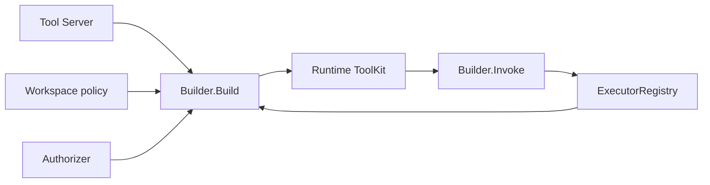

# Toolkit

[Go API Reference](https://pkg.go.dev/github.com/GizClaw/gizclaw-go/pkgs/gizclaw/services/runtime/toolkit)

`toolkit` Has persistent Tool resources, executor registry, and authorized ToolKit view constructed for an Agent runtime. ToolKit is not a general helper collection, but a security boundary for the Agent's visible and executable capabilities.

## Calling relationship

## Core structure and main function

| Structure or function | Function |
| --- | --- |
| `Tool` / `ToolKit` | Persistent Tool model and filter view of a runtime. |
| `Server` | Use KV store to implement Tool CRUD. |
| `NormalizeTool` / `NormalizePolicy` | Verify and standardize Tool and exposure policy. |
| `Builder.Build` | Constructs ToolKit based on enabled, policy, ACL, and executor availability. |
| `Builder.Invoke` | Confirm that the call is still within the authorization view, and then hand it over to the executor. |
| `ExecutorRegistry` | Register builtin/device executor and call it by name. |
| `DeviceRPCExecutor` | Send the device-owned Tool call to the corresponding Peer RPC. |
| `FromAPI` / `FromRPC` / `FromSpec` | Convert between persistence model and different contract surfaces. |

Tool schema, ACL, and executor availability must be re-constrained at call time and cannot rely solely on filtered results when ToolKit is presented. Specific business handlers should not insert any functions into Toolkit to bypass domain services.
