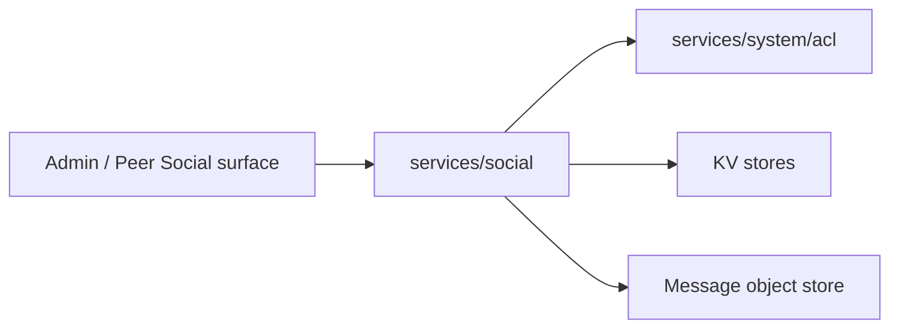

# services/social

`pkgs/gizclaw/services/social` Owns GizClaw’s social graph, including contacts, friend relationships, and friend groups. Each subpackage is responsible for a clear resource boundary.

## Directory structure

```text
services/social/
├── contact/       # Contact resources
├── friend/        # friend requests and friend relationships
└── friendgroup/   # groups, members, messages, and message assets
```

## Subdirectory responsibilities

### contact

Owns peer's contact resources and contact lifecycle. Contact is the address book data maintained by the user, which is not equivalent to the established friend relationship or the underlying giznet peer connection.

### friend

Has the ability to create, accept, and reject friend requests, as well as read and delete friend relationships. It can use ACL to determine permissions, but the friend state itself belongs to the social realm.

### friendgroup

Has friend group, member, message, invite and message assets. Group membership and ACL role are relationships at different levels; one cannot be used to implicitly replace the other.

## Dependencies and boundaries



Should be placed at `services/social`:

- Domain behaviors for Contact, friend request, friend relationship, group, member and message.
- Validation, storage and cleanup of Social resources.

Shouldn't be placed here:

-Giznet peer connection or signaling contact.
- ACL role, policy binding and general authorization engine.
- Chat Agent, workspace runtime, or generic messaging transport.
- Admin/Peer route registration.

When adding social capabilities, you should first determine whether it belongs to contact, friend, or friend group; only add new sub-packages when new independent resources and life cycles are formed.
