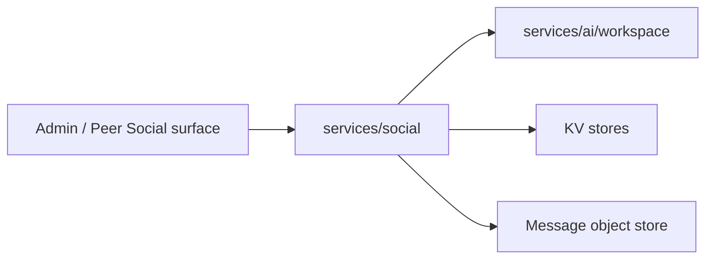

# services/social

`pkgs/gizclaw/services/social` Owns GizClaw’s social graph, including contacts, friend relationships, and friend groups. Each subpackage is responsible for a clear resource boundary.

## Directory structure

```text
services/social/
├── contact/       # Contact resources
├── friend/        # friend requests and friend relationships
└── friendgroup/   # groups, members, messages, and message assets
```

## Subdirectory responsibilities

### contact

Owns peer's contact resources and contact lifecycle. Contact is the address book data maintained by the user, which is not equivalent to the established friend relationship or the underlying giznet peer connection.

### friend

Owns friend-request creation, acceptance, rejection, and friend-relationship reads and deletion. A Friend relationship directly grants both peers access to its system Workspace without creating a generic access role.

Each direct-friend chat lifecycle owns a system Workspace and uses the internal Workspace create/delete capability for creation, rollback, and relationship deletion. The peer who creates the invite token is the initiator and immutable Workspace owner; the accepting peer receives access without sharing ownership. Admin creation uses its explicit owner. The owner's RuntimeProfile `workflows.system.friend_chatroom` selects the persisted Chatroom Workflow.

### friendgroup

Owns friend groups, members, messages, invites, and message assets. Group membership directly grants access to the group system Workspace.

Each Friend Group lifecycle owns a system Workspace and uses the internal Workspace create/delete capability for creation, rollback, and group deletion. A peer-created group belongs to its creator; Admin creation requires an explicit owner. Membership grants data access without changing ownership. The owner's RuntimeProfile `workflows.system.group_chatroom` selects the persisted Chatroom Workflow.

## Dependencies and boundaries



Should be placed at `services/social`:

- Domain behaviors for Contact, friend request, friend relationship, group, member and message.
- Validation, storage and cleanup of Social resources.

Shouldn't be placed here:

-Giznet peer connection or signaling contact.
- RuntimeProfile persistence, owner indexes, or generic registration logic. Social only resolves an owner's current profile to select the configured system Workflow before creating domain state.
- Chat Agent, workspace runtime, or generic messaging transport.
- Admin/Peer route registration.

When adding social capabilities, you should first determine whether it belongs to contact, friend, or friend group; only add new sub-packages when new independent resources and life cycles are formed.
