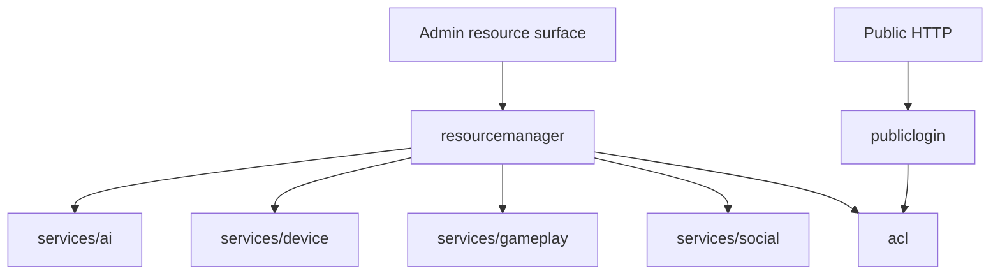

# services/system

`pkgs/gizclaw/services/system` Provides system-level services that multiple product areas rely on, including access control, public login, and declarative resource management.

## Directory structure

```text
services/system/
├── acl/               # roles, policy bindings, ACL views, and authorization decisions
├── publiclogin/       # Public HTTP login, assertions, and sessions
└── resourcemanager/   # unified entry point for Admin declarative resources
```

## Subdirectory responsibilities

### acl

Possess GizClaw's role, policy binding, ACL view, subject/resource permission and authorization judgment. Other domains can query ACLs, but cannot establish conflicting second sets of common permissions models within their respective packages.

ACL is not responsible for whether the transport peer can open the giznet service; transport-level policy and product resource authorization are different boundaries.

### publiclogin

Responsible for public HTTP caller using GizClaw identity to complete login and obtain session. It connects the public HTTP identity to the Server session, but does not have browser route, Edge proxy, or business resource permissions.

Final resource authorization is still performed by ACL and corresponding domain services. Successful login does not mean having access to all resources.

### resourcemanager

Provides unified declarative resource dispatch for Admin apply, show, and general resource operations. It knows which domain services should be handed over to different resource kinds, but does not reimplement business rules for credentials, workflow, firmware, gameplay or social.

ResourceManager is the cross-domain coordination layer and is not the actual owner of all GizClaw resources.

## Dependencies and boundaries



Should be placed at `services/system`:

- Product authorization and session capabilities that are uniformly used across domains.
- Cross-domain dispatch and common management boundaries of Declarative resources.
- System-owned migration, validation and persistence rules.

Shouldn't be placed here:

-Resources in each field realize their own business.
- Giznet transport security policy or WebRTC signaling crypto.
- Edge proxy token forwarding.
- CLI config, storage backend creation and process life cycle.
- Generic helper put in to avoid selecting domain ownership.
