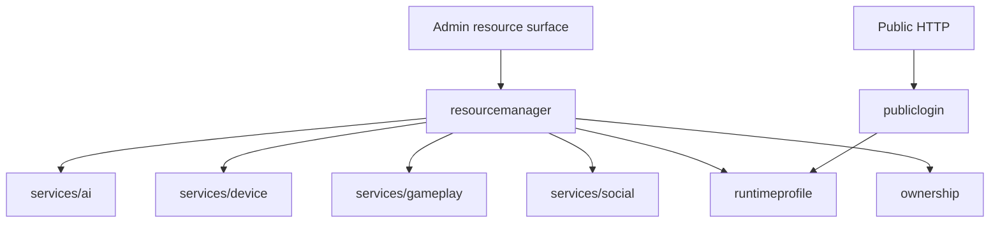

# services/system

`pkgs/gizclaw/services/system` provides shared system services including RuntimeProfile, device registration, resource ownership, public login, and declarative resource management.

## Directory structure

```text
services/system/
├── ownership/         # owner context, owner index keys, and write rules
├── pendingdeletion/   # durable fast-delete handoff records
├── publiclogin/       # Public HTTP login, assertions, and sessions
├── resourcemanager/   # unified entry point for Admin declarative resources
└── runtimeprofile/    # RuntimeProfile and RegistrationToken
```

## Subdirectory responsibilities

### ownership

Defines owner context and KV index conventions used by persisted resources. On the Peer surface, Workspace is user-created state; canonical Model, Credential, Workflow, and Tool mutation is Admin-only. Friend, FriendGroup, and Pet relationships add visibility for their system Workspaces.

### pendingdeletion

Defines the versioned, backend-neutral `PendingDeletion` envelope. A domain fast-delete makes its active resource undiscoverable and writes one minimal cleanup descriptor atomically in that resource's physical store. Peer and user Workspace producers use KV; Pet uses the gameplay SQL database. KV locator lookup supports kind and globally unique resource ID and explicitly rejects owner-scoped filters; the gameplay SQL source supports its owner-scoped locator. This package does not run workers, remove pending records, or expose deleted payloads. Processing belongs to the managed cleanup service.

### runtimeprofile

Owns RuntimeProfile and RegistrationToken KV state, schema validation, deterministic revisions, hash indexes, and registration resolution. It projects Admin resources through safe aliases and defines no reader/member role system. See [RuntimeProfile and device registration](./runtime-profile).

### publiclogin

Responsible for Public HTTP callers completing identity proof and obtaining typed sessions. A primary session represents the current Peer; a Side Control session uses a single-use device token and binds both the controller identity and target Peer. This package does not own browser routes, Edge proxying, or business resource implementations.

Final resource access is decided by RuntimeProfile, ownership, and the relevant domain relationship. Successful login does not grant every resource.

### resourcemanager

Provides unified declarative resource dispatch for Admin apply, show, and general resource operations. It knows which domain services should be handed over to different resource kinds, but does not reimplement business rules for credentials, workflow, firmware, gameplay or social.

ResourceManager is the cross-domain coordination layer and is not the actual owner of all GizClaw resources.

## Dependencies and boundaries



Should be placed at `services/system`:

- Product authorization and session capabilities that are uniformly used across domains.
- Cross-domain dispatch and common management boundaries of Declarative resources.
- System-owned migration, validation and persistence rules.

Shouldn't be placed here:

-Resources in each field realize their own business.
- Giznet transport security policy or WebRTC signaling crypto.
- Edge proxy token forwarding.
- CLI config, storage backend creation and process life cycle.
- Generic helper put in to avoid selecting domain ownership.
