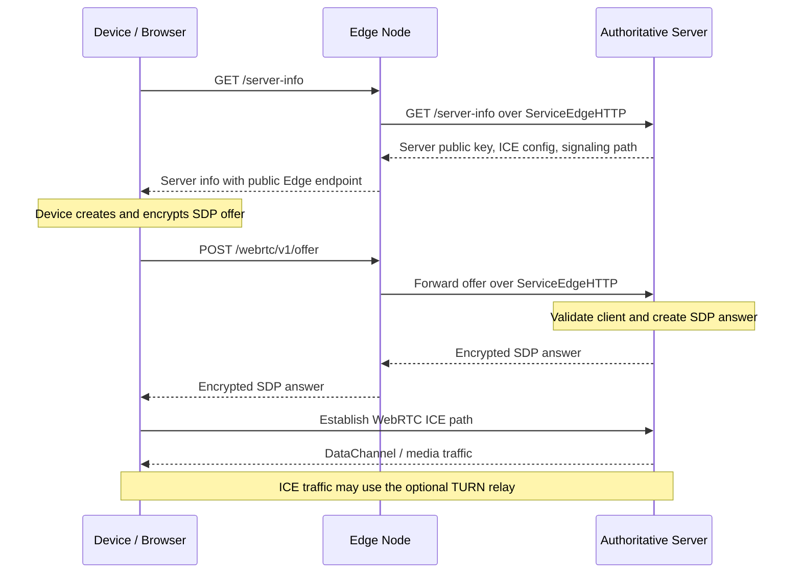
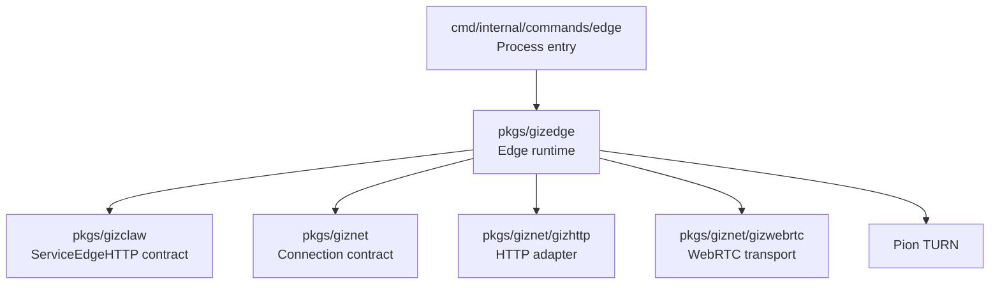

# pkgs/gizedge

`pkgs/gizedge` Provides GizClaw’s Edge Node ingress runtime. It receives HTTP requests from browsers or devices on the public network and forwards the requests to the configured authoritative GizClaw Server through `giznet` WebRTC connection.

Edge Node is the entry and forwarding node, not the owner of business data. Authentication, final authorization, realm services, and resource storage remain the responsibility of the upstream GizClaw Server.

[Go API References](https://pkg.go.dev/github.com/GizClaw/gizclaw-go@v0.0.0-20260707135347-b9bf1fb24b9f/pkgs/gizedge)

## Directory structure

```text
pkgs/gizedge/
├── config.go    # Edge workspace configuration and boundary validation
├── edge.go      # public ingress, upstream connections, and request-forwarding runtime
└── turn.go      # optional TURN server runtime
```

`pkgs/gizedge` is currently a flat package. The code here together constitutes a single Edge Node runtime, and there are no internal modules that need to be broken into independent public sub-packages.

## Device connection lane

After the Edge Node is started, a giznet connection to the authoritative Server has been established through WebRTC. Device then completes Server discovery and WebRTC signaling through Edge:



The ownership in this link is:

- Device creates SDP offer.
- Edge proxies `/server-info` and `/webrtc/v1/offer`, do not parse SDP and do not create the Device's WebRTC PeerConnection.
- Authoritative Server verifies the offer, creates SDP answer, and has the final GizClaw peer connection.
- TURN only forwards network traffic when ICE cannot be directly connected and does not have a GizClaw connection or business identity.

Therefore the Edge Node is a signaling ingress and optional relay, not the end point of the Device WebRTC session. Edge also does not locally execute the GizClaw domain handler or establish a second set of business permissions models.

## Directory Responsibilities

### Edge Configuration

The Edge workspace configuration describes the basic information required to run the current node:

- The Edge Node's own giznet identity.
- Public HTTP listen address and external endpoint.
- The endpoint and public key of a single upstream Server.
- Selection of TLS certificate source.
- Optional TURN listener, public endpoint, relay address, credential and relay port range.

The configuration belongs to the Edge runtime and does not reuse the storage, service or domain configuration of GizClaw Server. Server config should also not assume the public ingress and TURN parameters of the Edge process.

Currently only disabled paths work for the TLS certificate source; Edge RPC and file certificate sources are still not implemented. Development guidelines cannot write these configuration values ​​as supported capabilities.

### Public Ingress

Public ingress is responsible for:

- Listen to the public HTTP endpoint of the Edge Node.
- Forward allowed browser/device API requests to authoritative Server.
- Provides the CORS behavior required by ingress for browser requests.
- Publish Edge Node external endpoint in server-info response.
- Close the HTTP server, upstream connection and related listeners when the process stops.

Edge ingress does not have business implementations of Peer HTTP, OpenAI-compatible HTTP, or other product routes. The specific route is provided by `pkgs/gizclaw` Server, and Edge only forwards the public surface.

### Upstream Connection

The Edge Node uses `pkgs/giznet/gizwebrtc` to connect to the configured authoritative Server and uses `pkgs/giznet/gizhttp` to host forwarding requests on the `ServiceEdgeHTTP` stream.

Upstream connections belong to the long-lived runtime state. The connection can be re-established after a failure; only requests suitable for safe retry will be automatically sent again after reconnection. Edge packages should not copy the GizClaw handler themselves to circumvent upstream unavailability.

### TURN

The Edge Node can run an optional TURN UDP relay at the same time, providing relay capabilities for connections that cannot directly establish a WebRTC path.

TURN runtime is only responsible for relay listener, authentication and relay port range. It is not responsible for GizClaw user logins, peer ACLs, route assignments, or business authorization. TURN credential and GizClaw resource credential are not the same type of data.

## Dependencies



The dependency direction is:

- CLI command select workspace and start `pkgs/gizedge`.
- `pkgs/gizedge` consumes the Edge service contract defined by GizClaw, but does not depend on the specific domain service.
- Edge uses `giznet`, `gizhttp` and `gizwebrtc` to establish the upstream data path.
- `pkgs/gizclaw` and `pkgs/giznet` are not dependent on `pkgs/gizedge`.

## Ownership Boundary

Should be placed at `pkgs/gizedge`:

- Edge workspace configuration and Edge-specific validation.
- Public ingress listener, proxy and Edge response rewrite.
- Edge to authoritative Server connection, login, reconnection and forwarding life cycle.
- TURN relay run by Edge Node itself.
- Shutdown and cleanup behaviors only belong to the Edge process.

Should not be placed in `pkgs/gizedge`:

- Peer, workspace, firmware, gameplay, social or Agent domain services.
- Authoritative resource storage and final ACL judgment.
- Transport-independent connection contract or generic WebRTC implementation.
- HTTP/RPC handler for GizClaw Server.
- Server storage backend, migration and workspace runtime assembly.
- Global peer directory, mesh membership, cross-server data synchronization or route replication.

These contents belong to `pkgs/gizclaw`, `pkgs/giznet`, `cmd/internal/server` respectively, or are still the subsequent design scope of server mesh.

## Current boundary

Currently `pkgs/gizedge` implements an experimental Edge HTTP ingress that connects to a single authoritative Server, and optionally runs TURN relay.

It is not equivalent to a full server mesh:- The Edge Node is currently configured to connect to an upstream Server.
- `ServiceEdgeHTTP` has been used for public request forwarding.
- Edge control-plane RPC, certificate distribution and TLS certificate source are not fully implemented yet.
- Edge Node does not maintain mesh membership or global peer/resource route registry.
- There is no data replication and event synchronization between servers provided by this package.

Therefore, when adding a capability, you must first determine whether it is the responsibility of the current Edge ingress or the future work of the server mesh control plane; you cannot directly write `pkgs/gizedge` just because the capability is related to the public network entry point.
