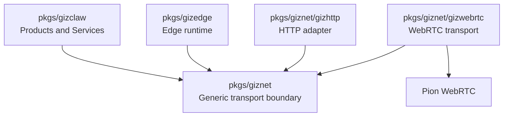

# pkgs/giznet

`pkgs/giznet` is the universal connection and transport layer of GizClaw. It isolates upper-layer services from specific transport implementations, enabling GizClaw Server, Edge Node, and other connecting parties to use unified peer connection, service stream, and packet transport capabilities.

This directory does not own GizClaw's product business. It is only responsible for establishing connections, identifying peers, carrying streams or packets, and providing security policy entry at the transmission boundary.

[Go API References](https://pkg.go.dev/github.com/GizClaw/gizclaw-go@v0.0.0-20260707135347-b9bf1fb24b9f/pkgs/giznet)

## Directory structure

```text
pkgs/giznet/
├── gizhttp/      # general adapters between HTTP and giznet service streams
└── gizwebrtc/    # WebRTC-based giznet transport
```

The root package holds transport-independent connection contracts and underlying types. Sub-packages rely on the root package to implement or adapt specific transmission capabilities.

## Directory Responsibilities

### giznet

`pkgs/giznet` The root directory defines transport-independent boundary, including:

- Peer identity and connection status.
- Public abstraction of Connection and listener.
- Transmission model for Reliable service stream and direct packet.
- Peer and service level security policy entry.
- Protocol, key and error definitions shared by all transport implementations.

These definitions must remain independent of GizClaw business. The upper layer can use them to host different services, but the root package does not know product concepts such as Admin, Device, Agent, OTA or Gameplay.

### gizhttp

`pkgs/giznet/gizhttp` Responsible for carrying standard HTTP requests and responses on the giznet service stream.

It is a general transport adapter that only connects HTTP and giznet and does not have specific routes, handlers, authentication roles or business responses. Specific surfaces such as Peer HTTP, Admin HTTP and Edge HTTP are assembled by the upper package.

### gizwebrtc

`pkgs/giznet/gizwebrtc` is the WebRTC transport implementation of giznet, responsible for WebRTC signaling, ICE, DataChannel, service stream, packet transport and connection life cycle.

WebRTC implementation details related to Pion are left in this subdirectory. The upper-layer GizClaw service relies on the giznet boundary and does not directly diffuse WebRTC types to the business layer.

## Dependencies



The dependency direction is:

- `pkgs/gizclaw` and `pkgs/gizedge` consume the generic transport boundaries provided by giznet.
- `gizhttp` and `gizwebrtc` rely on the giznet root package to complete the transport adapter or implementation.
- `pkgs/giznet` does not rely on `pkgs/gizclaw`, `pkgs/gizedge` or specific business services.

## Ownership Boundary

Should be placed at `pkgs/giznet`:

- Peer, connection, listener, stream, packet, security policy and transport basic definitions that can be reused by all connected parties.
- Network capabilities that are not tied to specific GizClaw product roles or business resources.

Should be placed at `pkgs/giznet/gizwebrtc`:

- Only implementations of WebRTC, ICE, signaling, DataChannel or Pion integration.
- WebRTC implementation of giznet transport boundary.

Should be placed at `pkgs/giznet/gizhttp`:

- Adaptation logic between HTTP and giznet service stream that can be reused by different upper-layer services.

Should not be placed in `pkgs/giznet`:

- Specific RPC method, HTTP route or service ID ownership of Admin, Peer and Edge.
- Device, Agent, OTA, Gameplay, Social and other business services.
- Server storage, workspace, configuration loading and CLI startup assembly.
- Firmware, board, desktop UI or browser product logic.
- Authorization rules that only make sense for a single GizClaw business surface.

These contents belong to `pkgs/gizclaw`, `pkgs/gizedge`, `cmd/internal/server` or the corresponding client directory.
