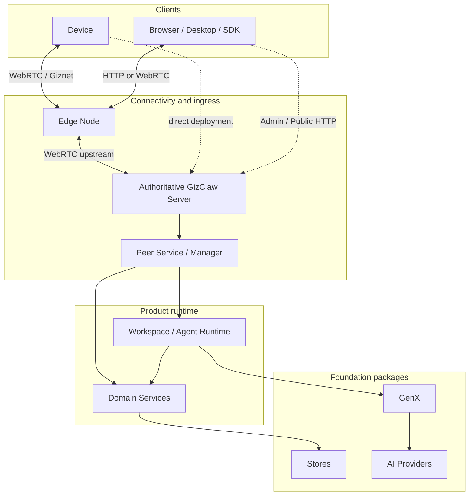
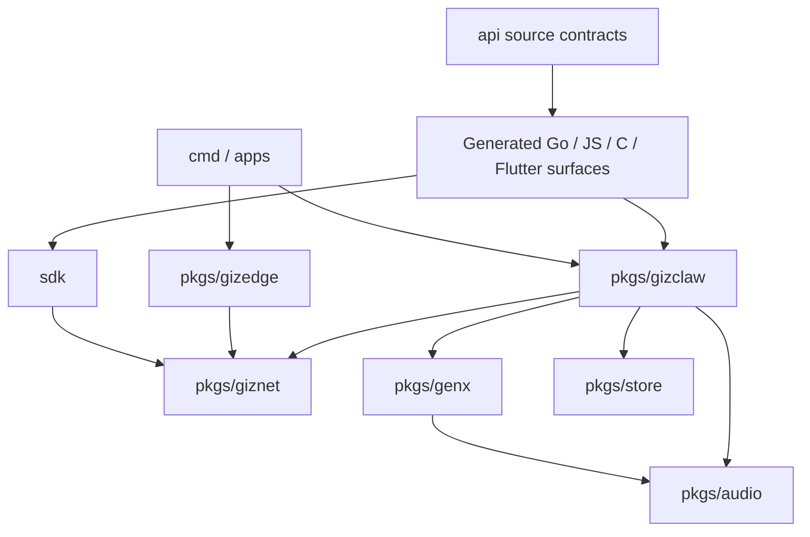
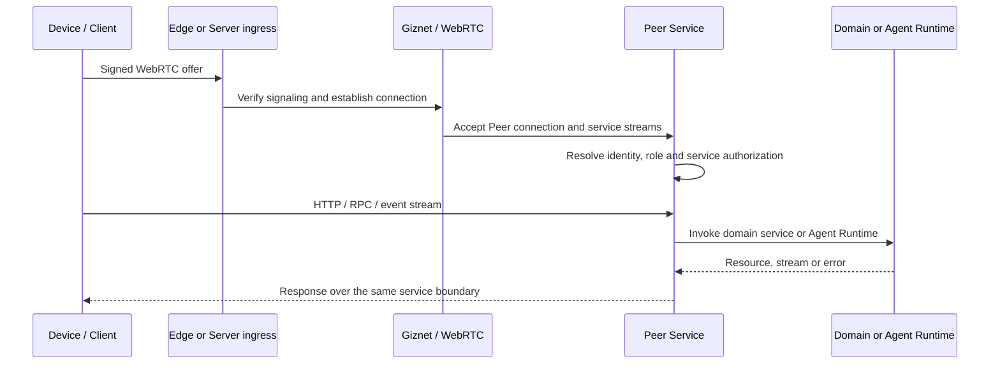

# GizClaw Development Guidelines

GizClaw is an agent runtime and edge server for GizClaw devices, desktop clients, and browser integrations. It provides WebRTC connectivity, device and runtime management, agent workflows, AI model adapters, Admin and Public HTTP APIs, Peer RPC, telemetry, OTA, digital-content, social, and gameplay domain services. The same contracts generate Go, JavaScript, C, and Flutter SDK surfaces.

The development guides support day-to-day implementation, code review, and troubleshooting. They explain the project structure, module boundaries, request paths, code ownership, and where to begin when diagnosing connectivity, protocol, runtime, storage, or provider problems.

Code review should use these boundaries to determine whether changes are in the correct modules, whether cross-layer contracts remain consistent, and whether generated outputs and tests were updated together. Go symbol signatures and documentation remain authoritative in pkg.go.dev and Go doc; these guides provide the project structure, call relationships, development constraints, and troubleshooting paths that an API reference cannot express alone.

## What does the project offer?

| Capabilities | Project Boundaries |
| --- | --- |
| Server and CLI | Start a local or deployed GizClaw Server and manage context, configuration, resources, and connections. |
| Device connectivity | Establish Peer connection through Giznet/WebRTC and carry RPC, HTTP and events on DataChannel/service stream. |
| Edge ingress | Edge Node accepts public network connections and forwards them to the authoritative Server; business resources and final authorization still belong to the Server. |
| Agent Runtime | Workspace instantiates the Agent environment, workflow driver determines the running mode, and runtime manages online Agent, input and output, and stream lifecycle. |
| AI capability | GenX provides unified message, stream, model, tool, generator and transformer contracts, implemented by provider adapters. |
| Product domains | Device, runtime, AI, system, social and gameplay services have their own resources and business rules. |
| API and SDK | Root `api/` stores the HTTP and Protobuf source contracts and generates Go, JavaScript, C, Flutter, and other client surfaces. |
| Storage and media | Store packages provide general persistence/indexing capabilities; Audio packages provide codec, PCM, resampling, and voiceprint. |

The current code supports Edge ingress with a single upstream. Distributed membership, cross-server data synchronization, and global routing are not among the currently completed Server Mesh capabilities.

## Runtime architecture



- The identity and service access of Device, Client, Server and Edge-node are determined by Giznet connection and Server security policy.
- Edge is responsible for ingress and upstream forwarding and does not become the business data owner.
- Peer Service maps connections to Manager, RPC/HTTP surfaces and domain services.
- Workspace is the persistence boundary of the Agent environment; Runtime has online Agent, connection and stream lifecycle.
- GenX only provides general AI contracts and adapters, and does not have credentials, model catalogs, workspaces or Agent instances.

## Repository module

```text
gizclaw/
├── api/              # HTTP / Protobuf source contracts
├── cmd/              # CLI and Server process wiring
├── pkgs/
│   ├── giznet/       # transport, WebRTC, and service streams
│   ├── gizclaw/      # product server, Peer, RPC, and domain services
│   ├── gizedge/      # edge ingress and upstream forwarding
│   ├── genx/         # general multimodal AI contracts and adapters
│   ├── store/        # storage and index primitives
│   └── audio/        # codec, PCM, and signal processing
├── sdk/              # Go, JavaScript, C, and Flutter SDK surfaces
├── apps/             # desktop and application entry points
├── examples/         # standalone capability examples
├── tests/            # integration and e2e harnesses
└── guides/           # Project Guide
```

| Modules | What to have | What not to have | Guidelines |
| --- | --- | --- | --- |
| `api/` | HTTP, RPC, Telemetry source contract and generation rules | Server implementation, business storage | [API Overview](api/overview) |
| `pkgs/giznet` | Connection, service, WebRTC, HTTP-over-stream transport | GizClaw resource and business authorization | [Giznet](giznet) |
| `pkgs/gizclaw` | Server, Peer lifecycle, RPC/HTTP composition, domain services | General transport, provider-neutral codec | [GizClaw](gizclaw/overview) |
| `pkgs/gizedge` | Edge ingress, upstream connection and forwarding | Authoritative resource, final ACL | [Gizedge](gizedge) |
| `pkgs/genx` | Message, Stream, Generator, Transformer, Tool and adapters | Agent instance, workspace, product model resource | [GenX](genx/overview) |
| `pkgs/store` | KV, object, metrics, graph, vector and identity primitives | Domain resource schema and business rules | [Stores](stores/overview) |
| `pkgs/audio` | Codec, PCM, resampling, device I/O and voiceprint | WebRTC connection, Agent lifecycle | [Audio](audio/overview) |
| `cmd` | Configuration reading, dependency wiring, process life cycle and CLI UX | Reusable domain logic | Corresponding package guidelines |
| `sdk` | Generate contract and client packaging for each language | Independently define another set of wire contracts | [API generation](api/generation) |

`pkgs/agent` is not currently part of the main product runtime path, so it is not a development-guide entry point yet. Its documentation should be added once the runtime consumes it and its actual boundaries are established.

## Module dependency direction



Dependencies must flow in the direction of basic capabilities:

- `cmd` and `apps` are responsible for assembling packages; reusable business logic cannot be put into the command layer in reverse.
- `pkgs/gizclaw` can rely on Giznet, GenX, Store and Audio; these basic packages cannot rely on GizClaw domain services.
- `pkgs/gizedge` can rely on Giznet and generate contracts, but cannot directly own Server domain store.
- `api/` contains wire-level source contracts. Generated code depends on those contracts; handwritten changes must not bypass the source schema by editing generated outputs.
- Provider-specific code stays in the corresponding Adapter or product integration and cannot be spread into the general GenX, Audio or Store contract.

## How to enter the system once connected



For specific signaling, Edge upstream, and service authorization, see the [Giznet](giznet), [Gizedge](gizedge), and [GizClaw](gizclaw/overview) pages.

## Where to start when developing

1. First confirm whether the change belongs to wire contract, transport, product area, AI adapter, storage/media primitive, or process wiring.
2. When modifying `api/`, first update the source schema, and then regenerate the committed outputs of all affected languages.
3. When modifying domain behavior, leave resources and business rules in the corresponding service; the Server/Peer file is only responsible for composition, connection and dispatch.
4. When modifying basic packages such as GenX/Audio/Store, do not introduce GizClaw product resources or provider credential ownership.
5. Run focused tests based on the risk of change; Go behavior changes ultimately require `go test ./...` by default, and schema changes also need to be generated and cross-language verified.

Further entry point:

- [Review Guidelines](/en/reviewing/)
- [Coding Standards](/en/coding-styles/)
- [Usage Guide](/en/using/)
- [Reference](/references/)
