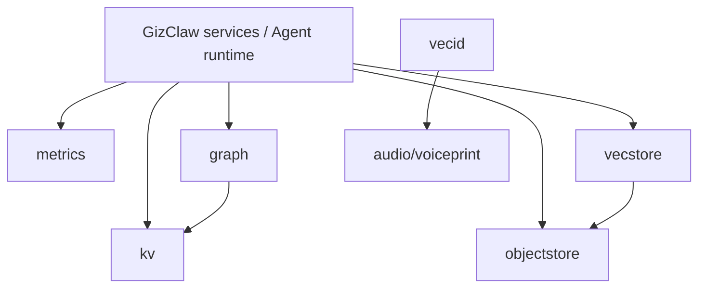

# pkgs/store Overview

`pkgs/store` Provides GizClaw with basic persistence and indexing capabilities that are used in multiple fields. This defines a storage abstraction and generic implementation that does not own business rules for Peer, Agent, AI, Gameplay or other product resources.

## Package structure

```text
pkgs/store/
├── graph/        # Entity / Relation graph abstraction
├── kv/           # Ordered hierarchical key-value store
├── metrics/      # Time-series sample write and query
├── objectstore/  # Prefix-addressable binary object storage
├── vecid/        # Vector locality-sensitive identity registry
└── vecstore/     # Vector similarity index
```

| Package | Core Boundary | Key Consumers |
| --- | --- | --- |
| [graph](./graph) | Entity, Relation and adjacency query | Agent memory, recall |
| [kv](./kv) | Ordered hierarchical key, CRUD and range traversal | GizClaw services, Agent memory, other stores |
| [metrics](./metrics) | Sample writing, instant/range query and aggregation | Peer telemetry, Server metrics |
| [objectstore](./objectstore) | Binary object, prefix list/delete and expiration | Firmware, workspace, gameplay assets, HNSW |
| [vecid](./vecid) | Vector hashing, bucket and identity clustering | Voiceprint detection |
| [vecstore](./vecstore) | Vector add/search/delete and HNSW persistence | Agent recall, memory index |

## Dependencies



`cmd/internal/storage` and `cmd/internal/stores` are responsible for reading the process configuration, selecting specific backends and injecting stores into the Server; `pkgs/store` does not read the GizClaw Server config, nor does it decide which physical backend to use in a certain field.

## Placement rules

Storage interfaces, backend adapters, and common key, query, index, expiration, and persistence semantics that can be reused across domains are stored here. Domain resource schema, HTTP/RPC, authorization, process configuration, and repositories belonging only to a single domain should not be placed in `pkgs/store`.
