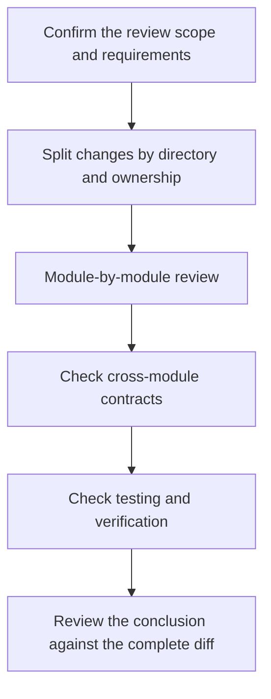

# Review Guide

Reviews confirm that requirements, implementation, contracts, tests, and documentation form a complete, verifiable result. A review is more than a style check, and passing tests do not replace judgment about behavior and boundaries.

Before an Issue enters review, it should first meet the title, Issue Type, body structure, and relationship field requirements in [Issue Format](./issue-format).

Before a PR is marked ready for review, its title and commit history should conform to [PR and Commit Format](./pr-commit-format).

## Review types

| Type | Executor | Target | Whether to modify the code |
| --- | --- | --- | --- |
| [Post-development self-review](./self_review) | Current developer or implementation agent | Find and fix issues before submission | Yes |
| [PR Agent Review](./pr_agent_review) | Remote Review Agent | Give a complete, actionable blocking finding on the PR | No |
| [Issue Review](./issue_review) | Issue author or Review Agent | Confirm that the issue definition reaches an implementable state | Modify only the Issue text |

All reviews share the same set of [review items](./review_items), but the actual scope of the review should be chosen based on change language, module ownership, and risk.

## Basic order

Check scope and requirement compliance before implementation details. Changes that cross Go, JavaScript, Dart/Flutter, C, schema, or generated-code boundaries must be reviewed together with the source contract, generated outputs, callers, and tests.

## Review results

Only issues that affect correctness, compatibility, security, lifecycle, maintainability, or verification confidence should be blocking findings. Do not present optional wording or typography preferences as defects.

Each finding includes at least:

- `P0`, `P1` or `P2` priority;
- Exact file and line numbers;
- Current behavior and its actual risks;
- An actionable fix direction.

When there is no blocking finding, the passing conclusion should be clearly given and the verifications that have been performed or cannot be independently confirmed should be listed.
