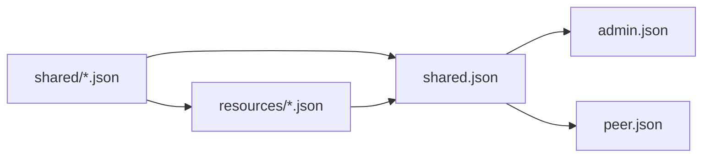

# Shared 与 Resources

`api/http/shared/` 与 `api/http/resources/` 表达不同所有权。Shared 是跨 surface 或跨领域复用的 contract；Resources 是 Admin 声明式资源及其专属数据。

## shared

`shared/` 只保存具有至少两个实际 consumers，或明确属于跨领域 contract 的数据结构、enum 和 value object。`shared.json` 聚合这些定义，并通过 `#/components/schemas` 提供给多个 HTTP surfaces 和 codegen。

适合放在 `shared/` 的内容：

- request/response 之间共享的稳定 DTO；
- 有独立语义的 enum、spec 或 nested value；
- 多个 HTTP surface 需要使用的 error 和 pagination 类型。

不适合放在这里的内容：单个 Resource 专属 Spec、只有一个父 schema 的小 value object、database row、service dependency、runtime lock、内部 cache state，以及只由单个 handler 使用的临时结构。

## Shared 所有权

`shared/` 当前按稳定 schema type 拆成细粒度物理文件。实际文件及其所有权族由 [HTTP Schema 依赖规则](./type-dependencies#shared-所有权映射) 维护；本页不复制第二份容易漂移的文件清单。

修改 Shared schema 时：

- 从 `api/http/shared/` 中实际存在的 owner 文件开始，不使用按领域臆造的聚合文件名；
- 跨 surface error、identity、runtime、ACL、configuration、firmware、credential、model、voice、tool、workflow、workspace 与 provider tenant values 按所有权映射定位；
- Public-only DTO 留在 `peer.json`，Admin endpoint 专属 DTO 留在 `admin.json`，OpenAI-compatible DTO 留在 `openai-compat/v1/service.json`；
- Resource envelope、metadata、Apply contract 与 Resource union 留在 `resources/resource.json`，Resource 专属数据留在对应 `resources/<kind>.json`。

如果现有 Shared value 最终只剩一个 owner，应在 contract 变更中评估是否内联；不能因为已经生成公共 symbol 就永久保留，也不能在没有独立复用证据时新增 Shared 文件。

`shared.json` 是当前 `apitypes` 的生成入口：它导出 Shared schema，并引用 `resources/*.json` 以生成 Resource graph。这个聚合关系只服务 codegen，不改变 `shared/` 与 `resources/` 的所有权边界。

## resources

`resources/` 描述 Admin 声明式资源。它们服务于 `admin apply`、`admin show` 和 resource manager，不被 Peer HTTP 或 Desktop surface 使用。

一个 resource schema 应表达：

- resource kind 与稳定 identity；
- 用户可以声明的 spec；
- apply/show 需要保留的 metadata；
- 与其他 resource 的显式引用。

### 核心数据与 Display

Resource 的数据首先按语义分为两类：

- 核心数据描述 Resource 是什么以及它与什么关联，包括稳定 identity、kind、分类、引用、ownership、运行配置和持久化语义。这些字段参与业务判断、查询、关联和执行，不能放进 `display`。
- 展示字段只描述如何把该 Resource 展示给用户。具体结构由 owner contract 决定；例如 Workflow 使用顶层 `i18n`，Workflow、Workspace 与 GameDef 使用顶层 typed `icon`。删除或替换展示字段不得改变 Resource 的关联关系或运行行为。

需要展示 metadata 的 Resource 只增加自身确实需要的 typed 字段。即使两个 Resource 当前需要相同的字段，也不能因此建立公共 `ResourceDisplay`、`ResourceDisplayData` 或通用 catalog schema。跨多个实际 owner 复用的独立 value object（例如 `Icon`）可以位于 `shared/`，但不会因此自动出现在所有 Resource 上。

如果某个 Resource 只需要本地化 catalog，不需要额外的展示 metadata，可以直接拥有语义更准确的 `i18n` 字段。Workflow 和 PetDef 分别使用自己的 `WorkflowI18n` 与 `PetDefI18n`：`i18n.default_locale` 指定默认语言，`i18n.en`、`i18n.zh-CN` 等 locale key 直接保存对应 catalog，不增加 `catalogs` 或 `display` 中间层。Workspace 是用户创建的运行实例，不拥有 catalog 型 i18n。

`WorkflowI18n` 虽位于 `shared/`，仍是 Workflow-owned contract。Admin API 与持久化层使用完整的 `Workflow{name,spec,i18n}`；声明式 `WorkflowResource` 保留通用 `ResourceMetadata`，resource manager 在 `metadata.name` 与 `Workflow.name` 之间映射，并原样传递 `spec` 与 `i18n`。这不表示 Workspace 或其他 Resource 可以复用它，也不应抽取公共 `ResourceI18n`。

Display 的共同命名是一项结构约定，不代表公共领域模型。不同 Resource 可以独立增加符合自身产品语义的展示字段；修改一个 Resource 的 Display 不应迫使无关 Resource 同步修改或重新生成 API。

判断字段归属时使用下面的规则：

| 问题 | 是 | 否 |
| --- | --- | --- |
| 字段是否影响 identity、关联、过滤、授权、执行或持久化语义？ | 放入 Resource 的核心字段或 `spec` | 继续判断 |
| 字段是否只用于面向人的名称、说明或视觉呈现？ | 使用该 Resource 明确定义的 typed 展示字段 | 不应为它创建展示字段 |
| 相同字段是否由多个 Resource 使用？ | 各 Resource 仍拥有自己的 Display 定义 | 不以“看起来相同”为理由放入 Shared |

`category`、关联 ID、workflow reference、provider kind 等机器可读字段属于核心数据。本地化名称、说明、icon 和 cover 的位置由 owner schema 决定。客户端在展示数据缺失时可以回退到稳定 ID，但 Server 不应把 fallback 文本持久化为核心数据。

“视觉内容”不自动等于 `display`。如果 asset、clip、animation graph 或 action-to-clip mapping 被设备、runtime 或领域逻辑直接消费，它就是 Resource 的核心内容或关联数据。例如 PetDef 的 PIXA、canvas、clips、visual refs 和 `visual_clip_id` 属于 PetDef spec；`display` 只保存管理界面或用户阅读所需的展示 metadata 与本地化文本。

新 Spec 如果只被一个 Resource 使用，应与该 Resource 定义在同一文件。对于已经位于 `shared/` 的 Spec，必须先核对所有实际 consumers 和兼容性影响，再决定是否迁移；不能只根据名称推断所有权，也不能再建立一份平行 schema。

运行时连接、stream、临时状态和 provider client 不能塞进 resource spec。Resource 表达期望状态，领域 service 负责校验并实现该状态。

## 复用关系

Schema 所有权依赖是 `shared/ ← resources/`；当前 codegen 再由 `shared.json` 聚合两层，供 `admin.json` 使用。`peer.json` 与 OpenAI-compatible surface 只引用它们实际需要的 Shared contract，不直接依赖 Admin Resource 文件。

新增字段时应优先修改其真正拥有者：真正共享的 value 修改 `shared/`，声明式资源和专属 Spec 修改 `resources/`，只属于某个 endpoint 的输入则留在该 surface。不要复制一份名字相近但逐渐漂移的 schema。

## 稳定性边界

Schema name、property name、required 集合、enum value、discriminator 和 OpenAPI operation ID 都会影响生成 API。重命名或改变 optional/nullable 语义属于 caller-facing contract 变化，必须与所有生成语言和调用点一起审查。

## Workspace 生命周期分类

`Workspace.system` 是必填、只读的生命周期 metadata。通过通用 Admin HTTP、Peer RPC 和声明式 resource 创建的 Workspace 始终为 `system: false`；调用方不能通过 Workspace 输入设置或修改它。Friend、Friend Group 和 Pet 生命周期通过 Workspace service 的内部能力创建 `system: true` Workspace。

对 system Workspace 执行通用 Workspace 删除会返回 HTTP 409 和 `SYSTEM_WORKSPACE_DELETE_FORBIDDEN`。只有拥有该 Workspace 的领域生命周期可以调用内部 system-Workspace 删除能力。已有持久化 Workspace 不迁移、不重新分类；分类保证只适用于此 contract 生效后创建的 Workspace。
