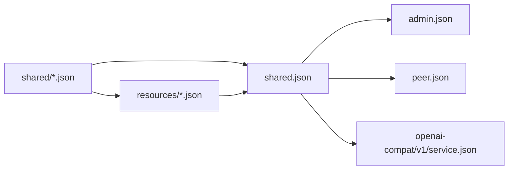

# HTTP Schema 依赖规则

HTTP schema 按所有权分为 Shared、Resources 和三个 API surfaces。当前生成入口使用一个 `shared.json` 聚合 Shared values 与 Resource graph；`shared/` 和 `resources/` 仍按所有权保持独立。

## 目录

```text
api/http/
├── admin.json
├── peer.json
├── openai-compat/
│   └── v1/
│       └── service.json
├── shared.json
├── shared/
│   └── ...
└── resources/
    └── ...
```

## 依赖方向



依赖必须保持单向：

```text
shared/ ← resources/ ← shared.json ← admin
shared.json ← public
shared.json ← openai-compatible
```

`shared/` 不得引用 `resources/`。`resources/` 可以引用 `shared/`。`shared.json` 是生成入口，同时导出两层的稳定 schema；它的文件名不表示 Resource 属于 Shared ownership。

## Shared 规则

Schema 只有满足以下至少一个条件才能进入 `shared/`：

- 被两个以上 HTTP surfaces 直接使用；
- 被两个以上领域 owner 使用；
- 是多个 Resources 共用的稳定 value contract。

需要生成 Go 或 JavaScript symbol，不构成 Shared 的理由。只有一个 owner 的 schema 与 owner 放在同一文件。

### Shared 所有权映射

`shared/` 按稳定 schema type 拆成细粒度文件，而不是为每个领域维护一个聚合文件。当前文件按以下所有权族组织：

| 所有权族 | 当前文件 | 拥有的 schema |
| --- | --- | --- |
| Error | `error_payload.json`、`error_response.json` | `ErrorPayload`、`ErrorResponse` |
| Device identity | `device_info.json`、`hardware_info.json`、`peer_imei.json`、`peer_label.json` | Device、hardware 与稳定 identity values |
| Runtime、Peer 与 Server state | `runtime.json`、`peer*.json`、`registration.json`、`server*.json` | Runtime、registration、Peer lifecycle、stream、telemetry 与 Server values |
| ACL | `acl_*.json` | Permission、Policy、Resource、Subject、Role、View 与 binding values |
| Configuration | `configuration.json`、`agent_selection.json`、`refresh_*.json` | 共同配置、Agent selection 与 refresh contracts |
| Gameplay | `gameplay.json` | Gameplay metadata 与共同规则 values |
| Firmware | `firmware*.json` | Firmware、slot、artifact、spec 与 selection values |
| Credential | `credential*.json` | Credential body、spec 与跨 Resource/API 使用的 values |
| Model | `model*.json` | Model kind、capabilities、provider、source、spec 与 provider data |
| Voice | `voice*.json` | Voice provider、source、spec 与 provider data |
| Tool | `tool*.json`、`toolkit_policy.json` | Tool executor、trigger、source、spec、policy 与 JSON schema values |
| Workflow 与 Workspace | `workflow*.json`、`workspace*.json` | Workflow identity、i18n、locale、driver、variants 与 Workspace values |
| Provider tenant | `*_tenant*.json` | 各 provider 的 tenant、spec、enum 与共享 values |

表中的 glob 是现有文件的所有权分组，不是可以直接创建的文件名。修改 schema 时必须先选择 `api/http/shared/` 中实际存在的 owner 文件；只有没有现有 owner 且满足 Shared 规则时才能新增文件。

不属于上述 Shared 所有权族的 schema 必须定义在其 owner 文件中：

- Public-only DTO 放入 `peer.json`。
- Admin endpoint 专属 DTO 放入 `admin.json`。
- OpenAI-compatible DTO 放入 `openai-compat/v1/service.json`。
- Resource、专属 `*Spec` 和 nested values 放入对应 `resources/<kind>.json`。
- Resource envelope、metadata、kind、Apply contract 与 union 放入 `resources/resource.json`。

新增 `shared/*.json` 必须先证明存在多个独立 consumers；新增所有权族时还必须同步更新本映射。不能先创建文件，再以“可能复用”为理由留在 Shared。

## Resource 规则

每个 `resources/<kind>.json` 同时拥有：

- Resource envelope 的具体 kind；
- 该 Resource 专属 Spec；
- 只服务于该 Resource 的 nested values；
- 对 Shared schema 的显式引用。

`resources/resource.json` 拥有 `ResourceAPIVersion`、`ResourceKind`、`ResourceMetadata`、Apply contract 与 Resource union。Resource 专属 Spec 不放入 `shared/`。

## Surface 规则

- `admin.json` 通过 `shared.json` 引用 Shared values 与 Resource graph。
- `peer.json` 只引用 `shared.json`，不引用 Admin Resources。Public-only DTO 直接定义在 `peer.json`。
- OpenAI-compatible models 留在自己的 `service.json`；只有确实与其他 GizClaw HTTP surfaces 共用的 contract 才引用 `shared.json`。
- Desktop application contract 属于 `apps/wails`，不进入 Server HTTP API schema graph。

## 文件边界

文件边界按共同 owner 和共同变更确定：

- 单一 Resource 的 `*Spec` 内联到对应 Resource 文件。
- 一个领域中的 parent、enum 与 nested value 合并在同一个 Shared 文件。
- 只有存在独立复用和稳定语义时才拆出新 Shared 文件。

Schema 文件合并不得改变 JSON property、required/nullable 语义、enum value、discriminator 或 OpenAPI operation ID。
