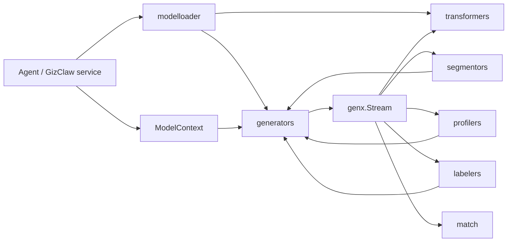

# pkgs/genx 总览

`pkgs/genx` 是 GizClaw 的通用多模态 AI 流处理层。它定义 message、model context、tool、generator、transformer 与 stream contract，使 Agent 和产品服务可以组合模型能力，而不直接依赖某一家 provider 的协议。

[Go API References](https://pkg.go.dev/github.com/GizClaw/gizclaw-go@v0.0.0-20260707135347-b9bf1fb24b9f/pkgs/genx)

## Package 结构

```text
pkgs/genx/
├── generators/    # Generator 注册、选择与调用
├── transformers/  # ASR、TTS、Realtime 与流转换
├── segmentors/    # 对话内容分段与实体关系抽取
├── profilers/     # 实体画像更新
├── labelers/      # Recall 查询标签选择
├── modelloader/   # 从配置装载并注册模型能力
└── match/         # 基于规则和模型的消息匹配
```

## 核心 Interfaces

### Generator

[`Generator`](https://pkg.go.dev/github.com/GizClaw/gizclaw-go@v0.0.0-20260707135347-b9bf1fb24b9f/pkgs/genx#Generator) 是模型生成能力的统一入口：

```go
type Generator interface {
    GenerateStream(context.Context, string, ModelContext) (Stream, error)
    Invoke(context.Context, string, ModelContext, *FuncTool) (Usage, *FuncCall, error)
}
```

- `GenerateStream` 根据 model pattern 和 Model Context 生成多模态输出流。
- `Invoke` 要求模型产生指定 `FuncTool` 的调用参数，适合结构化生成。
- OpenAI、Gemini 或其他 provider adapter 实现这个接口；上层通过 `generators.Mux` 选择实现。

### Transformer

[`Transformer`](https://pkg.go.dev/github.com/GizClaw/gizclaw-go@v0.0.0-20260707135347-b9bf1fb24b9f/pkgs/genx#Transformer) 表达流到流的转换：

```go
type Transformer interface {
    Transform(context.Context, string, Stream) (Stream, error)
}
```

它不改变调用模型：输入和输出都使用 `Stream`。ASR 可以把 audio stream 转为 text stream，TTS 做相反转换，Realtime 和 speech translation 也遵守同一边界。

### ModelContext

[`ModelContext`](https://pkg.go.dev/github.com/GizClaw/gizclaw-go@v0.0.0-20260707135347-b9bf1fb24b9f/pkgs/genx#ModelContext) 是一次模型调用所需上下文的只读视图：

```go
type ModelContext interface {
    Prompts() iter.Seq[*Prompt]
    Messages() iter.Seq[*Message]
    CoTs() iter.Seq[string]
    Tools() iter.Seq[Tool]
    Params() *ModelParams
}
```

它分别暴露 system prompts、历史消息、推理上下文、可调用工具和模型参数。`ModelContextBuilder` 用于组装单个上下文，`MultiModelContext` 用于按顺序组合多个上下文来源。

### Stream

[`Stream`](https://pkg.go.dev/github.com/GizClaw/gizclaw-go@v0.0.0-20260707135347-b9bf1fb24b9f/pkgs/genx#Stream) 是所有生成和转换能力之间的公共传输协议：

```go
type Stream interface {
    Next() (*MessageChunk, error)
    Close() error
    CloseWithError(error) error
}
```

- `Next` 顺序取得下一个 `MessageChunk`，直到流结束或返回错误。
- `Close` 正常终止并释放生产者资源。
- `CloseWithError` 携带失败原因终止流，使 pipeline 中的上游和下游能够传播错误。

`Merge`、`Split`、`Tee`、`CompositeSeq` 和 `Iter` 在这个最小接口上提供组合、分流和消费能力。

#### StreamCtrl

[`StreamCtrl`](https://pkg.go.dev/github.com/GizClaw/gizclaw-go@v0.0.0-20260707135347-b9bf1fb24b9f/pkgs/genx#StreamCtrl) 是 `MessageChunk` 上的可选控制信息，用于描述 chunk 所属的逻辑子流以及该子流的状态：

| 字段 | 语义 |
| --- | --- |
| `StreamID` | 逻辑路由标识。相关联的 text、audio、transcription 或 tool chunks 可以共用同一 ID，同时保持各 MIME channel 的独立生命周期。 |
| `Label` | 子流用途标签，例如 `transcript`、`assistant` 或 `history.user_audio`；它补充 StreamID，不替代唯一标识。 |
| `Error` | 当前子流的终止错误文本。通常与 `EndOfStream` 一起使用，不等同于关闭整个 Stream。 |
| `BeginOfStream` | 当前 chunk 是开始边界。携带 Part 时开始或声明对应 MIME channel；纯控制 chunk 则开始 StreamID route。 |
| `EndOfStream` | 当前 chunk 是结束边界。携带 Part 时只结束对应 MIME channel；纯控制 chunk 则结束整个 StreamID route。它也可以携带最后一段 data 或 Error。 |
| `Timestamp` | Chunk 的毫秒时间戳，供 `RealtimeStream` 排序和延迟处理；值为零时，`RealtimeStream` 会按当前时间补充单调递增值。 |

`Ctrl == nil` 表示当前 chunk 没有显式的路由或边界控制信息。消费者应通过 `MessageChunk.IsBeginOfStream()` 和 `IsEndOfStream()` 判断边界，不直接假设 `Ctrl` 一定存在。

#### StreamID、MIME channel 与 EOS

`MessageChunk.Ctrl.StreamID` 标识一条逻辑路由。同一路由可以承载多个具有独立结束边界的 MIME channel：

- `Text` 使用规范的 `text/plain` MIME channel；`Blob` 使用解析并规范化后的完整 MIME type，包括 `codecs=opus` 等具有语义的参数；大小写、参数顺序和无意义空格不会形成第二个 channel。
- 携带 Part 的 EOS 只结束该 Part 对应的 MIME channel。例如，同一 StreamID 上的 `text/plain` EOS 不会结束 `audio/opus`。
- `Part == nil` 的纯控制 EOS 结束整个 StreamID route 及其所有未完成 MIME channel，但仍不关闭外层 `Stream`。
- 如果 producer 可能在当前已观察 channel 全部完成后再增加新 MIME channel，必须在此前通过携带 MIME 的 BOS 或 data chunk 声明该 channel，或者保持 route 直到发出纯控制 EOS。
- 同一个 `Stream` 可以交错承载多个 StreamID；`Stream.Close` 和 `CloseWithError` 终止外层传输及所有未完成 route。
- `Iter` 会聚合 content reader 直到外层 Stream 结束，不通过 `StreamElement` 暴露 route-aware EOS。
- Adapter 必须保留 StreamID、role、label、MIME type、BOS/EOS 和 error 语义，不能依靠私有 session 状态让边界只在实现内部可见。

### Tool

[`Tool`](https://pkg.go.dev/github.com/GizClaw/gizclaw-go@v0.0.0-20260707135347-b9bf1fb24b9f/pkgs/genx#Tool) 是受限的工具类型集合。当前由 [`FuncTool`](https://pkg.go.dev/github.com/GizClaw/gizclaw-go@v0.0.0-20260707135347-b9bf1fb24b9f/pkgs/genx#FuncTool) 和 `SearchWebTool` 实现。

`FuncTool` 保存工具名称、说明、JSON Schema 和 typed invoke function；Generator 只负责产生 `FuncCall`，实际调用仍由拥有该工具的上层执行。

## 核心数据结构

| 结构 | 职责 |
| --- | --- |
| [`Message`](https://pkg.go.dev/github.com/GizClaw/gizclaw-go@v0.0.0-20260707135347-b9bf1fb24b9f/pkgs/genx#Message) | 表达一次完整的多模态输入或输出，由 role 和 contents 组成。 |
| [`MessageChunk`](https://pkg.go.dev/github.com/GizClaw/gizclaw-go@v0.0.0-20260707135347-b9bf1fb24b9f/pkgs/genx#MessageChunk) | Stream 中传递的增量消息，承载内容、工具调用、状态或流事件。 |
| [`ModelParams`](https://pkg.go.dev/github.com/GizClaw/gizclaw-go@v0.0.0-20260707135347-b9bf1fb24b9f/pkgs/genx#ModelParams) | 统一 max tokens、temperature、top-p 等模型参数，并允许 provider extra fields。 |
| [`Usage`](https://pkg.go.dev/github.com/GizClaw/gizclaw-go@v0.0.0-20260707135347-b9bf1fb24b9f/pkgs/genx#Usage) | 记录 prompt、cache 与 generated token usage。 |
| [`State`](https://pkg.go.dev/github.com/GizClaw/gizclaw-go@v0.0.0-20260707135347-b9bf1fb24b9f/pkgs/genx#State) | 表达完成、截断、拒绝或错误等生成终态。 |

## 调用关系



`genx.Stream` 是能力组合的公共数据边界。Generators 产生流；Transformers 改写流；Segmentors、Profilers 和 Labelers 使用 Generator 完成结构化推理；Model Loader 负责把配置解析成这些能力的注册关系。

## 放置规则

- 通用 message、stream、model、tool contract 放在 `pkgs/genx` 根包。
- 可按名称选择的能力通过对应子包的 mux 注册，不由产品服务维护第二套路由表。
- Provider SDK adapter 放在拥有该具体能力的 package；provider credential 和产品 model resource 仍属于 `pkgs/gizclaw/services/ai`。
- Agent memory、workspace、运行中的 Agent lifecycle 和产品 HTTP/RPC 不属于 `genx`。
