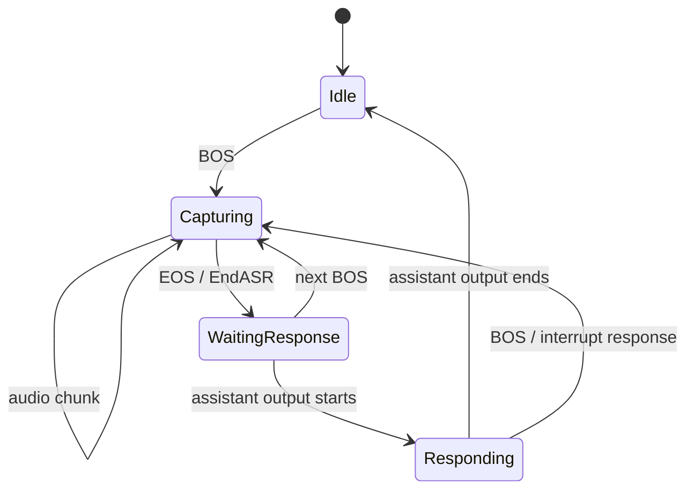

# Doubao Speech Adapter

Doubao Speech Adapter 将豆包语音协议适配为 `genx.Transformer`，覆盖单向识别、语音生成、实时对话、双工实时对话和语音翻译。

## 能力

| Transformer | 输入与输出 |
| --- | --- |
| [`DoubaoASRSAUC`](https://pkg.go.dev/github.com/GizClaw/gizclaw-go@v0.0.0-20260707135347-b9bf1fb24b9f/pkgs/genx/transformers#DoubaoASRSAUC) | Audio Stream → transcription Stream。 |
| [`DoubaoTTSSeedV2`](https://pkg.go.dev/github.com/GizClaw/gizclaw-go@v0.0.0-20260707135347-b9bf1fb24b9f/pkgs/genx/transformers#DoubaoTTSSeedV2) | Text Stream → generated audio Stream。 |
| [`DoubaoTTSICLV2`](https://pkg.go.dev/github.com/GizClaw/gizclaw-go@v0.0.0-20260707135347-b9bf1fb24b9f/pkgs/genx/transformers#DoubaoTTSICLV2) | Text Stream → ICL voice audio Stream。 |
| [`DoubaoRealtime`](https://pkg.go.dev/github.com/GizClaw/gizclaw-go@v0.0.0-20260707135347-b9bf1fb24b9f/pkgs/genx/transformers#DoubaoRealtime) | 适配豆包 Realtime Dialogue API（`volc.speech.dialog`），显式处理 ASR、Chat、TTS 事件，并支持 Push-to-Talk、连续语音和文本输入。 |
| [`DoubaoRealtimeDuplex`](https://pkg.go.dev/github.com/GizClaw/gizclaw-go@v0.0.0-20260707135347-b9bf1fb24b9f/pkgs/genx/transformers#DoubaoRealtimeDuplex) | 适配独立的 Realtime Duplex API，只处理连续双工音频；使用 transcription、response text/audio、function call 和 response cancel 事件。 |
| [`DoubaoASTTranslate`](https://pkg.go.dev/github.com/GizClaw/gizclaw-go@v0.0.0-20260707135347-b9bf1fb24b9f/pkgs/genx/transformers#DoubaoASTTranslate) | Speech input → translated text/audio Stream。 |

每个 Transformer 的 constructor options 定义稳定配置，per-request options 通过 context 传递。Adapter 必须在内部完成豆包事件、音频格式、usage、终态和错误到 GenX Stream 的转换。

## AST Translate 输入模式

`DoubaoASTTranslate` 支持 realtime 和 Push-to-Talk 音频输入，同时保持 provider 上传与事件接收并发执行：

| 模式 | 输出边界 |
| --- | --- |
| Realtime | Provider 事件到达时立即转发规范化后的 transcript、translation 和 TTS chunks。 |
| Push-to-Talk | 输入期间持续消费 provider 事件，但规范化后的 transcript、translation、history 和 TTS chunks 在匹配的输入音频 EOS 前保持未发布。 |

Push-to-Talk 的输入音频 EOS 按原始顺序一次性提交未发布 chunks。Provider failure 如果在提交前被记录，会丢弃整个未发布 turn 并返回 provider error，不暴露任何 retained data 或 control chunks。Commit gate 同时绑定输入 StreamID 与 provider session epoch，因此被打断 session 的迟到事件不能影响复用同一 StreamID 的新 session。

每个 turn 未发布的 assistant TTS output 最多保留两分钟，以规范化 Opus packet duration 计算。超过限制时丢弃整个未发布 turn，并只为对应 StreamID 发送一个 error EOS，不关闭共享 transformer output；input 和 history audio 不计入该限制。

## 两套 Realtime API

| 边界 | Realtime Dialogue | Realtime Duplex |
| --- | --- | --- |
| Go Adapter | `DoubaoRealtime` | `DoubaoRealtimeDuplex` |
| Provider session | `Client.Realtime.Connect` | `Client.RealtimeDuplex.OpenSession` |
| 输入方式 | Push-to-Talk、continuous realtime、text | Continuous full-duplex audio |
| Provider events | ASR、Chat、TTS、Session | Transcription、Response text/audio、Function call、Session |
| 打断操作 | `Interrupt` | `CancelResponse` |
| Tool result | 不由该 session contract 提供 | `SendFunctionCallOutputs` |

这两个 Adapter 可以共用 GenX Stream、audio conversion、StreamID 和 lifecycle 基础设施，但不能合并 provider session interface 或 event mapping。Push-to-Talk 只属于 Realtime Dialogue API，不应由 Realtime Duplex Adapter 模拟。

## Realtime Dialogue 输入模式

`DoubaoRealtime` 支持三种输入模式：

| 模式 | 输入边界 |
| --- | --- |
| Push-to-Talk | BOS 开始一次按键讲话，audio chunks 属于当前 turn，EOS 结束输入并触发 `EndASR`。 |
| Realtime | 连续发送 audio，由 provider VAD 划分用户 utterance；输入 EOS 只关闭本地 segment。 |
| Text | 发送 text chunks，不接受 audio input。 |

### DoubaoRealtime Push-to-Talk 状态机

本节只描述 `DoubaoRealtime` 对 Realtime Dialogue API 原生 Push-to-Talk 模式的适配。`DoubaoRealtimeDuplex` 不支持 Push-to-Talk，不使用这套状态机。



`DoubaoRealtime` 的 Push-to-Talk 适配必须显式跟踪当前 turn：Idle 状态不能接收 audio 或 EOS；Capturing 中每个 turn 只能接受一次 EOS；EOS 后不能继续向同一 turn 发送 audio。新 BOS 到达时，如果上一轮 assistant 仍在输出，应调用 Realtime Dialogue session 的 `Interrupt`，再为新 turn 建立输入边界。

所有 `OpenSession`、`SendAudio`、`SendText`、`EndASR`、interrupt/cancel 和 function-call output 操作都必须使用 `Transform` 收到的 context。取消 Transform 必须能够终止 provider I/O、event receiver、input reader 和 output pacing，不能启动脱离调用生命周期的 `context.Background()` 请求。

## 公共 Realtime Pipeline

Realtime 与 Realtime Duplex 可以使用不同的 provider event adapter，但应共用以下基础组件：

- audio MIME normalization、PCM/MP3/Opus decode、Opus encode/transcode 与 frame preparation；
- per-stream audio input lifecycle；
- StreamID、segment 与 response ID 管理；
- assistant interruption epoch、BOS/EOS 和 output pacing；
- pending input、session restart、context cancellation 与错误关闭。

Provider-specific event enum、session method 和 config conversion 留在各自 Adapter 中。公共媒体与 stream lifecycle 不能复制成 realtime/duplex 两套实现。

## 变更与回归约束

Doubao Transformers 同时处理 provider session、并发 event receiver、audio codec、StreamID 和 BOS/EOS，任何修改都必须先固定行为 contract，再改变实现。

### Bug 修复流程

1. 先在最小层级增加能够稳定失败的 regression test，证明 bug 的输入、状态和错误结果。
2. 如果问题同时存在于 Realtime 与 Duplex，先把相同 test case 加入公共 contract test；不能只修其中一份复制实现。
3. 只修改拥有该职责的层：provider event mapping、公共 media pipeline 或 GenX Stream lifecycle，不能跨层顺手重写。
4. 保持 provider event、GenX chunk、StreamID、role、label、BOS/EOS 和 error 的映射兼容；预期改变必须在同一变更中更新 contract 文档。
5. 修复后运行目标测试、完整 package tests 和 race tests，再进行一次新的代码审查。

### 必测行为矩阵

| 维度 | 必测边界 |
| --- | --- |
| Input format | PCM、MP3、raw Opus；支持的采样率和声道；非法 MIME 与损坏 frame。 |
| Stream contract | BOS、data、EOS；duplicate/out-of-order marker；StreamID、role、label 和 terminal error。 |
| Lifecycle | normal close、context cancel、provider EOF/error、blocked Send/Recv、session restart 和 repeated Close。 |
| Realtime Dialogue | Push-to-Talk 合法状态转换、每 turn 单次 EndASR、Realtime VAD、text mode 与 Interrupt。 |
| Realtime Duplex | continuous input、transcription、text/audio response、function call output 与 CancelResponse。 |
| Barge-in | pending response、正在输出 text、正在输出 audio；只产生一次 interrupted EOS，旧 epoch 不得继续输出。 |
| Output pacing | 20ms Opus pacing、cancel during wait、慢 consumer 与 output backpressure。 |

Realtime 与 Duplex 的公共媒体和 Stream lifecycle 必须使用同一组 table-driven contract tests。Provider-specific fake session 只补充各自 event/session 差异，不能复制整套通用测试。

### 必需验证

```sh
go test ./pkgs/genx/transformers -count=1
go test -race ./pkgs/genx/transformers -count=1
go test ./pkgs/genx/... -count=1
```

涉及真实 provider contract、SDK upgrade 或 event schema 变化时，还必须运行受凭据保护的 integration test；单元测试 fake 不能替代真实 session 的 cancel、Close/Recv 并发和 event ordering 验证。
