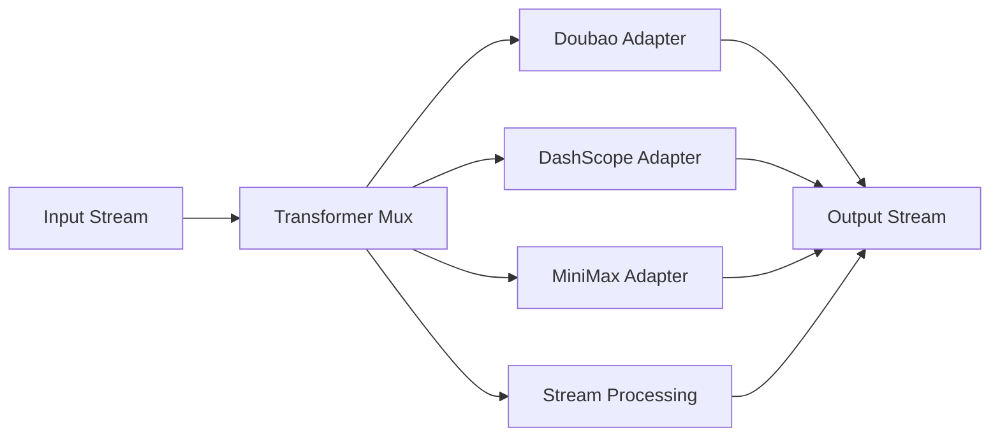

# Transformers 总览

`pkgs/genx/transformers` 将一个 `genx.Stream` 转换为另一个 Stream。Provider Adapters 负责外部 speech/realtime 协议；Stream Processing 负责 provider-neutral 的生命周期、buffer、TTS normalization、segmentation 和组合。

[Go API References](https://pkg.go.dev/github.com/GizClaw/gizclaw-go@v0.0.0-20260707135347-b9bf1fb24b9f/pkgs/genx/transformers)

## Adapter 结构

| Adapter | 能力 |
| --- | --- |
| [Doubao Speech](./doubao) | ASR、TTS、Realtime、Realtime Duplex 与 speech translation。 |
| [DashScope](./dashscope) | Realtime multimodal conversation。 |
| [MiniMax](./minimax) | Streaming TTS。 |
| [Stream Processing](./stream-processing) | Provider-neutral 的 mux、TTS normalization、文本分段和 stream wrapper。 |

Agent-capable adapter 使用独立 package 暴露 typed Config：

```text
pkgs/genx/transformers/
├── agentkit/
├── doubaoast/
├── doubaorealtime/
├── doubaorealtimeduplex/
└── dashscoperealtime/
```

每个 provider package 都提供 `New(Config) (*Transformer, error)`，constructor 只解析不可变配置，不建立连接。每次 `Transform(ctx, input)` 单独建立并管理 provider session。flat `transformers.New*` constructors 仍作为现有调用方的兼容入口。



## 核心结构与主函数

| 符号 | 作用 |
| --- | --- |
| [`Mux`](https://pkg.go.dev/github.com/GizClaw/gizclaw-go@v0.0.0-20260707135347-b9bf1fb24b9f/pkgs/genx/transformers#Mux) | 通用 Transformer registry。 |
| [`Transform`](https://pkg.go.dev/github.com/GizClaw/gizclaw-go@v0.0.0-20260707135347-b9bf1fb24b9f/pkgs/genx/transformers#Transform) | 通过默认 mux 选择并执行 Transformer。 |
| [`Handle`](https://pkg.go.dev/github.com/GizClaw/gizclaw-go@v0.0.0-20260707135347-b9bf1fb24b9f/pkgs/genx/transformers#Handle) | 注册通用 Transformer。 |

ASR、TTS、Realtime 和其他能力都实现同一个 `genx.Transformer`，并通过同一个 `Mux` 注册。`Mux` 实现 `genx.TransformerMux`，pattern 不会传入具体 Transformer。Guide 不为能力类别定义额外的 facade、session factory 或 registry API。
