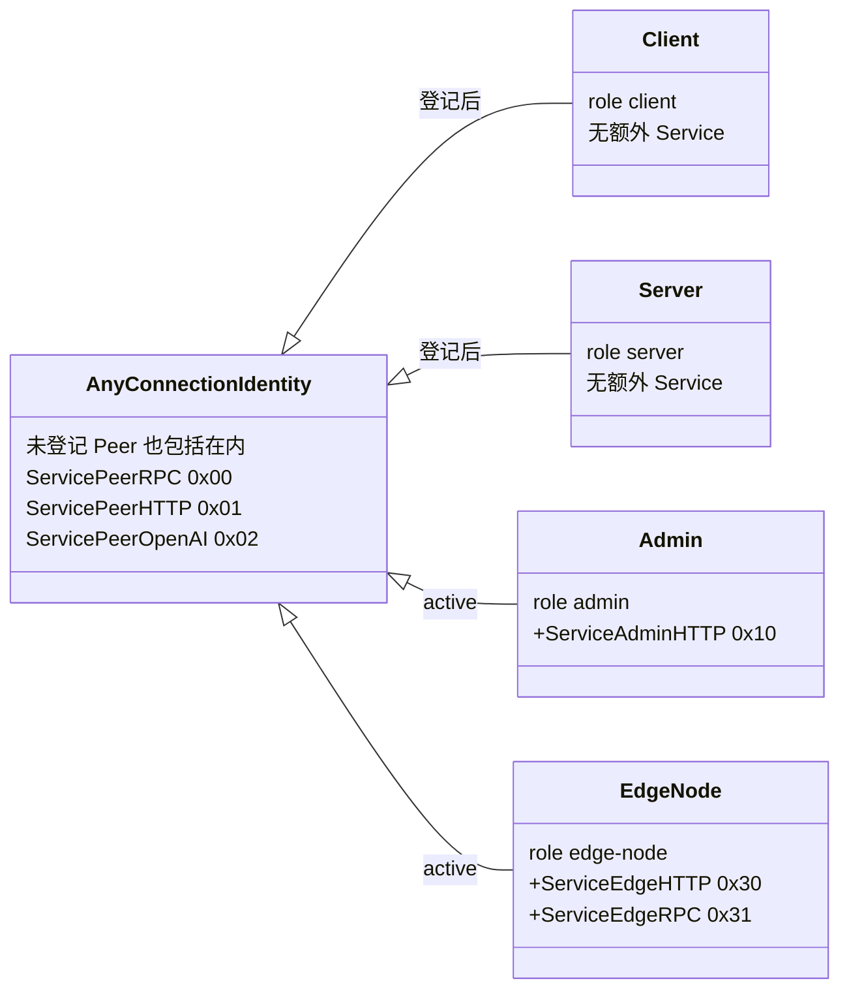
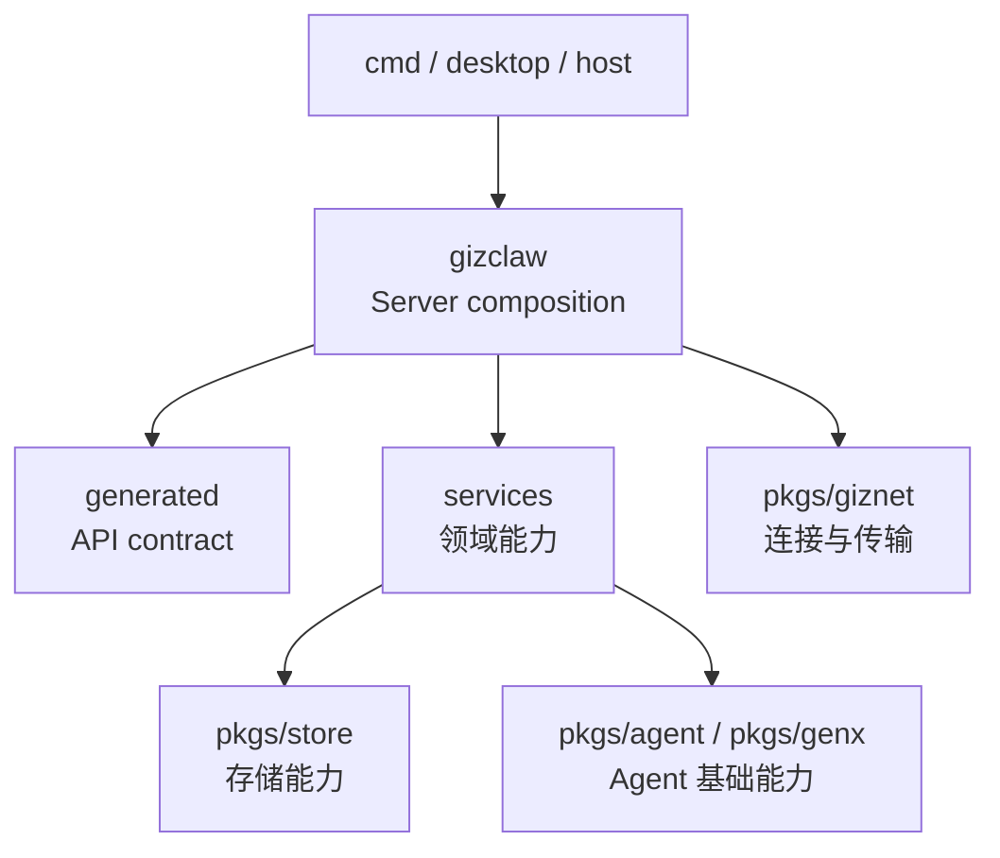

# pkgs/gizclaw

`pkgs/gizclaw` 是 GizClaw 产品层的核心 package。它在 `pkgs/giznet` 提供的通用连接与传输之上，组合 API contract、领域服务、Peer Runtime 和 Server public surface。

这个目录拥有可被 CLI Server、desktop 或其他宿主复用的 GizClaw Server 行为；具体进程的配置加载、storage backend 选择和启动流程属于 `cmd/`。

[Go API References](https://pkg.go.dev/github.com/GizClaw/gizclaw-go@v0.0.0-20260707135347-b9bf1fb24b9f/pkgs/gizclaw)

## 文档结构

当前 `peer_*`、`server_*` 和 `rpc_*` 文件仍直接位于 `pkgs/gizclaw/`。文档按照这些稳定前缀直接分组，不再增加重复的 `gizclaw/` 中间层。`generated` 是文档名称，实际代码目录为 `api/`。

```text
pkgs/gizclaw/
├── peer/          # 文档分组：当前 peer_*.go
├── server/        # 文档分组：当前 server*.go
├── rpc/           # 文档分组：当前 rpc_*.go
├── services/      # 实际目录：按产品领域组织的服务
├── generated/     # 文档分组：实际对应 pkgs/gizclaw/api/
├── contextstore/  # 实际目录：客户端 context 本地存储
└── customid/      # 实际目录：跨领域产品资源 ID
```

## 各分组负责什么

### peer、server 与 rpc

[peer](./peer/overview)、[server](./server/overview) 和 [rpc](./rpc/overview) 直接展开当前根 package 中对应前缀的文件。它们共同承担 connection、Server composition 和 RPC runtime 职责，不拥有单一领域的业务规则。

### services

[services](./services/overview) 是实际存在的领域层目录，拥有 AI、device、gameplay、runtime、social 和 system 的资源、validation、storage 与 service lifecycle。

### generated

[generated](./api) 对应实际目录 `pkgs/gizclaw/api/`。它保存从根目录 `api/` schema 生成并提交的 Go contract，以及紧贴 contract 的 codec 和稳定适配。公共 contract 必须从 source schema 修改，不能直接改生成结果。

### contextstore

[contextstore](./contextstore) 保存客户端连接 context，包括本地 identity、target endpoint 和当前 context 选择。它不是 Server 业务数据 store。

### customid

[customid](./customid) 保存多个 GizClaw surface 或领域共同识别的产品资源 ID 规则，不收纳领域私有数据库 key 或通用 encoding helper。

## Service Layout

`pkgs/gizclaw` 把一个 giznet connection 划分为多个相互独立的产品 surface。`Service*` 名称只用于承载在可靠 giznet service stream 上的 RPC 或 HTTP；service ID 同时决定连接两端使用哪个 handler，也构成 Server security policy 的授权边界。

| Service | ID | 协议与职责 | 访问边界 |
| --- | ---: | --- | --- |
| `ServicePeerRPC` | `0x00` | Peer 与 Server 之间的业务 RPC | 任何连接 identity |
| `ServicePeerHTTP` | `0x01` | Server 信息、登录、WebRTC Offer 与当前 Peer 信息 | 任何连接 identity |
| `ServicePeerOpenAI` | `0x02` | 通过 Peer connection 暴露 OpenAI-compatible HTTP | 任何连接 identity |
| `ServiceAdminHTTP` | `0x10` | 资源管理与运维 HTTP API | active `admin` Peer |
| `ServiceEdgeHTTP` | `0x30` | Edge 向权威 Server 转发 public API 请求 | active `edge-node` Peer |
| `ServiceEdgeRPC` | `0x31` | Edge 查询 Peer、分配 Peer 与解析路由 | active `edge-node` Peer |



这里的“任何连接 identity”是 service-level policy，不是一个 `PeerRole`。未登记 Peer，以及已登记为 `client`、`server`、`admin` 或 `edge-node` 的 Peer，都可以打开三个通用 Peer services。具体 endpoint 仍可在 handler 层继续检查 session、registration status 或 role。

### 各 surface 的边界

- **Peer RPC**：承载 common、client 与 server RPC method。它是设备和 Server 交换信息、runtime、workspace、workflow、social 与 gameplay 数据的 RPC surface；method 与调用路径见 [RPC](./rpc/overview)。
- **Peer HTTP**：承载连接建立、当前 Peer 与授权 Side Control endpoint，包括 `/server-info`、`/login`、`/webrtc/v1/offer`、`/me/*` 与 `/side-control/*`；handler 组织见 [Peer HTTP · WebRTC](./peer/service/webrtc)、[Peer HTTP · /me](./peer/service/peer-http-me) 和 [Peer HTTP · Side Control](./peer/service/side-control)。
- **Peer OpenAI-compatible HTTP**：将 OpenAI-compatible handler 放在独立 service stream 上，不与 Peer HTTP 的 bootstrap、signaling endpoint 混用。
- **Admin HTTP**：为具有 active `admin` role 的 Peer 提供资源管理 surface。它覆盖 ACL、workflow、firmware、credential、model、gameplay、AI tenant、workspace、Peer 与 social resource；各领域入口见 [Peer Services](./peer/service/overview)。
- **Edge HTTP**：Edge 使用 incoming token 的 Peer identity，把 browser/device public API 请求转发到权威 Server；它不是 Admin surface。
- **Edge RPC**：只提供 `server.peer.lookup`、`server.peer.assign` 和 `server.route.resolve` 三个 edge-node control method；实现边界见 [Edge RPC](./rpc/edge)。

### Event 与 Media 不属于 Service

以下标识同样由 `pkgs/gizclaw` 定义，但不属于上面的 HTTP/RPC service layout：

| 标识 | 值 | 传输语义 |
| --- | ---: | --- |
| `EventStreamAgent` | `0x20` | 可靠的 Agent event stream |
| `EventStreamTelemetry` | `0x40` | 不可靠的 telemetry event packet |
| `MediaStreamOpus` | `audio/opus` | WebRTC Opus media track codec |

因此，新增 RPC 或 HTTP surface 时使用 `Service*`；新增事件或媒体能力时，应先判断它属于可靠 event stream、直接 packet 还是 WebRTC media track，不能仅因为共用一条 Peer connection 就放进 Service namespace。

## 依赖方向



- Host 提供 storage、transport 和运行配置，再组装 GizClaw Server。
- `peer`、`server` 与 `rpc` 分组将 public surface、Peer Runtime 与领域服务接在一起。
- `services` 拥有各领域行为，可以依赖生成 contract 和必要的基础 package。
- `pkgs/gizclaw` 消费 `pkgs/giznet`；`pkgs/giznet` 不反向依赖产品逻辑。

如果一项改动只是因为“Server 会用到”就准备写入根 package，先判断它究竟属于 connection composition、具体领域、公共 schema、host process 还是通用基础能力。
