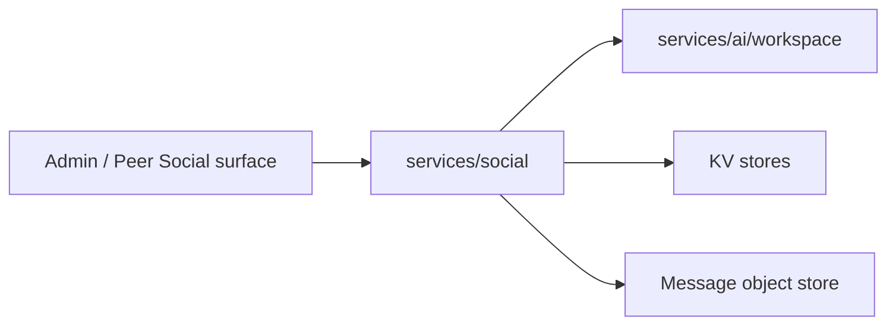

# services/social

`pkgs/gizclaw/services/social` 拥有 GizClaw 的 social graph，包括联系人、好友关系和 friend group。每个子 package 负责一个清晰的资源边界。

## 目录结构

```text
services/social/
├── contact/       # Contact 资源
├── friend/        # Friend request 和 friend relationship
└── friendgroup/   # Group、member、message 和 message asset
```

## 子目录职责

### contact

拥有 peer 的 contact 资源和 contact lifecycle。Contact 是用户维护的通讯录数据，不等同于已经建立的 friend relationship，也不等同于底层 giznet peer connection。

### friend

拥有 friend request 的创建、接受、拒绝，以及 friend relationship 的读取和删除。Friend 关系直接决定双方对 system Workspace 的访问，不创建通用访问 role。

每个好友直聊生命周期拥有一个 system Workspace，并在创建、rollback 和关系删除时使用内部 Workspace create/delete 能力。创建 invite token 的 Peer 是发起人，也是不可变的 Workspace owner；接受邀请的一方获得访问权，但不会共享 ownership。Admin 创建使用显式 owner。服务从 owner RuntimeProfile 的 `workflows.system.friend_chatroom` 选择真实 Chatroom Workflow。

### friendgroup

拥有 friend group、member、message、invite 和 message asset。Group membership 直接决定成员对 group system Workspace 的访问。

每个 Friend Group 生命周期拥有一个 system Workspace，并在创建、rollback 和群组删除时使用内部 Workspace create/delete 能力。Peer 创建的群归创建者所有；Admin 创建必须显式给出 owner。成员身份只授予数据访问，不改变 ownership。服务从 owner RuntimeProfile 的 `workflows.system.group_chatroom` 选择真实 Chatroom Workflow。

## 依赖与边界



应该放在 `services/social`：

- Contact、friend request、friend relationship、group、member 和 message 的领域行为。
- Social resource 的 validation、storage 和 cleanup。

不应该放在这里：

- Giznet peer connection 或 signaling contact。
- RuntimeProfile 持久化、owner index 或通用注册逻辑。Social 只在写入领域状态前解析 owner 当前 profile，以选择已配置的 system Workflow。
- Chat Agent、workspace runtime 或通用 messaging transport。
- Admin/Peer route registration。

新增 social 能力时，应先判断它属于 contact、friend 还是 friend group；只有形成新的独立资源与生命周期时才增加新的子 package。
