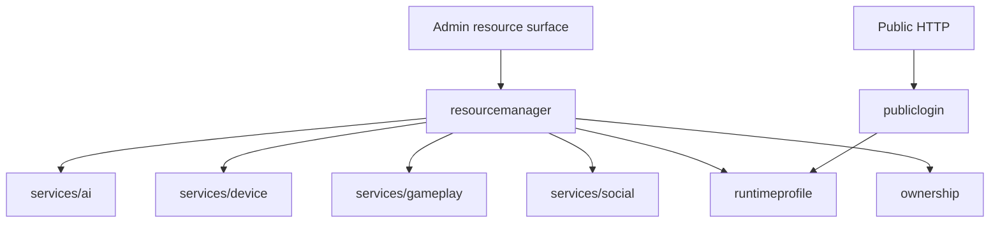

# services/system

`pkgs/gizclaw/services/system` 提供多个产品领域共同依赖的系统级服务，包括 RuntimeProfile、设备注册、resource ownership、public login 和 declarative resource 管理。

## 目录结构

```text
services/system/
├── ownership/         # owner context、owner index key 和写入规则
├── pendingdeletion/   # durable fast-delete handoff record
├── publiclogin/       # Public HTTP login、assertion 和 session
├── resourcemanager/   # Admin declarative resource 的统一入口
└── runtimeprofile/    # RuntimeProfile 与 RegistrationToken
```

## 子目录职责

### ownership

提供 persisted resource 使用的 owner context 与 KV index 约定。在 Peer surface 上，Workspace 是用户创建状态；真实 Model、Credential、Workflow 和 Tool 只能由 Admin 修改。Friend、FriendGroup 和 Pet 的 system Workspace 由各自领域关系补充可见性。

### pendingdeletion

定义带版本的、backend-neutral `PendingDeletion` envelope。领域 fast-delete 必须在资源自己的物理存储中，原子地让 active resource 不可发现并写入一条最小 cleanup descriptor。Peer 和用户 Workspace 使用 KV，Pet 使用 gameplay SQL database。KV locator lookup 支持 kind 与全局唯一 resource ID，并显式拒绝 owner-scoped filter；gameplay SQL source 支持包含 owner 的 locator。这个 package 不运行 worker、不删除 pending record，也不暴露已删除资源内容；processing 属于后续 managed cleanup service。

### runtimeprofile

拥有 RuntimeProfile 和 RegistrationToken 的 KV 状态、schema validation、确定性 revision、hash 索引和注册解析。它通过安全 alias 投影 Admin 资源，不定义 reader/member role system。完整结构见 [RuntimeProfile 与设备注册](./runtime-profile)。

### publiclogin

负责 public HTTP caller 使用 GizClaw identity 完成登录并取得 typed session。Primary session 表示当前 Peer；Side Control session 使用单次 device token 授权，并同时绑定 controller identity 与目标 Peer。该 package 不拥有 browser route、Edge proxy 或业务资源实现。

最终资源访问仍由 RuntimeProfile、owner 和对应领域关系共同判断。登录成功不等于拥有所有资源访问权限。

### resourcemanager

为 Admin apply、show 和通用 resource 操作提供统一的 declarative resource dispatch。它知道不同 resource kind 应交给哪个领域服务，但不重新实现 credential、workflow、firmware、gameplay 或 social 的业务规则。

ResourceManager 是跨领域协调层，不是所有 GizClaw resource 的实际 owner。

## 依赖与边界



应该放在 `services/system`：

- 跨领域统一使用的 product authorization 和 session 能力。
- Declarative resource 的跨领域 dispatch 与公共管理边界。
- System-owned migration、validation 和持久化规则。

不应该放在这里：

- 各领域资源自己的业务实现。
- Giznet transport security policy 或 WebRTC signaling crypto。
- Edge proxy token forwarding。
- CLI config、storage backend 创建和进程生命周期。
- 为了避免选择领域 ownership 而放入的通用 helper。
