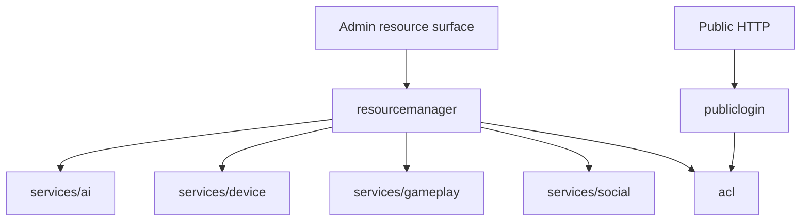

# services/system

`pkgs/gizclaw/services/system` 提供多个产品领域共同依赖的系统级服务，包括访问控制、public login 和 declarative resource 管理。

## 目录结构

```text
services/system/
├── acl/               # Role、policy binding、ACL view 和授权判断
├── publiclogin/       # Public HTTP login、assertion 和 session
└── resourcemanager/   # Admin declarative resource 的统一入口
```

## 子目录职责

### acl

拥有 GizClaw 的 role、policy binding、ACL view、subject/resource permission 和授权判断。其他领域可以询问 ACL，但不能在各自 package 中建立互相冲突的第二套通用权限模型。

ACL 不负责 transport peer 是否能打开 giznet service；transport-level policy 与 product resource authorization 是不同边界。

### publiclogin

负责 public HTTP caller 使用 GizClaw identity 完成登录并取得 typed session。Primary session 表示当前 Peer；Side Control session 使用单次 device token 授权，并同时绑定 controller identity 与目标 Peer。该 package 不拥有 browser route、Edge proxy 或业务资源实现。

最终资源授权仍由 ACL 和对应领域服务执行。登录成功不等于拥有所有资源访问权限。

### resourcemanager

为 Admin apply、show 和通用 resource 操作提供统一的 declarative resource dispatch。它知道不同 resource kind 应交给哪个领域服务，但不重新实现 credential、workflow、firmware、gameplay 或 social 的业务规则。

ResourceManager 是跨领域协调层，不是所有 GizClaw resource 的实际 owner。

## 依赖与边界



应该放在 `services/system`：

- 跨领域统一使用的 product authorization 和 session 能力。
- Declarative resource 的跨领域 dispatch 与公共管理边界。
- System-owned migration、validation 和持久化规则。

不应该放在这里：

- 各领域资源自己的业务实现。
- Giznet transport security policy 或 WebRTC signaling crypto。
- Edge proxy token forwarding。
- CLI config、storage backend 创建和进程生命周期。
- 为了避免选择领域 ownership 而放入的通用 helper。
