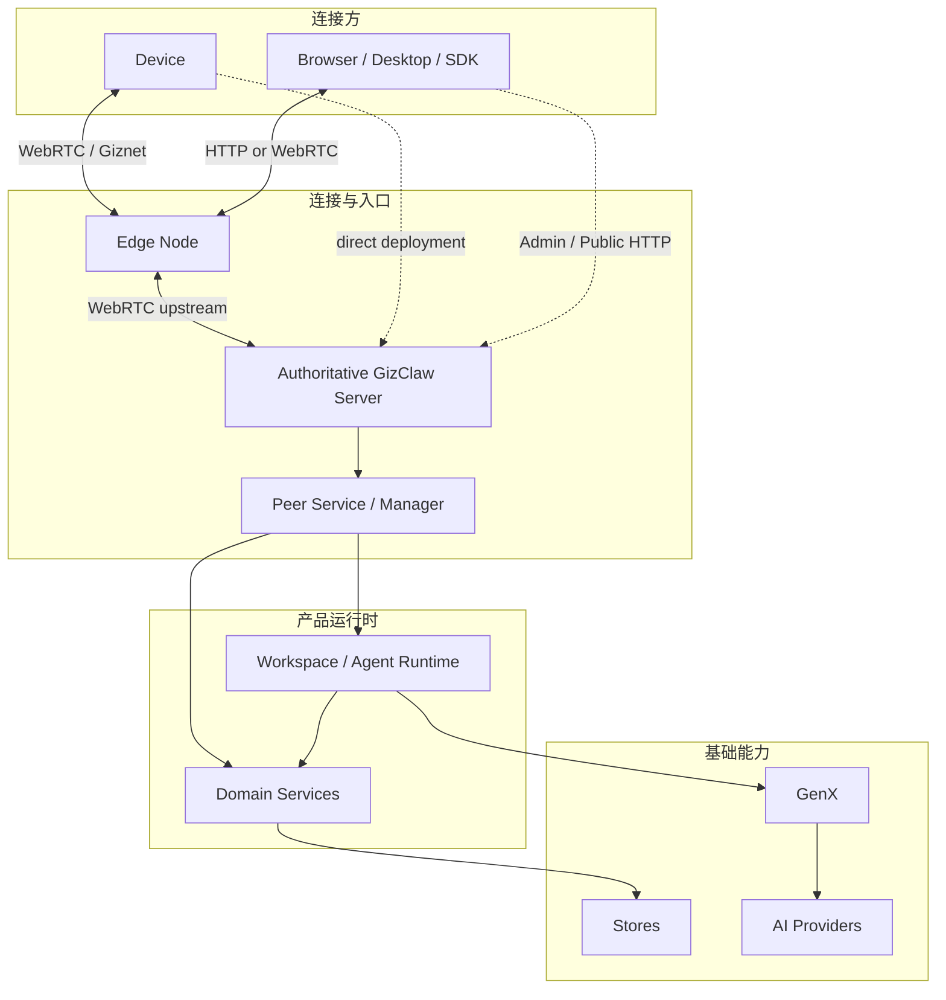
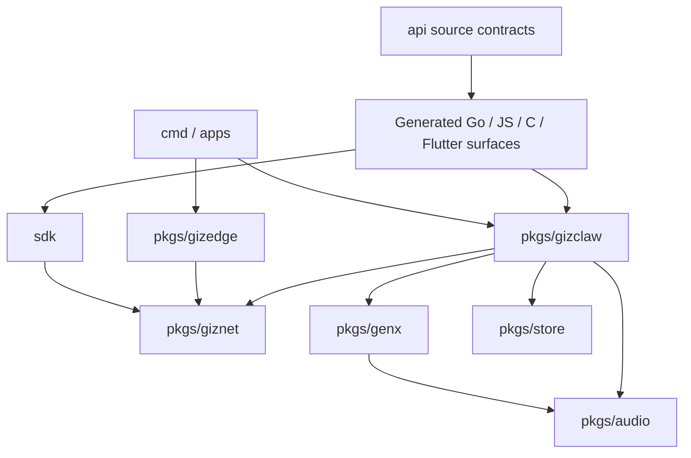
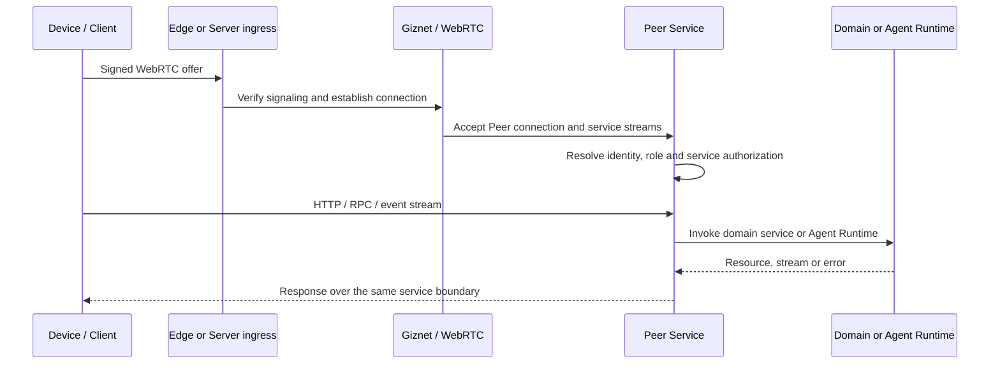

# GizClaw 开发指引

GizClaw 是面向 GizClaw 设备、桌面客户端和浏览器集成的 Agent Runtime 与 Edge Server。它提供 WebRTC 连接、设备与运行时管理、Agent workflow、AI 模型适配、Admin/Public HTTP API、Peer RPC、遥测、OTA、数字内容、社交与 Gameplay 领域服务，并从同一套 contract 生成 Go、JavaScript、C 和 Flutter SDK surface。

开发指引用于指导日常开发、代码审查和问题排查。它解释项目如何组成、模块边界在哪里、一次请求如何穿过系统、新代码应该放到哪个目录，以及出现连接、协议、运行时、存储或 Provider 问题时应从哪一层开始定位。

代码审查应使用这些边界判断变更是否放在正确模块、是否改变跨层 contract、是否同步生成产物和测试。具体 Go symbol 的签名与注释仍以 pkg.go.dev/Go doc 为准；本指引补充的是单个 API Reference 无法表达的项目结构、调用关系、开发约束和排查路径。

## 项目提供什么

| 能力 | 项目边界 |
| --- | --- |
| Server 与 CLI | 启动本地或部署的 GizClaw Server，管理 context、配置、资源和连接。 |
| Device connectivity | 通过 Giznet/WebRTC 建立 Peer connection，并在 DataChannel/service stream 上承载 RPC、HTTP 与事件。 |
| Edge ingress | Edge Node 接受公网连接并转发到 authoritative Server；业务资源和最终授权仍属于 Server。 |
| Agent Runtime | Workspace 实例化 Agent 环境，workflow driver 决定运行方式，runtime 管理在线 Agent、输入输出和 stream lifecycle。 |
| AI capability | GenX 提供统一的 message、stream、model、tool、generator 和 transformer contract，并由 provider adapters 实现。 |
| Product domains | Device、runtime、AI、system、social 和 gameplay services 拥有各自资源与业务规则。 |
| API 与 SDK | 根 `api/` 保存 HTTP/Protobuf source contract，并生成 Go、JavaScript、C、Flutter 等调用 surface。 |
| Storage 与 media | Store packages 提供通用持久化/索引能力；Audio packages 提供 codec、PCM、重采样和 voiceprint。 |
| Observability | 使用结构化日志定位单次请求，通过低 cardinality metrics 观察请求、runtime 与设备状态。具体字段与 ownership 见 [Observability](observability)。 |

当前代码支持单 upstream 的 Edge ingress。分布式 membership、跨 Server 数据同步和全局路由不属于当前已完成的 Server Mesh 能力。

## 运行时架构



- Device、Client、Server 和 Edge-node 的身份与 service 准入由 Giznet connection 和 Server security policy 协作判断。
- Edge 负责 ingress 与 upstream forwarding，不成为业务数据 owner。
- Peer Service 将连接映射到 Manager、RPC/HTTP surfaces 和领域 services。
- Workspace 是 Agent 环境的持久化边界；Runtime 拥有在线 Agent、connection 和 stream lifecycle。
- GenX 只提供通用 AI contract 与 adapters，不拥有 credential、model catalog、workspace 或 Agent instance。

## 仓库模块

```text
gizclaw/
├── api/              # HTTP / Protobuf source contracts
├── cmd/              # CLI 与 Server process wiring
├── pkgs/
│   ├── giznet/       # Transport、WebRTC 与 service streams
│   ├── gizclaw/      # Product server、Peer、RPC 与 domain services
│   ├── gizedge/      # Edge ingress 与 upstream forwarding
│   ├── genx/         # 通用多模态 AI contracts 与 adapters
│   ├── store/        # Storage 与 index primitives
│   └── audio/        # Codec、PCM 与 signal processing
├── sdk/              # Go、JavaScript、C、Flutter SDK surfaces
├── apps/             # Desktop 与应用入口
├── examples/         # 独立能力示例
├── tests/            # Integration 与 e2e harnesses
└── guides/           # Project Guide
```

| 模块 | 拥有什么 | 不拥有什么 | 指引 |
| --- | --- | --- | --- |
| `api/` | HTTP、RPC、Telemetry source contract 与生成规则 | Server implementation、业务存储 | [API 总览](api/overview) |
| `pkgs/giznet` | Connection、service、WebRTC、HTTP-over-stream transport | GizClaw resource 与业务授权 | [Giznet](giznet) |
| `pkgs/gizclaw` | Server、Peer lifecycle、RPC/HTTP composition、领域 services | 通用 transport、provider-neutral codec | [GizClaw](gizclaw/overview) |
| `pkgs/gizedge` | Edge ingress、upstream connection 与 forwarding | Authoritative resource、最终 resource access | [Gizedge](gizedge) |
| `pkgs/genx` | Message、Stream、Generator、Transformer、Tool 与 adapters | Agent instance、workspace、产品 model resource | [GenX](genx/overview) |
| `pkgs/store` | KV、object、metrics、graph、vector 与 identity primitives | 领域 resource schema 与业务规则 | [Stores](stores/overview) |
| `pkgs/audio` | Codec、PCM、resampling、device I/O 与 voiceprint | WebRTC connection、Agent lifecycle | [Audio](audio/overview) |
| `cmd` | 配置读取、dependency wiring、进程生命周期与 CLI UX | 可复用领域逻辑 | 对应 package 指引 |
| `sdk` | 面向各语言的生成 contract 与客户端封装 | 独立定义另一套 wire contract | [API 生成](api/generation) |

`pkgs/agent` 当前没有进入主要产品运行链，因此暂不作为开发指引入口；其能力真正被 Runtime 消费后，再按实际边界补充文档。

## 模块依赖方向



依赖必须朝基础能力方向流动：

- `cmd` 和 `apps` 负责组装 packages；可复用业务逻辑不能反向放入 command 层。
- `pkgs/gizclaw` 可以依赖 Giznet、GenX、Store 和 Audio；这些基础 packages 不能依赖 GizClaw 领域服务。
- `pkgs/gizedge` 可以依赖 Giznet 和生成 contract，但不能直接拥有 Server domain store。
- `api/` 是 wire/source contract；生成代码依赖它，手写代码不能修改生成产物来绕过 source schema。
- Provider-specific 代码停留在对应 Adapter 或 product integration 中，不能扩散进通用 GenX、Audio 或 Store contract。

## 一次连接如何进入系统



具体 signaling、Edge upstream 和 service authorization 以 [Giznet](giznet)、[Gizedge](gizedge) 与 [GizClaw](gizclaw/overview) 页面为准。

## 开发时从哪里开始

1. 先确认变化属于 wire contract、transport、产品领域、AI adapter、storage/media primitive，还是 process wiring。
2. 修改 `api/` 时先更新 source schema，再重新生成全部受影响语言的 committed outputs。
3. 修改领域行为时，把资源和业务规则留在对应 service；Server/Peer 文件只负责 composition、connection 与 dispatch。
4. 修改 GenX/Audio/Store 等基础 package 时，不引入 GizClaw 产品资源或 provider credential ownership。
5. 根据变更风险运行 focused tests；Go 行为变化默认最终需要 `go test ./...`，schema 变化还需要生成与跨语言验证。

日志字段、metrics names、labels 和 instrumentation ownership 统一遵循 [Observability](observability)。

进一步入口：

- [测试与 E2E](testing)
- [开发工具与示例](tooling)
- [审核指引](/zh/reviewing/)
- [编码规范](/zh/coding-styles/)
- [使用说明](/zh/using/)
- [Reference](/references/)
