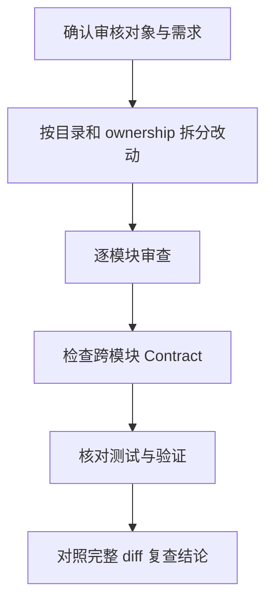

# 审核指引

审核用于确认需求、实现、Contract、测试和文档共同形成一个完整且可验证的结果。审核不是单纯寻找代码风格问题，也不能用测试通过代替对行为和边界的判断。

Issue 在进入审查前，应先符合 [Issue 格式](./issue-format) 中的标题、Issue Type、正文结构和关系字段要求。

PR 进入 review-ready 前，其标题和 commit history 应符合 [PR 与 Commit 格式](./pr-commit-format)。

## 审核类型

| 类型 | 执行者 | 目标 | 是否修改代码 |
| --- | --- | --- | --- |
| [开发后自我审查](./self_review) | 当前开发者或实现 Agent | 在提交前发现并修复问题 | 是 |
| [PR Agent 审查](./pr_agent_review) | 远程 Review Agent | 对 PR 给出一次完整、可执行的 blocking findings | 否 |
| [Issue 审查](./issue_review) | Issue 作者或 Review Agent | 确认问题定义达到可实施状态 | 只修改 Issue 文本 |

所有审核共用同一套[审查项目](./review_items)，但应根据改动语言、模块 ownership 和风险选择实际检查范围。

## 基本顺序

先检查 scope 和需求符合性，再检查实现细节。跨 Go、JavaScript、Dart/Flutter、C、Schema 或生成代码的改动，必须把 source contract、生成结果、调用方和测试放在一起审查。

## 审核结果

只有会影响正确性、兼容性、安全性、生命周期、可维护性或验证可信度的问题，才应成为 blocking finding。可选的措辞和排版偏好不应冒充缺陷。

每个 finding 至少包括：

- `P0`、`P1` 或 `P2` 优先级；
- 精确的文件和行号；
- 当前行为及其实际风险；
- 可以执行的修复方向。

没有 blocking finding 时，应明确给出通过结论，并列出已经执行或无法独立确认的验证。
